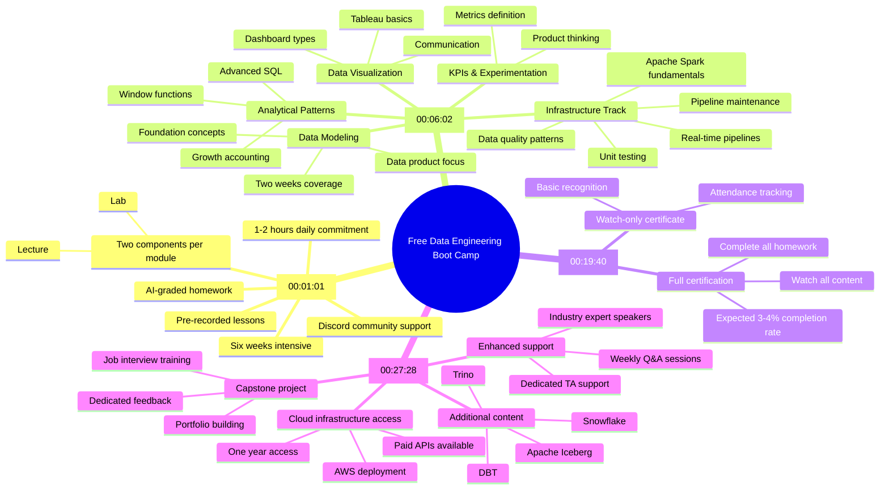

# Free Data Engineering Boot Camp Kickoff Summary

*A comprehensive 6-week program launching online with daily content releases at 5 PM Pacific.*

**Big picture:** Tech expert Zach is offering free data engineering training to help 1,000 engineers land jobs by February 15, with content available on YouTube until December 2025.

**Key details:**
- 10,000+ enrolled students
- 1-2 hours daily commitment recommended
- All content pre-recorded and uploaded daily
- Includes AI-graded homework assignments
- Discord community support available

**Core curriculum:**
- Data modeling (2 weeks)
- Analytical patterns and advanced SQL
- KPIs and experimentation
- Data visualization
- Infrastructure and pipeline maintenance
- Apache Spark fundamentals
- Real-time pipelines with Flink and Kafka

**Success metrics:** Only about 300-400 out of 10,000 students expected to complete certification, requiring:
- Watching all videos
- Completing all homework assignments
- Active participation in community

**What's different in paid version:**
- Cloud infrastructure access
- Weekly Q&As with Zach
- Industry expert speakers
- Additional tools: Snowflake, DBT, AWS Glue
- Direct TA support
- Capstone project mentorship
- Job interview training

**Bottom line:** While free version offers substantial technical training, paid version ($) provides more hands-on support and cloud-based tools for job preparation.