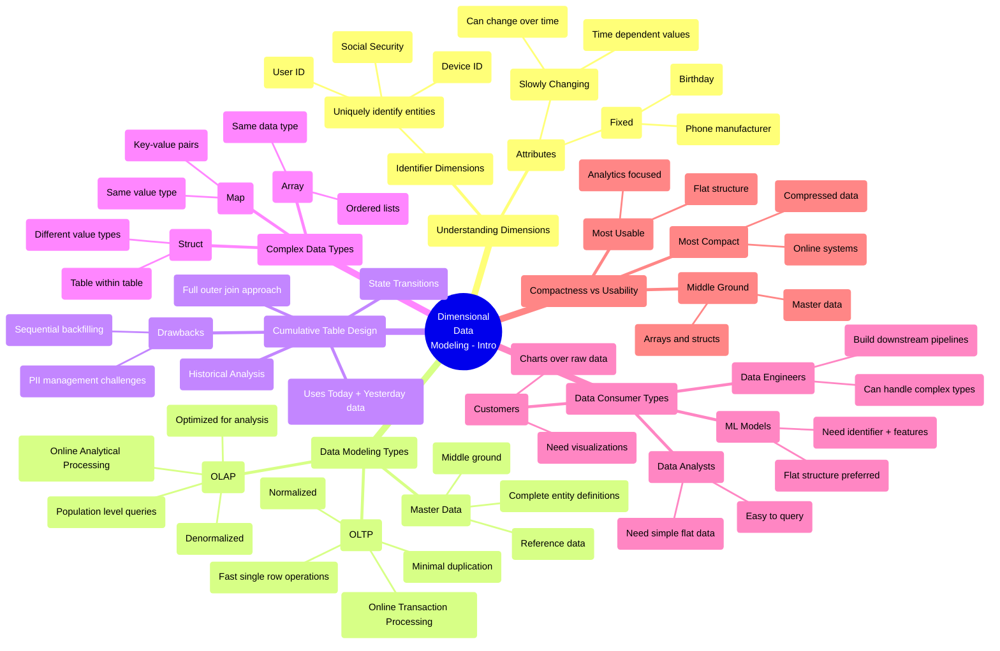

# Data Modeling: Complex Types and Cumulative Tables Deep Dive

*A comprehensive look at dimensional data modeling principles, focusing on the balance between data efficiency and usability.*

**Big picture:** Data modeling strategies vary significantly based on end users' needs, from analysts requiring simple flat tables to engineers working with compressed complex data types.

**Key dimensions types:**
- Identifier dimensions (unique entity IDs)
- Slowly changing dimensions (values change over time)
- Fixed dimensions (unchangeable values)

**Data modeling layers:**
- OLTP (transactional): Optimized for single-record operations
- Master data: Middle ground, combines completeness with efficiency
- OLAP (analytical): Optimized for aggregation and analysis
- Metrics: Highest level of aggregation

**Cumulative table design benefits:**
- Maintains complete historical records
- Enables efficient historical analysis
- Supports state transition tracking
- Reduces query complexity

**Watch out for:**
- Sequential processing requirement limits parallel backfilling
- Privacy concerns with historical data retention
- Storage size growth over time
- Shuffle operations breaking data sorting in distributed systems

**Complex data types tradeoffs:**
- Arrays: Best for ordered data, same-type elements
- Structs: Flexible "table within table" approach
- Maps: Dynamic key-value pairs with type restrictions

**Bottom line:** Success in dimensional modeling requires understanding your data consumers and balancing compression efficiency with query usability. Master data serves as a critical middle ground between transactional and analytical needs.