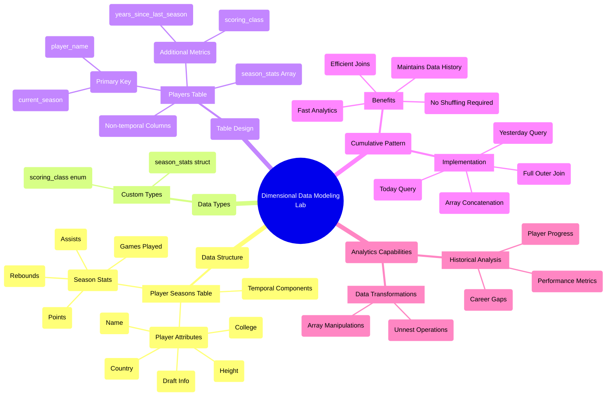

# Building Cumulative Tables with Complex Data Types: Lab Tutorial

*A hands-on demonstration of creating efficient dimensional tables using PostgreSQL arrays and structs to track NBA player statistics over time.*

**Big picture:** Converting season-by-season player statistics into a cumulative table using complex data types reduces data duplication and maintains data sorting efficiency while enabling quick historical analysis.

**Key components:**
- Custom struct type for season statistics
- Array column to store multiple seasons
- Tracking columns for scoring class and years since last season
- Full outer join logic for cumulative updates

**Implementation steps:**
- Create custom struct type for season stats (points, games, rebounds, assists)
- Build base table with player attributes and season stats array
- Implement incremental loading logic using full outer joins
- Add derived columns for player classification and activity tracking

**Performance benefits:**
- No GROUP BY operations needed for historical analysis
- Maintains data sorting after joins
- Reduces storage through elimination of duplicated data
- Enables fast parallel processing

**Real-world example:**
- Tracked Michael Jordan's career gap (1996-1997, returned 2001)
- Demonstrated scoring progression from first to last season
- Identified most improved players without expensive aggregations

**Bottom line:** Complex data types with cumulative loading provide significant performance advantages for dimensional data that changes over time, while maintaining data usability through unnesting capabilities.