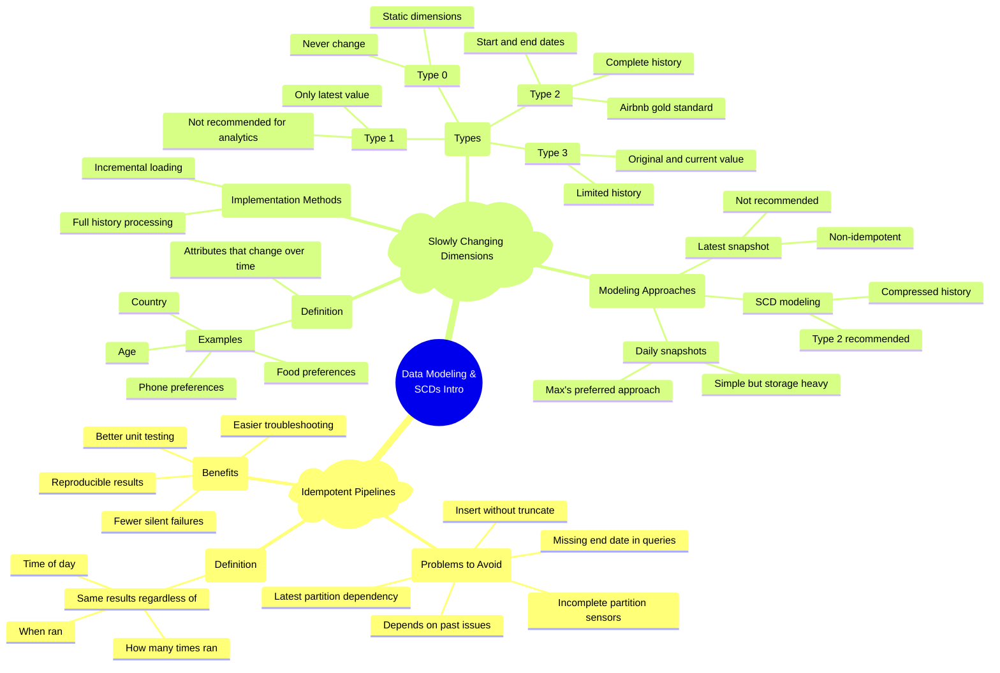

# Idempotency and Slowly Changing Dimensions in Data Engineering

*A comprehensive guide to building reliable data pipelines and handling temporal dimension changes.*

**Big picture:** Data pipelines must produce consistent results regardless of when or how many times they run. Slowly changing dimensions (SCDs) need careful modeling to maintain data accuracy over time.

**Idempotency essentials:**
- Pipelines should produce identical results whether run in production or backfill
- Multiple runs should not create duplicates
- Time windows must have clear boundaries
- All input dependencies must be verified

**Common idempotency pitfalls:**
- Using INSERT without TRUNCATE
- Unbounded date ranges
- Missing partition sensors
- Relying on latest data instead of point-in-time
- Cumulative dependencies on non-idempotent sources

**SCD modeling approaches:**
- Type 0: Fixed dimensions that never change
- Type 1: Latest value only (avoid for analytics)
- Type 2: Full history with start/end dates (recommended)
- Type 3: Original and current values only

**Best practices for Type 2 SCDs:**
- Use start and end dates for each value period
- Mark current records with future end date
- Can be loaded via full rebuild or incremental updates
- Choose implementation based on data volume and business needs

**Bottom line:** Idempotent pipelines and Type 2 SCDs are critical for reliable analytics, though implementation complexity should be balanced against business value and maintenance costs.

**Watch out for:** Using latest snapshot dimensions in analytical pipelines - this breaks idempotency and can cause incorrect historical analysis.