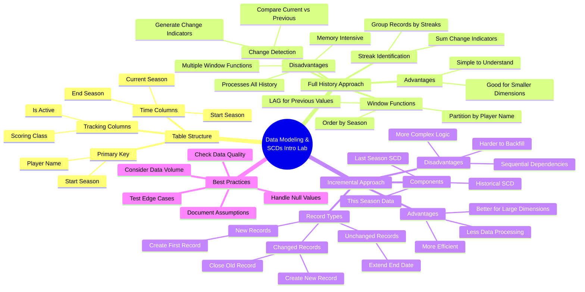

# Building Slowly Changing Dimensions (SCD) in Data Modeling

*A technical deep dive into implementing SCD Type 2 for tracking historical changes in dimensional data using PostgreSQL.*

**Big picture:** Two approaches demonstrated for tracking dimensional changes over time - a full historical rebuild and an incremental update method.

**Key components of SCD Type 2:**
- Start and end dates for each dimension record
- Support for tracking multiple changing attributes
- Maintains complete historical record of changes
- Primary key based on entity name and start date

**Full historical rebuild approach:**
- Uses window functions to detect changes
- Generates streak identifiers for tracking changes
- More memory-intensive but simpler to implement
- Works well for smaller dimensional tables (millions of records)
- Requires scanning all historical data

**Incremental update method:**
- Processes only changed records and new data
- More complex query logic but better performance
- Handles three scenarios:
  - Unchanged records (extend end date)
  - Changed records (close old record, create new)
  - New records (create initial record)
- Better for larger datasets but requires sequential processing

**Bottom line:** Choice between approaches depends on data volume and processing requirements. Full rebuild is simpler but less efficient; incremental update is more complex but better performing at scale.

**Watch out for:** Null handling in dimensional attributes can break comparison logic. Always validate assumptions about data quality when implementing either approach.