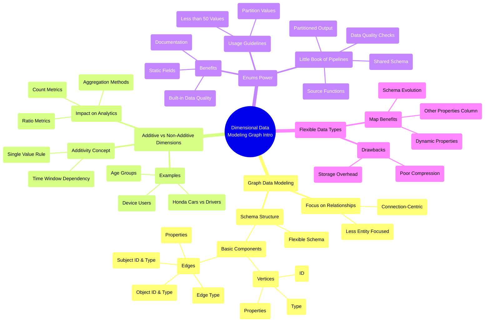

# Graph Data Modeling and Advanced Dimensional Concepts

*A deep dive into graph databases, additive dimensions, and flexible schema patterns for complex data modeling scenarios.*

**Big picture:** Graph data modeling shifts focus from entities to relationships, using a standardized structure to track how different objects connect and interact.

**Key concepts:**
- Additive vs non-additive dimensions
- Enumerated types for data quality
- Flexible schemas using maps
- Graph database fundamentals

**Additive dimensions:**
- Can aggregate subtotals directly
- Entity can only have one value at a time
- Examples: age groups, car counts
- Time window affects additivity

**Non-additive dimensions:**
- Require count distinct operations
- Entity can have multiple values simultaneously
- Examples: platform users (iOS/Android), car drivers
- Impact ratio metrics and aggregations

**Graph database structure:**
- Vertices (nodes):
  - Identifier
  - Type
  - Properties map
- Edges (relationships):
  - Subject and object identifiers/types
  - Edge type (usually verbs)
  - Relationship properties

**Pattern highlight - "Little Book of Pipelines":**
- Uses enums to manage multiple data sources
- Shared schema with custom quality checks
- Scales well for large integration projects
- Examples: unit economics, infrastructure graphs

**Bottom line:** Choose modeling approach based on use case - enums for limited values (<50), flexible schemas for varying attributes, and graph databases when relationships matter more than entities themselves.