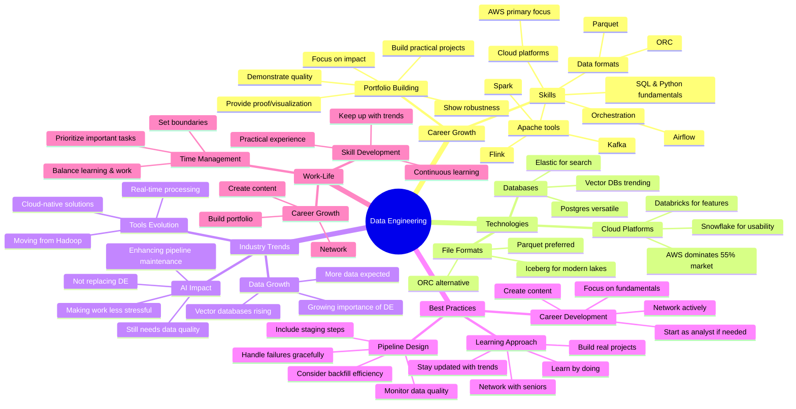

# Data Expert Free Boot Camp Live Q&A Highlights

*A comprehensive Q&A session covering data engineering career paths, boot camp details, and industry insights.*

**Big picture:** Zach Wilson addresses key questions about his free and paid data engineering boot camps, career transitions, and the future of data engineering amidst AI advancements.

**Boot camp details:**
- Free content available until January 31, 2025
- New fact data modeling content releasing tomorrow (5 hours)
- AI-graded homework assignments
- Certification opportunities
- Discord community support

**Key career insights:**
- Focus on AWS over Azure/GCP due to market share (55%)
- Entry-level DE roles are limited; consider data analyst path first
- Core skills needed: SQL, Python, cloud platforms
- Practical experience trumps certifications

**Technology perspectives:**
- Kafka remains exciting for real-time data
- Parquet vs ORC file formats both relevant
- DBT valuable for enforcing good practices
- Snowflake gaining momentum for usability

**Business update:**
- Free boot camp expanding reach (15,000 daily active users)
- Paid boot camp ($2,000 with discount) filling up
- Content helping both beginners and senior engineers

**Bottom line:** Success in data engineering requires continuous learning, practical experience, and understanding business needs. Focus on fundamentals before chasing new technologies.

**Watch out for:** Time zone compatibility with live sessions (particularly challenging for European participants).