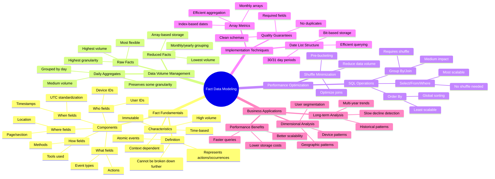

# Understanding Fact Data Modeling and Volume Optimization

*A comprehensive exploration of fact data modeling techniques, focusing on data volume optimization and efficiency in large-scale systems.*

**Big picture:** Fact data modeling requires careful consideration of volume, performance, and usability tradeoffs. Three main approaches exist, each with distinct advantages for different use cases.

**Key modeling approaches:**
- Raw facts: Highest granularity, largest volume
- Daily aggregates: Medium volume, good for 1-2 year analyses
- Reduced facts: Lowest volume, best for long-term analysis

**Performance impacts:**
- Shuffling is a major bottleneck in distributed computing
- SQL operations affect parallelism differently:
  - SELECT/FROM/WHERE: Highly parallel
  - GROUP BY/JOIN: Requires shuffling
  - ORDER BY: Least parallel, avoid for large datasets

**Innovation highlight - Reduced facts:**
- Stores data as arrays indexed by date
- Reduces storage by ~95%
- Enables decade-long analyses in hours vs weeks
- Maintains daily granularity while minimizing volume

**Implementation techniques:**
- Use array types for efficient storage
- Leverage bit operations for activity tracking
- Apply careful date indexing for time-based queries
- Pre-aggregate data while maintaining granularity

**Bottom line:** Successful fact data modeling requires balancing between data volume, query performance, and analytical flexibility. Reduced facts offer significant performance benefits for long-term analyses but require careful implementation.

**Watch out for:** Dimensional joins can become complex with reduced facts. Consider analytical needs and access patterns when choosing modeling approach.