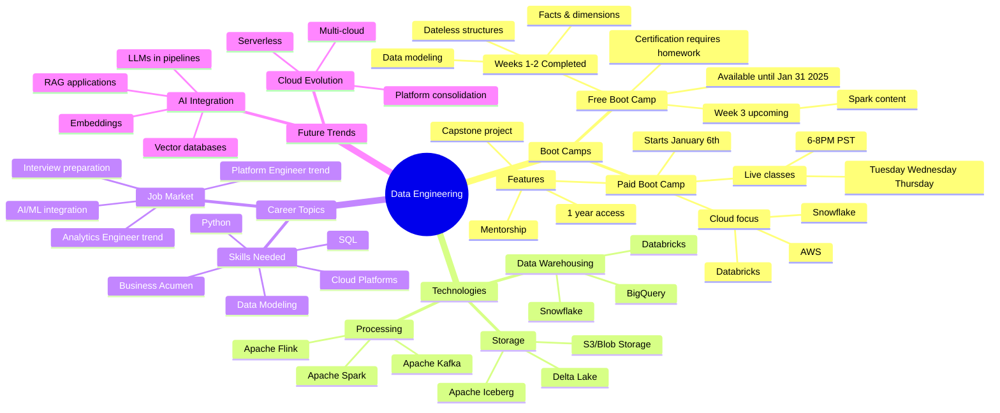

# Data Engineering Boot Camp Week 2 Live Q&A Session and Black Friday Updates

*A comprehensive Q&A session covering data engineering career paths, technology choices, and boot camp details.*

**Big picture:** Week 2 covered fact data modeling, with Week 3 starting tomorrow focusing on Apache Spark. The January paid boot camp will feature cloud technologies like Databricks and Snowflake.

**Key bootcamp details:**
- Free boot camp available until January 31, 2025
- Paid January boot camp runs January 6 - February 14
- Live classes Tuesday-Thursday, 6-8 PM Pacific
- 30% Black Friday discount available through December 2

**Technology insights:**
- Avoid technology preferences ("best" tools)
- Focus on business requirements over specific platforms
- Cloud providers (AWS/Azure/GCP) share similar core services
- Orchestration tools (Airflow/Dagster/etc.) serve similar purposes

**Career guidance:**
- Data engineering requires SQL and Python foundations
- Analytics background provides good business context
- Technical depth matters more than breadth
- Focus on building real projects over certifications

**Boot camp structure:**
- Homework assignments graded by AI
- Certification requires completing all assignments
- Mentorship available in paid version
- Cloud infrastructure provided for hands-on practice

**Bottom line:** Success in data engineering requires strong fundamentals, business understanding, and continuous learning rather than focusing on specific tools or certifications.