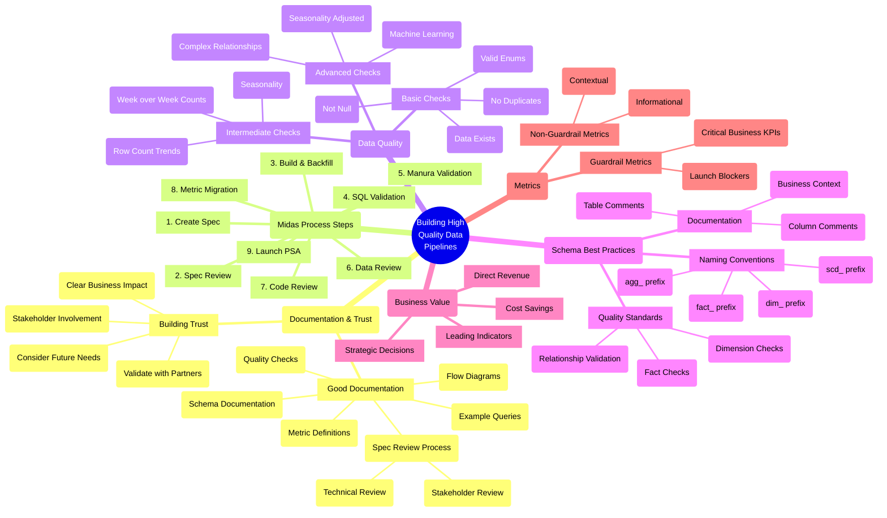

# Building Gold-Standard Data Pipelines: The Airbnb Midas Process

**Why it matters**: High-quality data pipelines are crucial for building trust and driving business value. Airbnb's Midas process offers a comprehensive framework for creating reliable, long-lasting data pipelines.

**The big picture**: The Midas process consists of 9 key steps:
1. Create a spec
2. Get technical and stakeholder reviews
3. Build and backfill pipeline
4. SQL validation
5. Manura validation (metrics)
6. Data review
7. Code review
8. Migrate metrics
9. Launch PSA

**Key insights**:
* Good documentation upfront prevents painful backfills and builds stakeholder trust
* Not every pipeline needs the full Midas treatment - reserve it for critical, long-term data assets
* Strong specs include flow diagrams, schema definitions, quality checks, and example queries
* Different quality checks are needed for dimension vs. fact tables
* Use week-over-week rather than day-over-day comparisons for more reliable monitoring

**What to watch**: Quality checks should include:
* Basic checks (nulls, duplicates, enum values)
* Intermediate checks (row counts, week-over-week comparisons)
* Advanced checks (seasonality adjustments, machine learning)

**Bottom line**: While the full Midas process may seem heavy, even implementing a few steps can dramatically improve data quality and stakeholder trust. The upfront investment in documentation and validation pays off in reduced maintenance and stronger analytics partnerships.