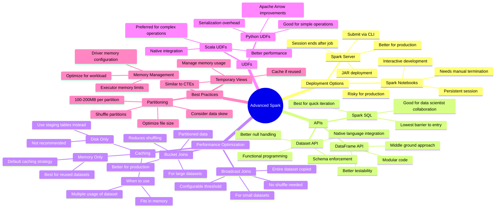

# Advanced Spark Deep Dive: Performance Optimization & API Selection

**Why it matters:** Understanding Spark's various APIs, caching strategies, and join optimizations is crucial for building efficient data pipelines at scale.

**Key takeaways:**

**Spark Server vs. Notebooks:**
* Spark Server deployment (via spark-submit) better mirrors production behavior
* Notebooks convenient for development but risky for production without proper CI/CD
* Notebook caching state can mask performance issues

**Memory & Performance:**
* Caching is only beneficial when data is reused multiple times
* Default executor memory (16GB) often wasteful - tune based on workload
* Use memory-only caching instead of disk caching; prefer staging tables over disk cache
* Broadcast joins effective for small datasets (typically <few GB)
* Set appropriate number of shuffle partitions (aim for 100-200MB per partition)

**API Selection Guide:**
* Spark SQL: Best for quick iteration with data scientists, lowest barrier to entry
* DataFrame API: Good for modular code and testing in PySpark
* Dataset API: Best for Scala Spark, offers compile-time type safety and null handling

**Python vs. Scala Spark:**
* Performance gap between Python and Scala UDFs mostly closed by Apache Arrow
* Dataset API (Scala-only) remains key advantage for Scala Spark
* Choose PySpark unless working at extreme scale or requiring Dataset API features

**Advanced Optimizations:**
* Bucket joins dramatically improve performance for large-scale joins
* Adaptive Query Execution (AQE) helps handle data skew automatically
* Proper partitioning and bucketing can eliminate expensive shuffles

**The bottom line:** Pick APIs and optimizations based on use case scale and team expertise. Start simple with Spark SQL or DataFrames, then optimize with advanced features like bucketing and caching when needed.