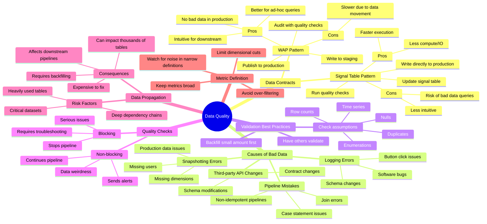

# WAP (Write Audit Publish) Pattern for Data Quality Management

**Why it matters**: Poor data quality can destroy trust, waste time, and cost companies millions in cleanup efforts. The WAP pattern prevents 80-90% of data quality issues before they hit production.

**The big picture**: Two main approaches exist for ensuring data quality:

1. **WAP Pattern** (used by Netflix, Airbnb)
   - Write data to staging
   - Audit with quality checks
   - Publish to production if checks pass
   - Preferred for ad-hoc queries and data consistency

2. **Signal Table Pattern** (used by Facebook)
   - Write directly to production
   - Run quality checks
   - Update signal table to mark data as ready
   - Faster but riskier for ad-hoc queries

**Key causes of bad data**:
- Logging errors and schema changes
- Snapshotting issues
- Production data quality problems
- Pipeline mistakes
- Insufficient validation
- Third-party API changes

**Best practices**:
- Have someone else validate your assumptions
- Start with small backfills (e.g., one month)
- Implement both blocking and non-blocking quality checks
- Keep metrics broad enough to avoid noise
- Be extra careful with heavily-used datasets

**Real-world impact**: At Facebook, one broken contract with their Dim All Users table affected 20,000 downstream pipelines, costing nearly $1 million to fix.