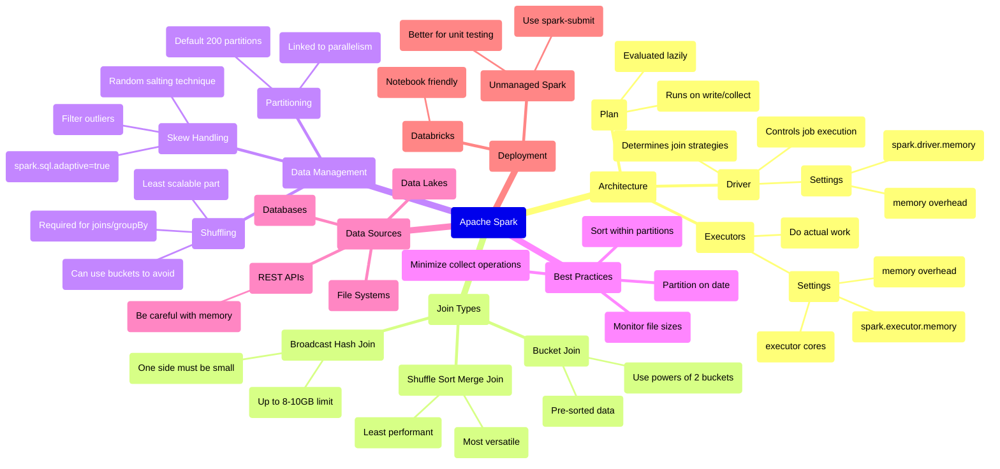

# Apache Spark Fundamentals: Core Concepts & Best Practices

**Why it matters**: Spark is a powerful distributed computing framework that has become the industry standard for processing big data, offering significant improvements over predecessors like Hadoop and Hive.

**Key takeaways:**

**Architecture basics:**
- Driver (coach): Controls job execution and planning
- Executors (players): Perform actual data processing
- Plan: The sequence of operations to be executed

**Memory management essentials:**
- Driver memory typically defaults to 2GB, can go up to 16GB
- Executor memory settings critical for performance
- Best practice: Test with different memory levels (2GB-8GB) to find optimal setting

**Join strategies matter:**
- Shuffle sort merge join: Most versatile but least performant
- Broadcast hash join: Efficient for small datasets (<8-10GB)
- Bucket join: Great for multiple joins on same columns

**Pro tips:**
- Avoid `collect()` on large datasets - use `take()` or `show()` instead
- Use `sortWithinPartitions()` rather than global `sort()` for better performance
- Set partitioning based on date for optimal organization
- Consider cardinality when sorting - low to high cardinality order improves compression

**Smart details:**
- Spark uses lazy evaluation - nothing runs until action is triggered
- Adaptive query execution in Spark 3+ helps handle data skew automatically
- File partitioning on date is crucial for managing large datasets efficiently

**What's next**: Organizations are increasingly adopting Spark for its versatility and performance advantages, though implementation requires careful consideration of data volumes and processing patterns.