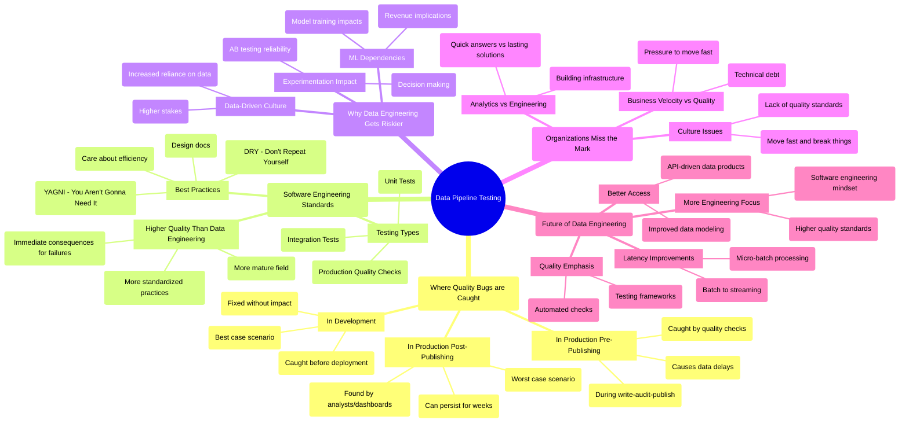

# Testing Spark Data Pipelines: From Development to Production

*Why it matters*: Data quality issues caught late in production can damage trust, impact business decisions, and create costly headaches. Proper testing in development is crucial for maintaining high-quality data pipelines.

🔑 Key points:

### Three scenarios for catching quality bugs:

- **Best case**: Catching bugs in development before deployment
- **Better case**: Catching issues in production during write-audit-publish process 
- **Worst case**: Bugs bypass quality checks and surface in production dashboards

### Software engineering mindset needed:

- Code should be written for humans to read, not just machines to run
- Favor loud failures over silent ones to catch issues early
- Use unit tests and integration tests to verify pipeline logic
- Follow DRY (Don't Repeat Yourself) principles

### Why testing matters more now:

1. Data engineering is becoming more like software engineering
2. Business decisions increasingly rely on data quality
3. Pipeline failures can significantly impact revenue and operations
4. ML models depend on reliable data inputs

### Practical implementation:

- Use frameworks like Chisa for unit testing Spark pipelines
- Separate transformation logic from pipeline execution code
- Create test cases with sample input/output data
- Validate data types and schema compatibility

*The bottom line*: As data engineering evolves and becomes more critical to business operations, adopting software engineering best practices for testing is essential for building reliable, maintainable pipelines.