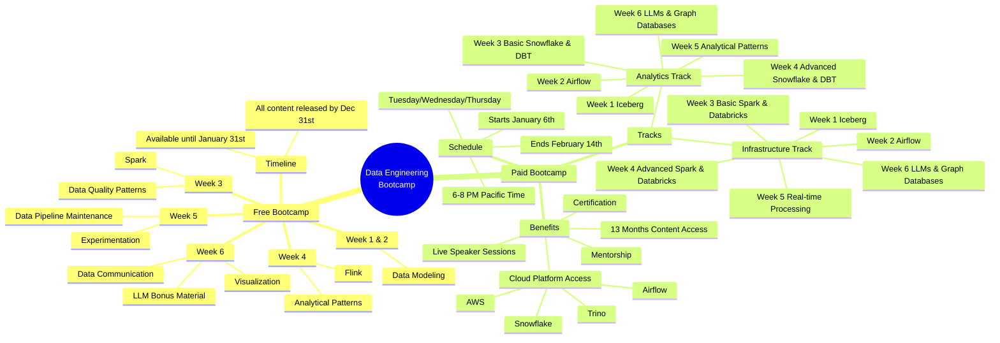

# Data Engineering Boot Camp Live Q&A Summary - Week 3/4 Update

**Why it matters**: The free boot camp is entering its final weeks, covering data quality patterns, Apache Spark, and preparing for Week 4's focus on Flink, Kafka, and analytical patterns.

**Key updates:**
* Content accessible until January 31st, 2024
* Week 4 content on Flink and Kafka releasing tomorrow
* Some labs from Week 3 were removed due to Astronomer Cloud IDE deprecation
* Week 4 includes both real-time processing and analytical patterns (growth accounting, J curves, retention)

**January paid boot camp details:**
* Starts January 6th through February 14th
* Sessions Tuesday-Thursday, 6-8 PM Pacific
* Cost: $2,000 (25% off with code "free boot camp")
* Split tracks available:
  - Analytics: Snowflake, DBT, analytical patterns
  - Infrastructure: Spark, Databricks, real-time processing
  - Optional Week 6 bonus on LLMs and graph databases

**Notable insights:**
* Companies still struggle with basic analytics despite AI hype
* Data engineering roles splitting between platform/infrastructure and analytics paths
* Bachelor's degree remains important for big tech roles - 70% of peers have master's degrees

**The bottom line**: The free boot camp content ends December 31st, but participants have until January 31st to complete assignments. The paid boot camp offers deeper cloud integration, mentorship, and certification opportunities.