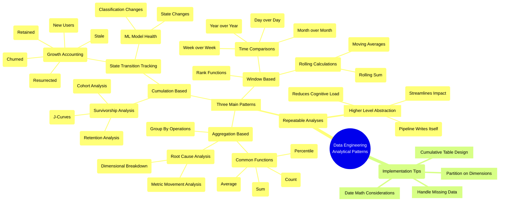

# Growth Accounting & Analytics Design Patterns at Meta

**The big picture:** This lecture covers essential data engineering design patterns used at major tech companies, focusing on growth accounting and survivorship analysis. These patterns help track user engagement, state changes, and retention metrics.

**Key design patterns:**

1. **Growth Accounting**
- Tracks user state changes (new, retained, churned, resurrected, stale)
- Used at Facebook for tracking user activity and notifications
- Applied to ML model monitoring at Netflix and Airbnb
- Built on cumulative table design principles

2. **Survivorship Analysis**
- Measures retention rates over time (J-curves)
- Used for cohort analysis and user engagement tracking
- Applications beyond user metrics (medical survival rates, behavioral changes)
- Key components: state check, reference date, and measurement period

3. **Window-based Analysis**
- Handles time-based comparisons (day-over-day, week-over-week)
- Uses rolling sums and averages for trend analysis
- Requires careful partitioning in big data environments

**Why it matters:** These patterns:
- Reduce cognitive load by providing higher-level abstractions
- Enable faster pipeline development
- Support better monitoring of ML models
- Work across different business contexts

**Real-world impact:** Companies use these patterns to:
- Track user growth and engagement
- Monitor ML model health
- Measure intervention effectiveness
- Support data-driven decision making

**Bottom line:** Understanding these patterns helps data engineers build more efficient pipelines and provides powerful tools for analyzing user behavior and system performance.