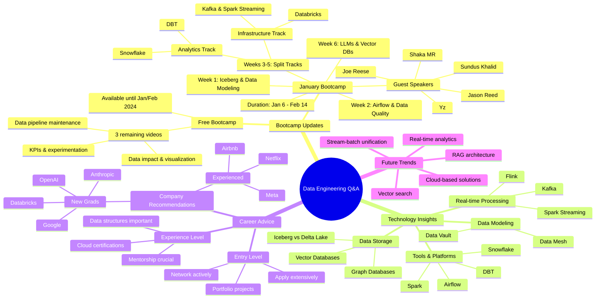

# Data Engineering Live Q&A: Boot Camp Updates & Industry Insights

**The big picture:** Zach Wilson hosted a 90-minute Q&A session from San Francisco, covering the free boot camp wrap-up, January boot camp launch, and various data engineering topics.

**Key announcements:**
- Free boot camp has 3 remaining videos: data impact/visualization, pipeline maintenance, and KPIs/experimentation
- January boot camp (Jan 6 - Feb 14) features high-profile speakers including Joe Reese, Sundus Khalid, and Jason Reed
- Special 30% discount offered (limited spots) for January boot camp enrollment

**Technology takes:**
- Recommends Iceberg over Delta Lake due to eventual merger post-DataBricks' $2B acquisition
- Views Microsoft Fabric as serviceable but not optimal, comparing it to "Microsoft SQL Server of data platforms"
- Emphasizes Scala's continued relevance for high-scale pipelines due to performance advantages

**Career insights:**
- Data structures and algorithms knowledge crucial for high-paying positions ($300K-600K range)
- Google preferred over Netflix for new grads due to established training programs
- Cloud certifications useful but overvalued compared to actual learning

**What's next:** The free boot camp content will be taken down by early February 2024, with the paid January boot camp accepting enrollments until January 4th.