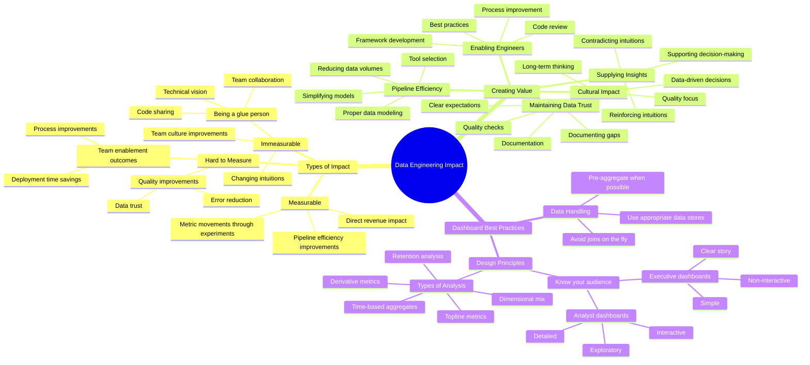

# Impact and Data Visualization Best Practices for Data Engineers

**The big picture:** Data engineering isn't just about moving data around—it's about driving real business impact through quality, efficiency, and enabling better decision-making.

**Key insights:**

* Types of impact:
  - Measurable: Pipeline efficiency improvements, experiment metrics
  - Hard to measure: Data quality improvements, team enablement
  - Immeasurable: Changing leadership intuitions, being a "glue person"

* How to deliver value:
  - Supply high-quality insights to business
  - Prevent bugs and maintain data trust
  - Create efficient pipelines
  - Enable other engineers to work faster
  - Shift culture toward data-driven decisions

**Best practices for dashboards:**

* Executive dashboards:
  - Keep it simple—minimal interactivity
  - Focus on key metrics and trends
  - Use clear annotations for important events
  - Optimize for screenshot-ability

* Analytical dashboards:
  - Include multiple interactive filters
  - Enable deep dives and exploration
  - Show dimensional breakdowns
  - Allow for root cause analysis

**Why it matters:** 85% of dashboards are used only once or never again. The key to adoption is building performant, intuitive visualizations that tell clear stories.

**Smart tips:**

* Pre-aggregate data when possible
* Don't do joins on the fly
* Use appropriate data stores (not S3)
* Match dashboard style to audience
* Document gaps and limitations
* Push back on low-value requests

**Bottom line:** Impact comes from building sustainable, high-quality data solutions—not just churning out quick answers. Focus on long-term value over short-term fixes.