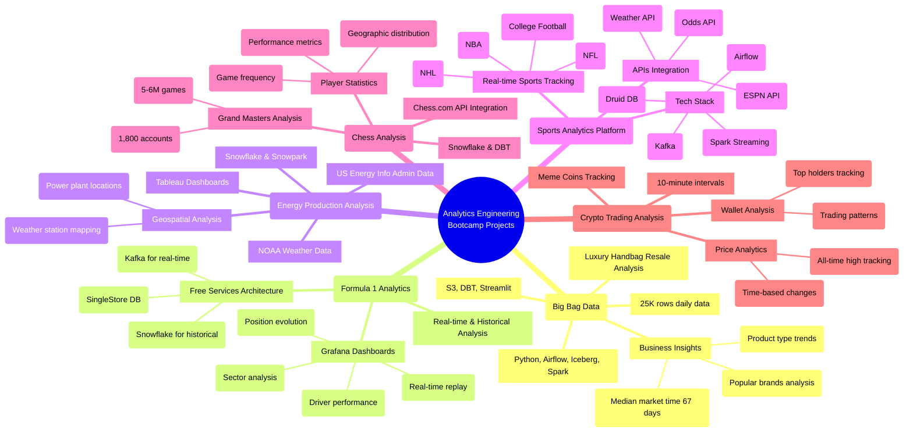

# Innovative Data Engineering Capstone Projects Showcase

**The big picture:** Six analytics engineering students showcased ambitious capstone projects, demonstrating real-world applications ranging from luxury handbag analytics to real-time Formula 1 racing dashboards.

**Key projects:**

* **Big Bag Data (Luxury Resale Analytics)**
  - Built automated pipeline for handbag resale market analysis
  - Integrated multiple data sources using Airflow, Spark, and Iceberg
  - Delivered actionable insights on optimal pricing and inventory strategies

* **Formula 1 Real-Time Analytics**
  - Created zero-cost architecture using free cloud services
  - Built real-time race monitoring with 1-second refresh rates
  - Integrated historical analysis for race performance comparisons

* **Energy Production Analysis**
  - Combined power generation data with weather patterns
  - Used geospatial analysis to match weather stations to power plants
  - Built interactive Tableau dashboards for insights

* **Sports Betting Platform**
  - Integrated real-time odds and scores across multiple sports
  - Built complete streaming pipeline using Kafka and Spark
  - Created live betting probability calculations

* **Chess.com Analytics**
  - Analyzed 6 million games from grandmasters
  - Built player segmentation and performance analytics
  - Created geographical analysis of chess activity

* **Crypto Trading Strategy**
  - Tracked new token launches and market performance
  - Built pipeline for monitoring price movements
  - Developed analytics for identifying successful trading patterns

**Why it matters:** These projects demonstrate how modern data engineering tools can transform raw data into valuable business insights across diverse domains.

**Bottom line:** Students showed impressive technical depth and business acumen, creating production-ready solutions that could potentially evolve into commercial products.