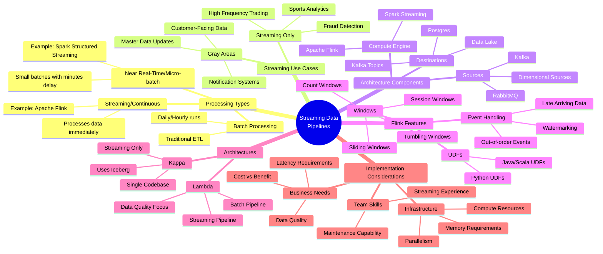

# Real-time Data Processing and Streaming Pipelines: A Practical Guide

🔑 **Why it matters:** Real-time data processing is transforming how businesses handle data, but implementing streaming solutions requires careful consideration of trade-offs between complexity and latency.

**The big picture:** Streaming pipelines process data in low latency (minutes vs. daily batches), but they're significantly more complex than batch processing and require specialized skills.

**Key insights:**

- When stakeholders say "real-time," they rarely mean true streaming (only ~10% of cases). Most often they need reliable, predictable refresh rates
- Streaming is essential for:
  - Fraud detection
  - High-frequency trading
  - Live sports analytics
  - Mission-critical customer-facing applications

**Technical implementation:**

- Apache Flink and Kafka are primary tools for streaming architectures
- Key challenges include:
  - Managing out-of-order events using watermarks
  - Handling late-arriving data
  - Recovering from failures effectively

**Architecture choices:**

- Lambda Architecture: Runs parallel batch and streaming pipelines
  - Pros: Better data quality, reliable backup
  - Cons: Maintains two codebases

- Kappa Architecture: Streaming-only approach
  - Pros: Single codebase
  - Cons: More complex backfills, harder data quality checks

**Smart advice:** Don't build streaming pipelines unless absolutely necessary. Consider:
- Team's streaming expertise
- Actual latency requirements
- Pipeline homogeneity
- Incremental benefit vs. complexity

**Bottom line:** While streaming enables real-time data processing, it's often overused. Most use cases can be effectively served with batch or micro-batch processing, which are simpler to maintain and debug.