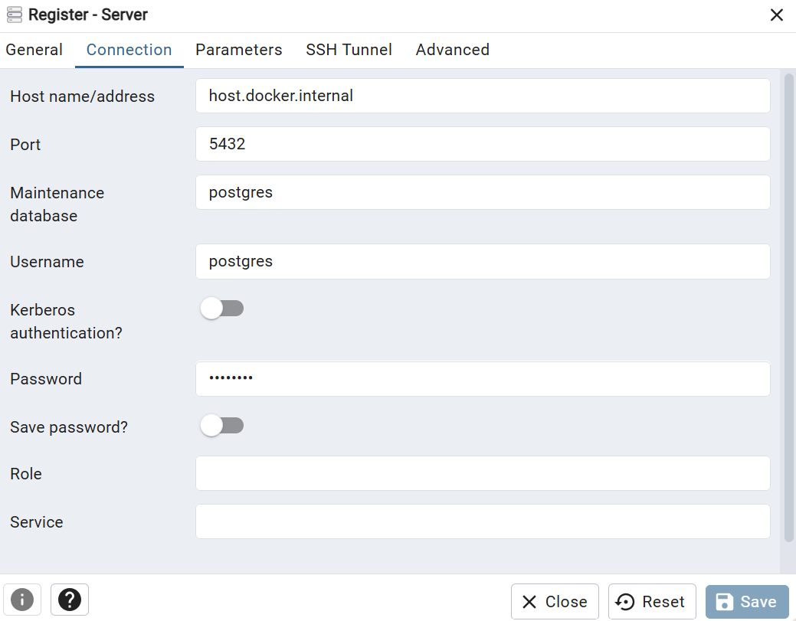

# 📅 Data Modeling

This repository contains the setup for the data modeling modules in Weeks 1 and 2.
 
:wrench: **Tech Stack**

- Git
- Postgres
- PSQL CLI
- Database management environment (DataGrip, DBeaver, VS Code with extensions, etc.)
- Docker, Docker Compose, and Docker Desktop

:pencil: **TL;DR**

1. [Clone the repository](https://github.com/DataExpert-io/data-engineer-handbook/edit/main/bootcamp/materials/1-dimensional-data-modeling/README.md).
2. [Start Postgres instance](https://github.com/DataExpert-io/data-engineer-handbook/edit/main/bootcamp/materials/1-dimensional-data-modeling/README.md#2%EF%B8%8F%E2%83%A3run-postgres).
3. [Connect to Postgres](https://github.com/DataExpert-io/data-engineer-handbook/edit/main/bootcamp/materials/1-dimensional-data-modeling/README.md#threeconnect-to-postgres-in-database-client) using your preferred database management tool.

For detailed instructions and more information, please refer to the step-by-step instructions below.

## 1️⃣ **Clone the repository**

- Clone the repo using the SSH link. This will create a new folder in the current directory on your local machine.
    
    ```bash
    git clone git@github.com:DataExpert-io/data-engineer-handbook.git
    ```
    
    > ℹ️ To securely interact with GitHub repositories, it is recommended to use SSH keys. Follow the instructions provided **[here](https://docs.github.com/en/authentication/connecting-to-github-with-ssh/adding-a-new-ssh-key-to-your-github-account)** to set up SSH keys on GitHub.
    > 

- Navigate into the cloned repo using the command line:
    
    ```bash
    cd data-engineer-handbook/bootcamp/materials/1-dimensional-data-modeling
    ```

## 2️⃣ **Run Postgres**

There are two methods to get Postgres running locally.

### 💻 **Option 1: Run on local machine**

1. Install Postgres
    - For Mac: Follow this **[tutorial](https://daily-dev-tips.com/posts/installing-postgresql-on-a-mac-with-homebrew/)** (Homebrew is really nice for installing on Mac)
    - For Windows: Follow this **[tutorial](https://www.sqlshack.com/how-to-install-postgresql-on-windows/)**
2. Run this command after replacing **`<computer-username>`** with your computer's username:

    ```bash
    pg_restore -U <computer-username> -d postgres data.dump
    ```

    If you have any issue, the syntax is `pg_restore -U [username] -d [database_name] -h [host] -p [port] [backup_file]`
    
3. Set up DataGrip, DBeaver, or your VS Code extension to point at your locally running Postgres instance.
4. Have fun querying!

### 🐳 **Option 2: Run Postgres and PGAdmin in Docker**

- Install Docker Desktop from **[here](https://www.docker.com/products/docker-desktop/)**.
- Copy **`example.env`** to **`.env`**:
    
    ```bash
    cp example.env .env
    ```

- Start the Docker Compose container:
    - If you're on Mac:
        
        ```bash
        make up
        ```
        
    - If you're on Windows:
        
        ```bash
        docker compose up -d
        ```
        
- A folder named **`postgres-data`** will be created in the root of the repo. The data backing your Postgres instance will be saved here.
- You can check that your Docker Compose stack is running by either:
    - Going into Docker Desktop: you should see an entry there with a drop-down for each of the containers running in your Docker Compose stack.
    - Running **`docker ps -a`** and looking for the containers with the name **`postgres`**.
- If you navigate to **`http://localhost:5050`** you will be able to see the PGAdmin instance up and running and should be able to connect to the following server:
    
Where:
    - Host name: host.docker.internal (Or container name i.e my-postgres-container)
    - Port: 5432
    - Username: postgres
    - Password: postgres


- When you're finished with your Postgres instance, you can stop the Docker Compose containers with:
    
    ```bash
    make down
    ```
    
    Or if you're on Windows:
    
    ```bash
    docker compose down -v
    ```

### :rotating_light: **Need help loading tables?** :rotating_light:

> Refer to the instructions below to resolve the issue when the data dump fails to load tables, displaying the message `PostgreSQL Database directory appears to contain a database; Skipping initialization.`
> 

## :three: **Connect to Postgres in Database Client**

- Some options for interacting with your Postgres instance:
    - DataGrip - JetBrains; 30-day free trial or paid version.
    - VSCode built-in extension (there are a few of these).
    - PGAdmin.
    - Postbird.
- Using your client of choice, follow the instructions to establish a new PostgreSQL connection.
    - The default username is **`postgres`** and corresponds to **`$POSTGRES_USER`** in your **`.env`**.
    - The default password is **`postgres`** and corresponds to **`$POSTGRES_PASSWORD`** in your **`.env`**.
    - The default database is **`postgres`** and corresponds to **`$POSTGRES_DB`** in your **`.env`**.
    - The default host is **`localhost`** or **`0.0.0.0`.** This is the IP address of the Docker container running the PostgreSQL instance.
    - The default port for Postgres is **`5432` .** This corresponds to the **`$CONTAINER_PORT`** variable in the **`.env`** file.
    
    &rarr; :bulb: You can edit these values by modifying the corresponding values in **`.env`**.
    
- If the test connection is successful, click "Finish" or "Save" to save the connection. You should now be able to use the database client to manage your PostgreSQL database locally.

## **🚨 Tables not loading!? 🚨**
- If you're seeing errors about `error: invalid command \N`, you should use `pg_restore` to load `data.dump`.
```bash
  pg_restore -U $POSTGRES_USER -d $POSTGRES_DB data.dump
```
- If you are on Windows and used **`docker compose up`**, table creation and data load will not take place with container creation. Once you have docker container up and verified that you are able to connect to empty postgres database with your own choice of client, follow the following steps:
1. On Docker desktop, connect to my-postgres-container terminal.
2. Run:
    ```bash
    psql \
        -v ON_ERROR_STOP=1 \
        --username $POSTGRES_USER \
        --dbname $POSTGRES_DB \
        < /docker-entrypoint-initdb.d/data.dump
    ```
    - → This will run the file `data.dump` from inside your docker container.

- If the tables don't come with the loaded data, follow these steps with manual installation of postgres:

1. Find where your `psql` client is installed (Something like `C:\\Program Files\\PostgreSQL\\13\\runpsql.bat`)
2. Make sure you're in the root of the repo, and launch `psql` by running that `.bat` script
3. Enter your credentials for postgres (described in the connect to postgres section)
    - → If the above worked, you should now be inside a psql REPL (It looks like `postgres=#`)
4. Run:
    
    ```bash
    postgres=# \\i data.dump
    ```
    
    - → This will run the file `data.dump` from inside your psql REPL.

- If you did the setup using Option 2, and the tables are not in the database, another solution is to: 

1. Find the container id by running `docker ps` - under CONTAINER ID
2. Go inside the container by executing `docker exec -it <container_name_or_id> bash`
3. Run `pg_restore -U $POSTGRES_USER -d $POSTGRES_DB /docker-entrypoint-initdb.d/data.dump` 

---

#### 💡 Additional Docker Make commands

- To restart the Postgres instance, you can run **`make restart`**.
- To see logs from the Postgres container, run **`make logs`**.
- To inspect the Postgres container, run **`make inspect`**.
- To find the port Postgres is running on, run **`make ip`**.
