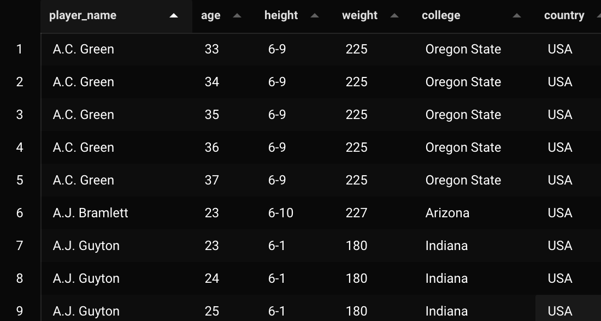

# Day 1 - Lab

<aside>


[Instructions to setup the lab](https://github.com/DataExpert-io/data-engineer-handbook/blob/6c32b89b9cc845471ebbfae327e71d434d569bc6/bootcamp/materials/1-dimensional-data-modeling/README.md#2%EF%B8%8F%E2%83%A3run-postgres)

</aside>

We’re gonna be working with this table.

```sql
SELECT * FROM player_seasons;
```

The problem with this table is that the player has duplicate for each seasons.



Due to this temporal problem, if we were to join it with something downstream, it would cause shuffling to happen and we would lose compression.

We wanna create a table with an array of all their seasons and related season stats, i.e. all those dimensions that change season by season.

So player dimensions (height, name, college etc…) we keep in the base table as normal attributes because those don’t change through time.

We create a `season_stats` struct type, that will be the item of the “seasons array”. In other words, each player will have an array of `season_stats`.

```sql
CREATE TYPE season_stats AS
(
    season integer,
    gp integer, -- games played
    pts real, -- points
    reb real, -- rebounds
    ast real -- assists
);
```

The next step is to create the `players` table.

```sql
CREATE TABLE IF NOT EXISTS players
(
    player_name text,
    height text,
    college text,
    country text,
    draft_year text,
    draft_round text,
    draft_number text,
    season_stats season_stats[], -- !!! the ARRAY<season_stats> !!!
    current_season integer,
    PRIMARY KEY (player_name, current_season)
)
```

Notice we add a `current_season` column, this is because **we are building this table cumulatively**, so as we do the outer join, `current_season` will be whatever the **latest value** in the seasons table is (will make more sense later).

Now we’re gonna work on the `FULL OUTER JOIN` logic.

```sql
WITH
yesterday AS (
    SELECT * FROM players
    WHERE current_season = 1995 -- 1 year before 1st season available
),

today AS (
    SELECT * FROM player_seasons
    WHERE season = 1996
)

-- this will give us the **cumulation** between "today" and "yesterday".

SELECT *
FROM today t
FULL OUTER JOIN yesterday y
    ON t.player_name = y.player_name
```

Running this query you will notice that all values from `yesterday` are `NULL`.

So we want to `COALESCE` the values that are not temporal, i.e. that don’t change through time.

```sql
-- [..]

SELECT
    COALESCE(t.player_name, y.player_name) AS player_name,
    COALESCE(t.height, y.height) AS height,
    COALESCE(t.college, y.college) AS college,
    COALESCE(t.country, y.country) AS country,
    COALESCE(t.draft_year, y.draft_year) AS draft_year,
    COALESCE(t.draft_round, y.draft_round) AS draft_round,
    COALESCE(t.draft_number, y.draft_number) AS draft_number
FROM today t
FULL OUTER JOIN yesterday y
    ON t.player_name = y.player_name
```

Obviously this doesn’t do a lot yet, but it’s the basis of cumulation, we we start building the `seasons` array.

```sql
-- [..]
COALESCE(t.draft_number, y.draft_number) AS draft_number,
CASE
    WHEN y.season_stats IS NULL -- if yesterday has no stats we create
        THEN ARRAY[ROW(
            t.season,
            t.gp,
            t.pts,
            t.reb,
            t.ast
        )::season_stats]
    WHEN t.season IS NOT NULL -- if player is still playing we append
        THEN y.season_stats || ARRAY[ROW(
            t.season,
            t.gp,
            t.pts,
            t.reb,
            t.ast
        )::season_stats]
    ELSE y.season_stats -- if player is not playing anymore we don't add anything
END AS season_stats,

-- this is gonna give us the current season value, as it takes either
-- the current season (t.season) or "yesterday's" season (y.) plus one.
COALESCE(t.season, y.current_season + 1) AS current_season;
```

We now turn this into an insert statement, to start the cumulation.

```sql
INSERT INTO players

WITH
yesterday AS (
    SELECT * FROM players
    WHERE current_season = 1995
),

today AS (
    SELECT * FROM player_seasons
    WHERE season = 1996
)

SELECT
    COALESCE(t.player_name, y.player_name) AS player_name,
    COALESCE(t.height, y.height) AS height,
    COALESCE(t.college, y.college) AS college,
    COALESCE(t.country, y.country) AS country,
    COALESCE(t.draft_year, y.draft_year) AS draft_year,
    COALESCE(t.draft_round, y.draft_round) AS draft_round,
    COALESCE(t.draft_number, y.draft_number) AS draft_number
    CASE
        WHEN y.season_stats IS NULL -- if yesterday has no stats we create
            THEN ARRAY[ROW(
                t.season,
                t.gp,
                t.pts,
                t.reb,
                t.ast
            )::season_stats]
        WHEN t.season IS NOT NULL -- if player is still playing we append
            THEN y.season_stats || ARRAY[ROW(
                t.season,
                t.gp,
                t.pts,
                t.reb,
                t.ast
            )::season_stats]
        ELSE y.season_stats -- if player is not playing anymore we don't add anything
    END AS season_stats,
    COALESCE(t.season, y.current_season + 1) AS current_season;

FROM today t
FULL OUTER JOIN yesterday y
    ON t.player_name = y.player_name
```

If you know repeat this operation bumping the year by 1 each time, you will start cumulating the values, season by season. For instance, this is what you’re going to see after 2 cumulations (when `current_season = 1997`)


See the player highlighted in yellow, only has 1 element in the array? It’s because he joined in 1997, and didn’t play in 1996.

The table `players` can easily be turned back into `player_seasons`.

```sql
WITH

unnested AS (
  SELECT
    player_name,
    UNNEST(season_stats)::season_stats as season_stats
  FROM players
  WHERE current_season = 2001
  AND player_name = 'Michael Jordan'
)

SELECT player_name, (season_stats::season_stats).*
FROM unnested;
```


Another secondary benefit of this is that when you unnest this, it’s already gonna be sorted, which can take advantage of run length encoding compression. Try removing ‘Michael Jordan’ from the filter.


Let’s now drop the players table so we can do some extra stuff. We want to create a `scoring_class` column that is based on the points a player scores.

```sql
DROP TABLE players

CREATE TYPE scoring_class AS ENUM('star', 'good', 'average', 'bad');

CREATE TABLE IF NOT EXISTS players
(
    player_name text,
    height text,
    college text,
    country text,
    draft_year text,
    draft_round text,
    draft_number text,
    season_stats season_stats[],
    scoring_class scoring_class,
    years_since_last_season integer,
    current_season integer,
    PRIMARY KEY (player_name, current_season)
);
```

Now to our previous cumulative query we need to add 2 more columns, right before `current_season`.

```sql
-- [..]

CASE
    WHEN t.season IS NOT NULL THEN -- if they're active this season, give them score
        CASE WHEN t.pts > 20 THEN 'star'
                 WHEN t.pts > 15 THEN 'good'
                 WHEN t.pts > 10 THEN 'average'
                 ELSE 'bad'
        END::scoring_class
    ELSE y.scoring_class -- else keep previous score
END AS scoring_class,

CASE
    WHEN t.season IS NOT NULL THEN 0 -- if they're active, then 0 years since last season
    ELSE y.years_since_last_season + 1
END AS years_since_last_season,

COALESCE(t.season, y.current_season + 1) AS current_season

FROM today t
FULL OUTER JOIN yesterday y
    ON t.player_name = y.player_name;
```

Then repeat the same thing we did above, cumulating the table by running the query year by year until 2001 or so.

Let’s now run some analytics:

```sql
SELECT
    player_name,
    season_stats[CARDINALITY(season_stats)].pts
        / CASE WHEN season_stats[1].pts = 0 THEN 1 ELSE season_stats[1].pts END
        AS improvement
FROM players
WHERE current_season = 2001
ORDER BY 2 DESC
```

This gives us which player has improved the most from their 1st season to their latest one.

Notice that this query doesn’t have a `GROUP BY`, whereas normally this would be done by doing some kind of aggregation, a `min` and `max` probably. This one has none of this, which means it is insanely fast (if you exclude the `ORDER BY`) and has **NO SHUFFLE**.

In ‘map-reduce’ terms, this query can be done exclusively with a **map** step, and no reduce, which means it can be parallelized infinitely.
