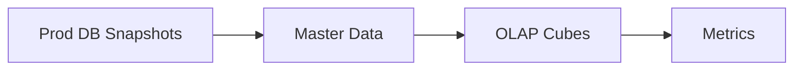
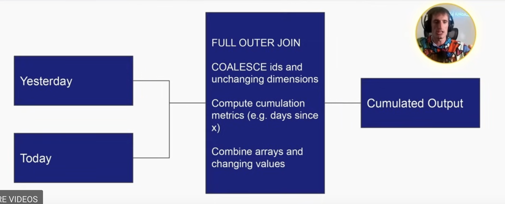

# Day 1 - Lecture

# Intro

Dimensions are attributes of an entity. Some of them may IDENTIFY an entity (e.g. user’s ID). Other dimensions are just attributes.

Dimensions come in two flavors

- Slowly-changing → May change through time, e.g. favorite food.
- Fixed → Can’t change through time, e.g. birth date.

<aside>
✏️

**Topics**

- Knowing your data consumer
- OLTP vs OLAP data modeling
- Cumulative table design
- The compactness vs usability tradeoff
- Temporal cardinality explosion
- Run-length encoding compression gotchas

</aside>

# Knowing your customer

First thing when modeling data is to think “who’s gonna use this?”.  It’s an exercise in empathy.

- **Data analysts / data scientists** → Easy data to query. Flat. Not many complex data types. Don’t wanna make their job hard with these datasets.
- **Other data engineers** → Should be compact and probably harder to query. Nested types are ok.
  - *Master data set* → a dataset upon which many other are built.
- **ML models** → depends on the model and how its trained. But most times it’s ID and flat data.
- **Customers** → Should be very easy to interpret. Charts.

In short, you have to understand how the data is being used. Otherwise, you’re gonna waste a lot of time and money.

# OLTP vs master data vs OLAP

- **OLTP** (online transaction processing) → mostly outside the realm of data engineers, you know what this is. Optimized for low-latency, low-volume queries.
- **OLAP** (online analytical processing) → most common data modeling for data engineers. Optimize for large volume, GROUP BY queries, minimizes JOINs.

Obviously these two models are opposite to each other and incompatible in functions. This is where *master data* comes in help.

- **Master data** → Entities deduped and with very compete definitions for your entities. Sits in the middle between OLTP and OLAP.

## Mismatching needs = less business value

Some of the biggest problems in DE occur when data is modeled for the wrong customer.

E.g. modeling an OLTP system like OLAP would make it very slow and inefficient, as the queries would fetch way more data than necessary. In the opposite case, it also would be inefficient but for different reasons. One is gonna end up with a lot of JOINs and shuffles that expensive and slow.

Master data can be plugged in the middle to help make the transition between OLTP and OLAP.

- Prod DB → 40 normalized tables
- Master data → Unified table but still normalized and dedupet. Very complete
- OLAP Cubes → Flatten the data out, multiple rows per entity. This is where one does aggregates, group bys etc…
- Metrics → Aggregate an OLAP Cube even more and get 1 number.

# Cumulative Table Design

One thing that can happen when building master data is that some days, not every user is gonna show up *[this is assuming that our data effectively includes user — Ed.].*

Master data should keep all history. A cumulative table is all about holding on all the dimensions that ever existed (maybe up until a point).

**Core components**

- 2 dataframes (yesterday and today)
- `FULL OUTER JOIN` the two data frames together → The reason is that yesterday’s data might not be present in today’s data and viceversa. With this, you get the whole set.
- `COALESCE` values to keep everything.
- This way you can hang onto all of history.

**Usages**

- **Growth analytics** at Facebook (`dim_all_users`). Also used as the master source for all users’ data.
- **State transition tracking** → in practice, it keeps track of a state of a user across time. E.g. was active, now inactive: *churned*. Was inactive, now active: *resurrected*, and so on.

If you’re starting cumulation today, yesterday will be NULL. Otherwise, it contains all the user history from when you started cumulation.

In the case of Facebook, for instance, you can kick out of the table a user that has been inactive for the past 180 days (this is just ONE of the possible filters).

Pruning the table is necessary, otherwise the size of this table would spiral out of control, when dealing with sizes such as Facebook’s.

This kind of table allows to easily calculate cumulative metrics, like `days_since_last_active`. Each time you compute the cumulative table, you can for instance just add `+1` to that field if that’s the case.

**Strenghts**

- Historical analysis without shuffles (GROUP BYs, JOINs etc…)
- Easy “transition” analysis

**Drawbacks**

- Can only be backfilled sequentially
- Handling PII data can be a mess since deleted/inactive users get carried forward

# Compactness vs usability tradeoff

- **The most usable tables** → Straightforward. Very easy to manipulate with WHERE and GROUP BY. No complex data types.
- **The most compact tables** → Not human readable. Usually they have an ID and some blob of data to keep it as compressed as possible, and can’t really be queried until they’re decoded.
- **The middle-ground tables** → Use complex data types (e.g. ARRAY, MAP, STRUCT) making querying trickier but also compacting more.

Each of them have their own use case. The most usable tables are analytics focused, whereas the most compact ones are more SWE / production data focused.

## When would you use each type?

- **Most compact**
  - Online systems where latency and data volumes matter a lot. Consumers are usually highly technical.
- **Middle ground**
  - Upstream staging / master data where the majority of consumers are other data engineers (that might be creating other tables for other people)
- **Most usable**
  - When analytics is the main consumer and the majority of consumers are less technical

## Struct vs Array vs Map

- **Struct** → Like a table inside a table
  - Keys are rigidly defined, compression is good!
  - Values can be any type
- **Map**
  - Keys are loosely defined, compression is ok!
  - All values have to be the same type
- **Array**
  - Ordinal
  - List of values that all have to be the same type (but these could be also Maps of Structs)

# Temporal Cardinality Explosions of Dimensions

When you add a temporal aspect to your dimensions and the cardinality increases by at least 1 order of magnitude.

Example: In AirBnb you have 6 million “listings”, but a listing has a calendar and the calendar has “nights”, so you end up having a `listing_night`, which is its own entity, in some way.

How do you model this? As 6 million listings? Or 2 billion nights?

- If we want to know the nightly pricing pricing and availability of each night for the next year, that’s 365 * 6 million or about ~2 billion nights.

Should this dataset be:

- Listing-level with an array of nights?
- Listhing_night level with 2 billion rows?

By **doing the sorting right,** Parquet will keep these two about the same size.

## Badness of denormalized temporal dimensions

If you explode it out (the previous example, i.e. at the `listing_night` lvl) and need to join other dimensions, shuffle will ruin your compression, because run-length encoding won’t work well in this case.

Same data, run-length encoded:

After a join (Spark Shuffle):

**Two ways to solve this problem:**

1. After joining this dataset, re-sort it. *[Zach doesn’t recommend this one, says only sort you data once, and then if someone else does it instead of you, you have to tell them to resort the data, not convenient. — Ed.]*
2. Instead of having all these player names and seasons broken out on separate rows, have 1 row per player name, and then an array of seasons. Here we can join on player name, and then AFTER the join, we can explode out the seasons array, and it keeps the sorting!

> Remember that Spark Shuffle fucks with the ordering of the data. It’s good for join but can mess with your table size.
>