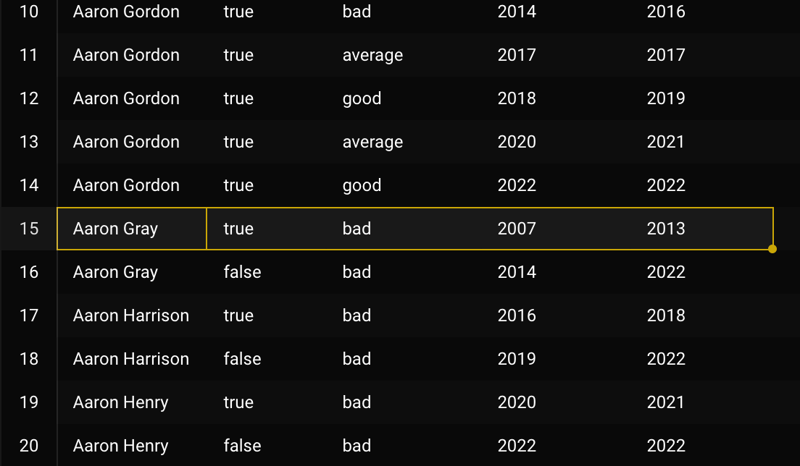

# Day 2 - Lab

In this lab, we will take the datasets created in first lab and convert them in SCDs of type 2.

First we need to recreate the `players` table because Zach forgot to add something during first lab.

```sql
DROP TABLE players;

CREATE TABLE players
(
    player_name text,
    height text,
    college text,
    country text,
    draft_year text,
    draft_round text,
    draft_number text,
    season_stats season_stats[],
    scoring_class scoring_class,
    years_since_last_season integer,
    current_season integer,
    is_active boolean, -- ADDED COLUMN
    PRIMARY KEY (player_name, current_season)
);

-- All this crazy query does is it recreates the `player` table
-- as we had it in lab 1 and adds the `is_active` column.
-- Just copy paste it and run it
INSERT INTO players
WITH
years AS (
    SELECT *
    FROM GENERATE_SERIES(1996, 2021) AS season
),

p AS (
  SELECT
      player_name,
      MIN(season) AS first_season
  FROM player_seasons
  GROUP BY player_name
),

players_and_seasons AS (
  SELECT *
  FROM p
  JOIN years y
      ON p.first_season <= y.season
),

windowed AS (
  SELECT
    pas.player_name,
    pas.season,
    ARRAY_REMOVE(
      ARRAY_AGG(
        CASE
          WHEN ps.season IS NOT NULL
            THEN ROW(
              ps.season,
              ps.gp,
              ps.pts,
              ps.reb,
              ps.ast
            )::season_stats
        END)
      OVER (PARTITION BY pas.player_name ORDER BY COALESCE(pas.season, ps.season)),
      NULL
    ) AS seasons
  FROM players_and_seasons pas
  LEFT JOIN player_seasons ps
      ON pas.player_name = ps.player_name
      AND pas.season = ps.season
  ORDER BY pas.player_name, pas.season
),

static AS (
  SELECT
    player_name,
    MAX(height) AS height,
    MAX(college) AS college,
    MAX(country) AS country,
    MAX(draft_year) AS draft_year,
    MAX(draft_round) AS draft_round,
    MAX(draft_number) AS draft_number
  FROM player_seasons
  GROUP BY player_name
)

SELECT
  w.player_name,
  s.height,
  s.college,
  s.country,
  s.draft_year,
  s.draft_round,
  s.draft_number,
  seasons AS season_stats,
  CASE
    WHEN (seasons[CARDINALITY(seasons)]::season_stats).pts > 20 THEN 'star'
    WHEN (seasons[CARDINALITY(seasons)]::season_stats).pts > 15 THEN 'good'
    WHEN (seasons[CARDINALITY(seasons)]::season_stats).pts > 10 THEN 'average'
    ELSE 'bad'
  END::scoring_class AS scoring_class,
  w.season - (seasons[CARDINALITY(seasons)]::season_stats).season AS years_since_last_active,
  w.season,
  (seasons[CARDINALITY(seasons)]::season_stats).season = season AS is_active
FROM windowed w
JOIN static s
  ON w.player_name = s.player_name;
```

# SCD2 - full scan

Let’s now create the SCD table for the players. We want to track changes in two columns: `scoring_class` and `is_active`.

```sql
CREATE TABLE players_scd (
    player_name text,
    scoring_class scoring_class,
    is_active boolean,
    start_season integer,
    end_season integer,
    current_season integer, -- this can be thought of the "date" partition
    PRIMARY KEY (player_name, start_season)
);

SELECT
    player_name,
    current_season,
    scoring_class,
    is_active,
    LAG(scoring_class, 1) OVER(PARTITION BY player_name ORDER BY current_season) AS previous_scoring_class,
    LAG(is_active, 1) OVER(PARTITION BY player_name ORDER BY current_season) AS previous_is_active
FROM players;
```

The window functions allow us to check the value of the previous season for both `scoring_class` and `is_active`. We’re building our SCD2 on based on this logic.

We now create an indicator of whether or not one of `scoring_class` or `is_active` has changed.

```sql
WITH
with_previous as (
    SELECT
        player_name,
        current_season,
        scoring_class,
        is_active,
        LAG(scoring_class, 1) OVER(PARTITION BY player_name ORDER BY current_season) AS previous_scoring_class,
        LAG(is_active, 1) OVER(PARTITION BY player_name ORDER BY current_season) AS previous_is_active
    FROM players
)

SELECT
    *,
    CASE
        WHEN scoring_class <> previous_scoring_class THEN 1
        ELSE 0
    END AS scoring_class_change_indicator,
    CASE
        WHEN is_active <> previous_is_active THEN 1
        ELSE 0
    END AS is_active_change_indicator
FROM with_previous;
```

Let’s add this last part of the query to another CTE, and combine the two indicators into a single one, so that tracking changes becomes easier.

```sql
-- [..]

with_indicators AS (
    SELECT
        *,
        CASE
            WHEN scoring_class <> previous_scoring_class THEN 1
            WHEN is_active <> previous_is_active THEN 1
            ELSE 0
        END AS change_indicator
    FROM with_previous
)

SELECT
    *,
    SUM(change_indicator) OVER(PARTITION BY player_name ORDER BY current_season) AS streak_identifier
FROM with_indicators;
```

This `streak_identifier` shows how long a player stayed the same value, over time, and also when some dimension (either `scoring_class` or `is_active`) changes.

We add another CTE

```sql
-- [..]

with_streaks AS (
    SELECT
        *,
        SUM(change_indicator) OVER(PARTITION BY player_name ORDER BY current_season) AS streak_identifier
    FROM with_indicators
)

SELECT
    player_name,
    scoring_class,
    is_active,
    MIN(current_season) AS start_season,
    MAX(current_season) AS end_season,
    -- 👇 imagine in some sort of pipeline this is a parameter you inject
    -- [not exactly sure what Zach means here -- Ed.]
    2021 AS current_season
FROM with_streaks
GROUP BY player_name, streak_identifier, is_active, scoring_class
ORDER BY player_name, streak_identifier
```

You can already see from the results that the table is almost done. For each player, every row represents a “streak” where its dimensions (`is_active` and `scoring_class`) were constant.

The “duration” of each row (or in other words, its validity range) can be arbitrarily large (see highlighted row in screenshot).



So, now that we have built out the SCD2, let’s actually add it to the table. We just need to append `INSERT INTO` to the big ass query we just wrote:

```sql
INSERT INTO players_scd

WITH
with_previous as (
    SELECT
        player_name,
        current_season,
        scoring_class,
        is_active,
        LAG(scoring_class, 1) OVER(PARTITION BY player_name ORDER BY current_season) AS previous_scoring_class,
        LAG(is_active, 1) OVER(PARTITION BY player_name ORDER BY current_season) AS previous_is_active
    FROM players
    **WHERE current_season <= 2021**
    -- we add this filter so that we can use 2022 in the incremental build
),

with_indicators AS (
    SELECT
        *,
        CASE
            WHEN scoring_class <> previous_scoring_class THEN 1
            WHEN is_active <> previous_is_active THEN 1
            ELSE 0
        END AS change_indicator
    FROM with_previous
),

with_streaks AS (
    SELECT
        *,
        SUM(change_indicator) OVER(PARTITION BY player_name ORDER BY current_season) AS streak_identifier
    FROM with_indicators
)

SELECT
    player_name,
  scoring_class,
    is_active,
    MIN(current_season) AS start_season,
    MAX(current_season) AS end_season,
  2021 AS current_season
FROM with_streaks
GROUP BY player_name, streak_identifier, is_active, scoring_class;
```

This query has some expensive parts that Zach doesn’t like:

- Window functions on the entire dataset
- Aggregation at the end
- Scans all history every time

Working with dimensions however, you can do crazy stuff like this because dimensional data is, in general, quite small w.r.t. fact data, so even re-scanning all table every time is quite legit, and probably more convenient than dealing with the complexities of the alternative.

The alternative approach is an incremental build, which however is more prone to OOM, skew and other problems. E.g. imagine one guy that has a change every single time, or in other words, some people that are not as “slowly changing” as others, you end up having with many streaks for that specific user, and it blows up the cardinality of the final table.

# SCD2 - incremental

This time, we create the SCD table but incrementally.

What Zach is doing here is showing how the incremental query can be built, by taking advantage of the pre-existing SCD2 table.

Note that

```sql
SELECT max(end_season) FROM players_scd;
```

returns `2021`. So basically, our SCD table latest changes are at most from 2021 (thanks to the filter we added above). In this new query, we’re adding data from 2022, this time incrementally.

This query is built as a union of different CTEs, each representing a different piece of the data. Let’s take a brief look:

- **historical_scd**
All historical records for all players up to the 2nd to last one (i.e., up to 2020 in our case)
- **unchanged_records**
All records (from last period, 2021) that didn’t change, with the valid end date (`end_season`) bumped by one
- **unnested_changed_records**
All records for players where the dimensions changed. These include both last period (2021) as well as new period (2022). That’s because in the `historical_scd`, we don’t include the last period.
- **new_records**
This is quite self explanatory. All records that didn’t exist in the last period (2021) but only in the new one (2022). These are basically the new players.

```sql
-- we start by creating a TYPE, but this is only necessary in postgres
CREATE TYPE scd_type AS (
    scoring_class scoring_class,
    is_active boolean,
    start_season integer,
    end_season integer
)

-- this is the actual incremental query
WITH
last_season_scd AS ( -- latest, current record for all players
    SELECT * FROM players_scd
    WHERE current_season = 2021
    AND end_season = 2021
),

historical_scd AS ( -- historical records for all players, one per period
    SELECT
        player_name,
        scoring_class,
        is_active,
        start_season,
        end_season
    FROM players_scd
    WHERE current_season = 2021
    AND end_season < 2021
),

this_season_data AS ( -- new incoming data
    SELECT * FROM players
    WHERE current_season = 2022
),

unchanged_records AS ( -- records that didn't change between new data and latest records
    SELECT
        ts.player_name,
        ts.scoring_class,
        ts.is_active,
        ls.start_season,
        ts.current_season AS end_season
        -- for these records we increase `current_season` by 1
        -- or in other words, we increase the range of the validity period
        -- HINT: read `start_season` and `end_season` as `valid_from`, `valid_to`
    FROM this_season_data ts
        JOIN last_season_scd ls
        ON ls.player_name = ts.player_name
    WHERE ts.scoring_class = ls.scoring_class
    AND ts.is_active = ls.is_active
),

-- players with changed data
-- this one has 2 records per player
-- one for this period, one for previous (in this case 2022 and 2021)
changed_records AS (
    SELECT
        ts.player_name,
        UNNEST(ARRAY[
            ROW(
                ls.scoring_class,
                ls.is_active,
                ls.start_season,
                ls.end_season
            )::scd_type,
            ROW(
                ts.scoring_class,
                ts.is_active,
                ts.current_season,
                ts.current_season
            )::scd_type
        ]) AS records
    FROM this_season_data ts
        LEFT JOIN last_season_scd ls
        ON ls.player_name = ts.player_name
    WHERE ts.scoring_class <> ls.scoring_class
    OR ts.is_active <> ls.is_active
),

-- builds from previous CTE, just makes it more readable
unnested_changed_records AS (
    SELECT
        player_name,
        (records).scoring_class,
        (records).is_active,
        (records).start_season,
        (records).end_season
    FROM changed_records
),

new_records AS ( -- new players that were not in the dataset before
    SELECT
        ts.player_name,
        ts.scoring_class,
        ts.is_active,
        ts.current_season AS start_season,
        ts.current_season AS end_season
    FROM this_season_data ts
        LEFT JOIN last_season_scd ls
        ON ts.player_name = ls.player_name
    WHERE ls.player_name IS NULL
    -- only include those players that don't exist in last_season (ls)
)

SELECT * FROM historical_scd

UNION ALL

SELECT * FROM unchanged_records

UNION ALL

SELECT * FROM unnested_changed_records

UNION ALL

SELECT * FROM new_records
```

This query looks quite insane, but it processes a lot less data than the other one, as it only processes the compacted data from 2022 and 2021. However, it needs quite attention since it is quite convoluted.

Also, we made some assumptions here, in that `scoring_class` and `is_active` can never be `NULL`, but in reality they can, so one should keep that in consideration (since equality with `NULL` doesn’t make sense in SQL, so one should have to use stuff like `is distinct from` or do two checks).
