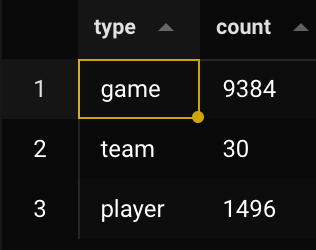

# Day 3 - Lab

In this lab, we will build a graph data model to see which NBA players play with each other and in which team.

In the lecture we talked a lot about **vertices** and **edges**, so let’s create those tables now.

```sql
CREATE TYPE vertex_type
    AS ENUM('player', 'team', 'game');

CREATE TABLE vertices (
    identifier TEXT,
    type vertex_type,
    properties JSON, -- because postgres doesn't have a MAP type
    PRIMARY KEY (identifier, type)
);

CREATE TYPE edge_type
    AS ENUM (
        'plays_against', -- a player
        'shares_team', -- with a player
        'plays_in', -- in a game
        'plays_on' -- on a team
    );

CREATE TABLE edges (
    subject_identifier TEXT,
    subject_type vertex_type,
    object_identifier TEXT,
    object_type vertex_type,
    edge_type edge_type,
    properties JSON,
    PRIMARY KEY (subject_identifier,
                             subject_type,
                             object_identifier,
                             object_type,
                             edge_type) -- idk why the PK here is so convoluted
);
```

Let’s create **game** as a vertex type.

```sql
-- let's check the table first
-- this is already deduped so we just need to move it to vertices
SELECT * FROM games;

INSERT INTO vertices
SELECT
    game_id AS identifier,
    'game'::vertex_type AS type,
    json_build_object(
        'pts_home', pts_home,
        'pts_away', pts_away,
        'winning_team', CASE WHEN home_team_wins = 1 THEN home_team_id ELSE visitor_team_id END
    ) AS properties
FROM games;
```

Now we do the same for players

```sql
-- first we check the data that we will use
SELECT
    player_id AS identifier,
    MAX(player_name) AS player_name, -- can also be MIN, it's just to get the name
    COUNT(1) AS number_of_games,
    SUM(pts) AS total_points,
    ARRAY_AGG(DISTINCT team_id) AS teams
FROM game_details
GROUP BY player_id;

-- let’s build the vertex from there
INSERT INTO vertices
WITH players_agg AS (
    SELECT
        player_id AS identifier,
        MAX(player_name) AS player_name,
        COUNT(1) AS number_of_games,
        SUM(pts) AS total_points,
        ARRAY_AGG(DISTINCT team_id) AS teams
    FROM game_details
    GROUP BY player_id
)

SELECT
    identifier,
    'player'::vertex_type,
    json_build_object(
        'player_name', player_name,
        'number_of_games', number_of_games,
        'total_points', total_points,
        'teams', teams
    )
FROM players_agg
```

And finally, let’s do the teams

```sql
SELECT * FROM teams;

INSERT INTO vertices
-- this data somehow has dupes so we have to do some silly shenanigan to dedupe it
WITH teams_deduped AS (
    SELECT *, ROW_NUMBER() OVER(PARTITION BY team_id) AS row_num
    FROM teams
)
SELECT
    team_id AS identifier,
    'team'::vertex_type AS type,
    json_build_object(
        'abbrevation', abbreviation,
        'nickname', nickname,
        'city', city,
        'arena', arena,
        'year_founded', yearfounded
    )
FROM teams_deduped
WHERE row_num = 1
```

We have created all vertices in our table.

```sql
SELECT
    type,
    COUNT(1)
FROM vertices
GROUP BY 1;
```



This was kind of the easy part, now we will start adding to the edges table, which is going to be more nasty.

```sql
-- We have some dupes in this table too (this is just an issue with the data import)
-- so we need to use the same trick we did before

INSERT INTO edges
WITH deduped AS (
    SELECT *, ROW_NUMBER() OVER(PARTITION BY player_id, game_id) AS row_num
    FROM game_details
)

SELECT
    player_id AS subject_identifier,
    'player'::vertex_type AS subject_type,
    game_id AS object_identifier,
    'game'::vertex_type AS object_type,
    'plays_in'::edge_type AS edge_type,
    json_build_object(
        'start_position', start_position,
        'pts', pts,
        'team_id', team_id,
        'team_abbreviation', team_abbreviation
    ) AS properties
FROM deduped
WHERE row_num = 1;

-- let's take a look at what we have so far
SELECT *
FROM vertices v
JOIN edges e
    ON e.subject_identifier = v.identifier
    AND e.subject_type = v.type;
```

Now we create an edge that is `plays_against` between two players. This actually has to create 2 edges, that are a mirror of each other (A → B but also B → A). We will do this via a **SELF JOIN.**

```sql
WITH deduped AS (
    SELECT *, ROW_NUMBER() OVER(PARTITION BY player_id, game_id) AS row_num
    FROM game_details
),

filtered AS (
    SELECT * FROM deduped
    WHERE row_num = 1
)

SELECT
    f1.player_name,
    f2.player_name,
    f1.team_abbreviation,
    f2.team_abbreviation
FROM filtered f1
    JOIN filtered f2 -- this is the self join
    ON f1.game_id = f2.game_id
    AND f1.player_name <> f2.player_name
```

The above query [run it and see] returns both:

- Players that played **against** each other in the same game
- Players that played **with** each other in the same game

So we could actually use it to generate both edges (`plays_against` and `shares_team`)

Let’s build upon it:

```sql
-- [dedupe part]

SELECT
    f1.player_id,
    f1.player_name,
    f2.player_id,
    f2.player_name,
    CASE
        WHEN f1.team_abbreviation = f2.team_abbreviation THEN 'shares_team'::edge_type
        ELSE 'plays_against'::edge_type
    END
FROM filtered f1
    JOIN filtered f2
    ON f1.game_id = f2.game_id
    AND f1.player_name <> f2.player_name
```

However, the above creates an **edge per game**, but we don’t want that, we want to create an aggregation of both sides. So let’s create it.

```sql
-- [..]
SELECT
    f1.player_id,
    f1.player_name,
    f2.player_id,
    f2.player_name,
    CASE
        WHEN f1.team_abbreviation = f2.team_abbreviation THEN 'shares_team'::edge_type
        ELSE 'plays_against'::edge_type
    END AS edge_type,
    COUNT(1) AS num_games,
    SUM(f1.pts) AS left_points,
    SUM(f2.pts) AS right_points
FROM filtered f1
    JOIN filtered f2
    ON f1.game_id = f2.game_id
    AND f1.player_name <> f2.player_name
GROUP BY  f1.player_id,
    f1.player_name,
    f2.player_id,
    f2.player_name,
    CASE
        WHEN f1.team_abbreviation = f2.team_abbreviation THEN 'shares_team'::edge_type
        ELSE 'plays_against'::edge_type
    END;

-- BTW this query is mega slow so either wait or add a LIMIT 100;
```

Now the result of this query shows who played against or with who, how many times, and how many points were scored by each.

One issue is that there’s going to be a lot of edges and half of it is a duplicate, because **A → B** has the same meaning as **B → A** (the ARROW is the edge, i.e. this relationship we’re modeling).

In other words, this is a 2 sided connection, and who is the subject and who is the object doesn’t matter (it’s a transitive relationship).

To obtain just one edge, so no duplicates but same data, we can add the following:

```sql
FROM [..]
WHERE f1.player_id > f2.player_id
```

This makes it so that we do not have double edges.

Let’s now wrap the query in another CTE and actually build the **edges**.

```sql
-- [..]
-- we have to add a MAX to player_name, and remove it from GROUP BY
-- because some players may have same IDs but different names, so it will create dupes
-- and not allow us to INSERT INTO the edges table.
-- This solution fixes the issue.
aggregated AS (
    SELECT
        f1.player_id AS subject_player_id,
        MAX(f1.player_name) AS subject_player_name,
        f2.player_id AS object_player_id,
        MAX(f2.player_name) AS object_player_name,
    CASE
      WHEN f1.team_abbreviation = f2.team_abbreviation THEN 'shares_team'::edge_type
      ELSE 'plays_against'::edge_type
    END AS edge_type,
    COUNT(1) AS num_games,
    SUM(f1.pts) AS subject_points,
    SUM(f2.pts) AS object_points
  FROM filtered f1
    JOIN filtered f2
    ON f1.game_id = f2.game_id
    AND f1.player_name <> f2.player_name
  WHERE f1.player_id > f2.player_id
  GROUP BY
      f1.player_id,
    f2.player_id,
    CASE
      WHEN f1.team_abbreviation = f2.team_abbreviation THEN 'shares_team'::edge_type
      ELSE 'plays_against'::edge_type
    END

)

SELECT
    subject_player_id AS subject_identifier,
    'player'::vertex_type AS subject_type,
    object_player_id AS object_identifier,
    'player'::vertex_type AS object_type,
    edge_type AS edge_type,
    json_build_object(
        'num_games', num_games,
        'subject_points', subject_points,
        'object_points', object_points
    )
FROM aggregated;
```

Let’s check the final results with some example queries.

```sql
-- shows all relationships between players
SELECT *
FROM vertices v
    JOIN edges e
    ON v.identifier = e.subject_identifier
  AND v.type = e.subject_type
WHERE e.object_type = 'player'::vertex_type;

-- this shows for each player, their career performance (in pts per game)
-- as well as how they perform when paired with (or against) another player
-- [in the video, Zach rushes this so there were some inconsistencies that I fixed -- Ed.]
SELECT
    v.properties->>'player_name' AS player_name,
    e.object_identifier AS other_player_id,
    CAST(v.properties->>'total_points' AS REAL) /
    CASE WHEN CAST(v.properties->>'number_of_games' AS REAL) = 0 THEN 1
        ELSE CAST(v.properties->>'number_of_games' AS REAL) END AS career_avg,
    CAST(e.properties->>'subject_points' AS REAL) /
    CASE WHEN CAST(e.properties->>'num_games' AS REAL) = 0 THEN 1
      ELSE CAST(e.properties->>'num_games' AS REAL) END AS avg_points_per_game
FROM vertices v
    JOIN edges e
    ON v.identifier = e.subject_identifier
  AND v.type = e.subject_type
WHERE e.object_type = 'player'::vertex_type;
```
