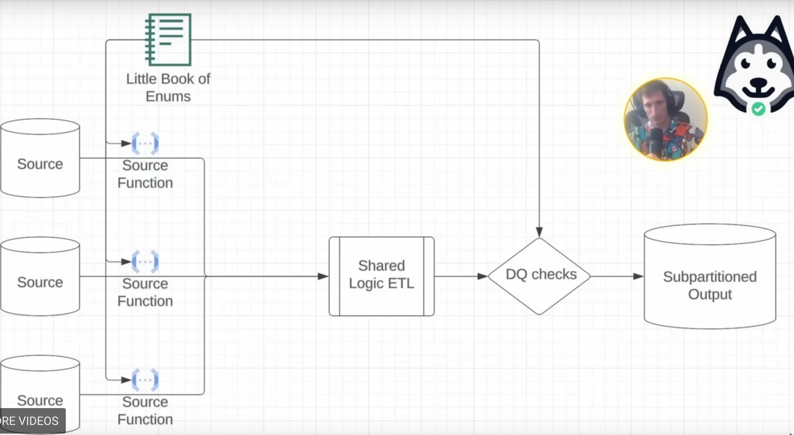

# Day 3 - Lecture

# Intro

In this lecture we talk about graph data modeling.

Graph data modeling is more relationship focused rather than entity focused, but comes with a tradeoff in that you don’t have that much of a schema, it’s rather flimsy and flexible.

<aside>
✏️

**Topics**

- Additive vs non-additive dimensions
- The power of Enums
- When to use flexible data types (basically, `MAP< .. , .. >`)
- Graph data modeling

</aside>

# What makes a dimension additive?

Additive dimensions mean that you don’t *“double count”*.

In other words, you can take all the sub totals and sum them up, you get the grand total, and it’s a correct number.

E.g: *Population = all 1 year olds + all 2 year olds + all 3 year olds + …*

Not all dimensions are additive.

E.g: *Total* c*ar drivers is NOT EQUAL to all Honda drivers + all Toyota drivers … What if a person owns 2 different cars?*

## The essential nature of additivity

A dimension is additive over a specific **time window** if and only if the grain of data over that window can only ever be one value at a time.

Back to the car example, for instance: on a small enough time scale, you can say that *# drivers = all Honda drivers + all Toyota drivers + …*

If the window is like 1 second, that’s obvious, because no one can drive 2 cars at once. In this case the dimension is additive, but as the timescale gets larger, it loses additivity.

### How does additivity help?

- If you have the subtotals you can just add them up, and you don’t need to use `COUNT(DISTINCT)` **on pre-aggregated dimensions**. In other words, you don’t have to go back down one level of grain to get the total count.
- Non-additive dimensions are usually non-additive w.r.t. `COUNT` aggregations, but not `SUM`.
→ E.g. if you sum instead all miles driven by Honda drivers + all driven by Toyota drivers and so on, this makes sense, because one can’t drive two cars at once, ever.

<aside>

A rule of thumb to know if a dimension can be additive, is to think “Can a user be two of them at the same time in a given day?”. And if they can, then it’s **not additive,** you can’t do partial aggregations like with additive dimensions.

</aside>

# When should you use enums?

We covered **enums** in the last lab, with the NBA “scoring class”, like *star, good, average, bad.*

One things with enumerations is that there is a limit how much you wanna enumerate.

- Enums are great for low-to-medium cardinality
- Country is a great example of where Enums start to struggle.

**Why should you use enums?**

- Built in data quality
→ If model a field as an **enum** and you get a value that doesn’t fit, the pipeline fails.
- Built in static fields
→ Sometimes there’s fields of an enum that are just static that you don’t need to know about. [Not exactly sure what Zach means here — Ed.]
- Built in documentation
→ You already know what all the possible values of a thing can be. If it’s just a `STRING`, you don’t get that.

Don’t throw them around everywhere like it’s rice at a wedding, use them properly!

## Enumerations and subpartitions

- Enums make amazing subpartitions, because
  - You have an exhaustive list
  - They chunk up the big data problem into manageable pieces
- The little book of pipelines [example](https://github.com/EcZachly/little-book-of-pipelines)
→ Design developed by Zach, leverages the concept of Enum to a great extent.

The following diagram shows an example of this design pattern, with 3 sources (but there can be a lot more)

So here you have an **enum** that contains a set of values, like “fees”, “coupons”, “infra cost” and other things, and they’re all different sources.

This enum gets shared with all **source functions**, and what these source functions do is they map the data to a **shared schema**, shared among all sources.

The Little book of Enums also includes the several DQ checks for each source/partition.

After each DQ check, the **subpartitioned output** will have a **date** partition, and then the **subpartition** will be the **enum values.**

This patterns scales nicely, because if you need another source, you just add another value to the little book of enum, and that’s it, and you also have the docs for free, because people can just query the book easily.

**How does the enum actually look?**

Usually it’s just a Python or Scala enumerator, and then you have a job that turns it into a tiny table, as many rows as values in the enum, and that’s how you can share it between your DQ checks and your **source functions.** Check out the example at the link above for proper implementation.

### What type of use cases is this enum pattern useful?

Whenever you have tons of sources mapping to a shared schema. Or in other words, when tons of different sources need to be brought together downstream.

Some examples from Zach:

- Airbnb
  - Unit Economics (fees, coupons, credits, insurance, infra cost, taxes, etc…)
- Netflix
  - Infrastructure Graph (applications, databases, servers, code bases, CI/CD jobs, etc…)
- Facebook:
  - Family of Apps (oculus, instagram, facebook, messenger, whatsapp, threads, etc…)

What you end up with, is that all this different data ends up being in the **SAME TABLE.**

**How do you model data from disparate sources into a shared schema?**

Zach says with what he calls a **Flexible Schema**!

<aside>

What you **DON’T WANT** to do is bring all columns together into a single table that ends up having 500 columns, most of them being null all the time.

</aside>

In this flexible schema, you want to often leverage a **MAP datatype**, which sort of overlaps with a graph data model.

# Flexible schemas

What do you do if you need to add more things? Just put them in the map! Throw more columns in there.

- Benefits
  - You don’t have to run ALTER TABLE commands
  - You can manage a lot more cols
  - Your schemas don’t have a ton of “NULL” columns
  - `other_properties` column is pretty awesome for rarely-used-but-needed columns
- Drawbacks
  - Compression is usually worse (especially if you use JSON)
    → Reason is, the header has to
  - Readability, queriability

# How is graph data modeling different?

Graph modeling is **relationship** focused, **not entity** focused.

<aside>

Zach says: Every graph database he ever built always ends up having the same schema. If you can remember this schema, you’re set.

</aside>

The main thing to remember is that it’s not entity focused, so we don’t care about columns.

An entity in a graph has 3 columns:

- id: `STRING`
- type: `STRING`
- properties: `MAP<STRING, STRING>`

The whole idea behind graph DBs is that it shifts focus from **how things are** to **how things are connected.**

---

The schema above is for **vertexes** (entities).

**Edges** (relationships) have their own schema:

- subject_id: `STRING`
→ the entity **DOING** the thing
- subject_type: `VERTEX_TYPE`
- object_id: `STRING`
→ the entity **RECEIVING** the thing
- object_type: `VERTEX_TYPE`
- edge_type: `EDGE_TYPE`
→ almost always a **verb**: “is”, “plays with”…
- properties: `MAP<STRING, STRING>`

Example for player in a team:

- subject_type: `player`
- object_type: `team`
- edge_type: `plays_on`
- properties: `{years_playing_on_team: "", starting_year: ""}`

