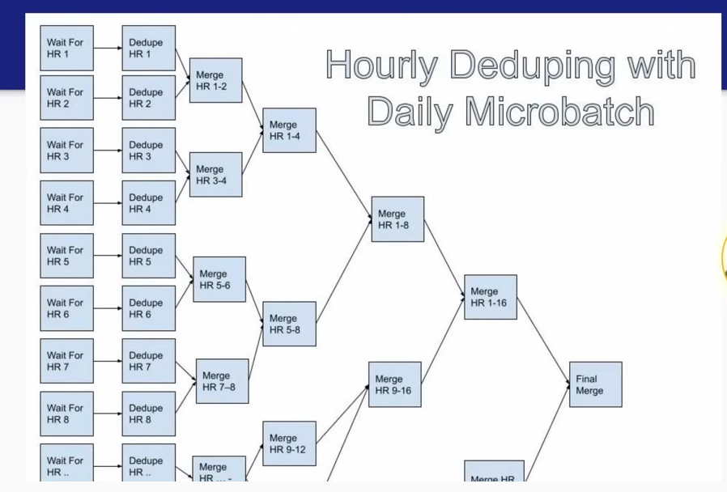

# Day 1 - Lecture

# What is a fact?

Something that **happened** or **occurred.**

- A user logs into an app
- A transaction is made
- You run a mile with your fitbit

Contrary to dimensions, **facts don’t change**, which makes them easier to model than dimensions **in some respects**.

It should be something atomic, you can’t break it down into smaller pieces (so like the *mile example* is not perfect because you can break it down).

# What makes fact modeling hard?

Fact data is usually 10-100x the volume of dimension data.

- Example of how many steps you take in a day. You take like 5000-10000, vs YOU, as a single datapoint in a `users` table.
- Facebook had 2B active users when Zach worked there, and sent 50B notifications every day.

Fact data can need a lot of context for effective analysis.

- Imagine sending a notification. That fact in isolation is quite useless. But imagine sending a notification, and then the user clicks on it, and then 20 minutes later they buy something. This is a lot more informative.

So basically, fact data needs other data around it (other facts or even dimensions) to be valuable

Duplicates in facts are way more common than in dimensional data.

- E.g. maybe the SWE team publishes a bug that logs things twice, but sometimes duplicates can be genuine, for instance a user clicking twice on a notification, a few hours apart. This is a proper action that we want to log, but not count it as 2, cause then you’d have skewed metrics (e.g. CTR = 200%). Dupes are very challenging to work with.

# How does fact data modeling work?

**Normalization vs Denormalization**

- Both of them important and powerful, and both of them can cause lots of problems
- Normalized facts don’t have any dimensional attributes, just IDs to join to get that information.
- Denormalized facts bring in some dimensional attributes for quicker analysis at the cost of more storage

<aside>

The smaller the scale, the better normalization is gonna be as your option, because you remove all duplicates and increase data integrity, and don’t have to worry about restating stuff.

</aside>

**Fact data and raw logs are NOT the same thing.**

They’re married, but not the same!

- **Raw logs** → usually owned by people without strong data skills — SWEs. Don’t really care quite as much. As a DE you can work with them to get the data logged in the correct format.
  - Ugly schemas designed for online systems that make data analysis sad
  - Potentially contains duplicates and other quality errors
  - Usually have shorter retention
- **Fact data** → the trust in this data should be orders of magnitude higher than raw logs. As a DE, this is your goal, convert raw logs into highly trusted fact data. ****
  - Nice column names
  - Quality guarantees like uniqueness, not null, etc…
  - Longer retention

Think of facts as Who, Where, When, What, and How?

- “Who” fields are usually pushed out as IDs (*this user clicked this button,* we only hold the `user_id` not the entire user object)
- “Where” fields
  - Location, country, city, state
  - **OR** also, **where** in a web app the user did the action. Can also be modeled with **ids**, but often doesn’t happen.
- “How” fields
  - How fields are very similar to “where” fields. *“He used an iphone to make this click”.*
- “What” fields → Fundamentally part of the nature of the fact
  - In notification world: “GENERATED”, “SENT”, “CLICKED”, “DELIVERED”
- “When” fields → Same as *what*, part of the nature of the fact
  - Mostly an `event_timestamp` field or `event_date`
  - **Make sure that devices are logging UTC timezone, even in clientside.**
    - **Clientside logging** is usually better than serverside logging, because you can get all the interactions the user does, and not just things that cause a web request to happen.

- Fact datasets should have quality guarantees → if they didn’t, analysis would just go to the raw logs
  - **No duplicates!**
  - **Certain fields that must exist: e.g “what” and “when” should never be null.**
  - “Who” field also is quite important not to be null.
- Fact data should generally be smaller than raw logs
- Fact data should parse out hard-to-understand columns!
  - Often SWEs pass you a column that is a string but is a JSON and is a blob of nastyness that’s impossible to query. Fact data should not have these kinds of shits and be simple!

<aside>

You job as DE is to be making datasets that are fun and delightful to use, and if you’re not doing that you’re not being a good DE.

</aside>

# When should you model in dimensions?

Example from Zach’s time at Netflix: [Network logs pipeline](https://www.youtube.com/watch?v=g23GHqJje40)

- 2PBs of brand new data every day, over 100TBs/hr
- Loads of microservices
  - Really good to make development faster, and split responsibilities
  - A mess when it comes to security, ‘cause instead of having one app that can be hacked, imagine having 3000.
- They wanted to see which microservice app each network request came from and went to, in order to see how an app getting hacked would affect others
  - The only way to do that was by looking at all network traffic, and that was insane.
- What they did was take the network traffic and JOIN it with a small database of IP addresses and app names, all of the IP addresses for Netflix microservices architecture
  - IP addresses were the identifiers of the apps.
  - The join would result into something like `IP_1 talks to IP_2` etc…
- This was doable because the right side of the JOIN is a small table that could fit in a **broadcast join**
- When they needed to move to IPv6, they realized the new JOIN would have not worked anymore, cause there were too many.
  - They tried but the cost was skyrocketing
- The solution was to not do the JOIN at all, and have instead all of the apps log the “app” field with each network request. **DENORMALIZATION SAVES THE DAY**.
- This required each microservice to adopt a “sidecar proxy” that enabled logging of which app they were.
- Very large org effort to solve this issue.

<aside>

A lot of the times, the impact that you have as a Data Engineer is not optimizing a pipeline. It's actually going upstream and solving the problem at the source.

</aside>

# How does logging fit into fact data?

Logging should give all the columns that you need, except maybe for some dimensional columns.

- Logging brings in all the critical context for your fact data
  - Usually done in collaboration with online system engineers → They are the ones knowing more about event generation, i.e. **WHEN and HOW** those events are being created.
- **Don’t log everything!**
  - Log only what you really need
  - Raw logs can be very expensive and cost a lot of money in the cloud
  - Logging stuff “just in case” is an anti-pattern
- Logging should conform to values specified by the online teams
  - There should be some sort of contract or schema or shared vision so that teams can be easily aligned (at the technical level too)
  - Airbnb example: imagine part of a system is written in Ruby, another in Scala, how do you reconcile the schemas? You can’t import a library. So you need some kind of middle layer between these 2 realities.
  - At Netflix and Airbnb these things were defined in a *Thrift schema*
  - **Thrift** [I think Zach’s talking about [Apache Thrift](https://thrift.apache.org/) — Ed.] is a specification that is language agnostic and it’s a way to describe schema and data (and functions), in a way that is sharable, so that both Ruby and Scala could reference the same schema for price.
    - Ideally there would be a test here so that if team A breaks teams B code, team A can’t push until they talked to team B (e.g. “hey we’re adding this new column etc…”).

# Options when working with high volume fact data

**Sampling**

- Sometimes the solution is to filter down and not work with all of the data. Doesn’t work for all use cases, best used for metric-driven use cases where imprecision isn’t an issue.
- In some cases it can’t work: e.g. security or those very low probability situations.

Overall it can be very cost effective, as past a certain amount of data you get a diminishing return on how accurate a statistic can be (law of large numbers and whatnot).

**Bucketing**

- Fact data can be bucketed by one of the important dimensions (usually user, the “who”)
- If you join on the bucketed column, you don’t have to shuffle across the entire dataset, but just within the bucket, and it can be a lot faster.
- Sorted-merge bucket (SMB) joins can do joins without shuffle at all because both sides of data are sorted and can be joined “like a zipper”.

# How long should you hold onto fact data?

If you have very high volume fact data you can’t just hold on to it forever, it becomes very costly.

- Big tech has an interesting approach here:
  - Any fact tables <10 TBs, retention didn’t matter much
    - Anonymization of facts usually happened after 60-90 days though, and the data would be moved to a new table with the PII stripped.
  - Any fact tables >100 TBs, **VERY SHORT RETENTION** (~14 days or less)
  - These sizes (10 and 100 TBs) were for big tech, but any company can choose on their own window.

<aside>

“Let’s put a higher retention — just in case”. That *just in case* almost never comes, it’s almost always a cop out and very rarely something you need to worry about.

</aside>

# Deduplication of fact data

- Facts can often be duplicated
  - e.g. you can click a notification multiple times (*think about the timeframe*)
- How do you pick the right window for deduplication?
  - No duplicates in a day? An hour? A week?
    - Imagine if a user clicks a Facebook notification today, and then the same notification a year from now. Does it matter even if it’s duplicate? Most likely not.
  - You can do some analysis on your dataset to look at distribution of duplicates.

**Intraday deduping options**

- Streaming → very short time frame
- Microbatch → hourly basis

## Streaming to deduplicate facts

Streaming allows you to capture most duplicates in a very efficient manner.

- You can capture the duplicates on whatever window you want → “we saw this notification ID and we’re gonna hold on to it X time. If we see it again within X, then we have found a duplicate”
- A large majority of dupes happen in a short window after a short event
- **Entire day duplicates can be harder for streaming because it need to hold onto such a big window of memory.** In the end streaming didn’t work because it used too much memory *(keep in mind we’re talking about FAANG business, so like 50B records a day — a problem most people won’t have)*

## Hourly microbatch dedupe

Used to reduce landing time of daily tables that dedupe slowly (last point of previous paragraph).

In Zach’s example, this took 1 hour instead of 9 hours every day, deduping 50B notification events every day.

Steps:

- Get all the data for a specific hour → Aggregate down (`GROUP BY`).
- A `FULL OUTER JOIN` between hour 0 → 1, or 1 → 2, or 2 → 3 etc…
  - What this does it makes it so that it eliminates dupes that are across hours. Eg. a dupe that happened in hour 0 and also in hour 1.
- This all comes together and it branches like a tree

- Basically the hour pairs keep merging until you have the final, daily dataset.
