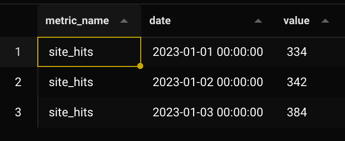

# Day 3 - Lab

Let’s start by creating the `array_metrics` table we will be building today, as described at the end of day 3 lecture.

```sql
CREATE TABLE array_metrics (
  user_id NUMERIC,
  month_start DATE,
  metric_name TEXT,
  metric_array REAL[],
  PRIMARY KEY (user_id, month_start, metric_name)
);
```

This is the full query. It’s a bit tricky so read the notes.

```sql
INSERT INTO array_metrics
WITH
daily_aggregate AS (
  SELECT
    user_id,
    DATE(event_time) AS date,
    COUNT(1) AS num_site_hits
  FROM events
  WHERE DATE(event_time) = DATE('2023-01-01')
  AND user_id IS NOT NULL
  GROUP BY user_id, DATE(event_time)
),

yesterday_array AS (
  SELECT
    *
  FROM array_metrics
  WHERE month_start = DATE('2023-01-01')
)

SELECT
  COALESCE(da.user_id, ya.user_id) AS user_id,
  -- we truncate `da.date` because each day it goes up by one,
  -- whereas we just need the 1st day of the month
  COALESCE(ya.month_start, DATE_TRUNC('month', da.date)) AS month_start,
  -- this is hard coded arbitrarily,
  -- in a real scenario it's probably a variable in a pipeline or something more dynamic
  'site_hits' AS metric_name,
  CASE
    WHEN ya.metric_array IS NOT NULL THEN
      ya.metric_array || ARRAY[COALESCE(da.num_site_hits, 0)]
    WHEN ya.metric_array IS NULL THEN -- (this could be just an ELSE)
      -- these date shenanigans just mean: how many days after beginning of the month
      ARRAY_FILL(0, ARRAY[COALESCE(date - DATE(DATE_TRUNC('month', date)), 0)])
        || ARRAY[COALESCE(da.num_site_hits, 0)]
      -- the reason we have to use `ARRAY_FILL`, is because all arrays for all users
      -- have to be of same length. So if a user shows up on the 5th, the first 4 elements
      -- of the metric_array must be all zeros, like [0, 0, 0, 0, n]
      -- (where n is the number of hits that day).
  END AS metric_array
FROM daily_aggregate da
  FULL OUTER JOIN yesterday_array ya
  ON da.user_id = ya.user_id

ON CONFLICT (user_id, month_start, metric_name)
DO
  UPDATE SET metric_array = EXCLUDED.metric_array;
```

To cumulate this, you have to bump the date by one in the 1st CTE every time.

We use `ON CONFLICT` because contrary to previous examples, in this case we are just “merging” and updating, instead of creating a new partition for each day, since all history that we care about is already contained in the `metric_array` for each month.

The partitions, like said in the lesson, are `month_start` and `metric_name` as sub-partition.

If everything was done properly, the next query should have only results with cardinality `2`

```sql
SELECT
  cardinality(metric_array),
  COUNT(1)
FROM array_metrics
GROUP BY 1;
```

Let’s add one more day, and then do an example aggregate analysis.

```sql
WITH

agg AS (
  SELECT
    metric_name,
    month_start,
    ARRAY[SUM(metric_array[1]),
          SUM(metric_array[2]),
          SUM(metric_array[3])] AS summed_array
  FROM array_metrics
  GROUP BY metric_name, month_start
)

SELECT
  metric_name,
  month_start + CAST(CAST(index - 1 AS TEXT) || ' day' AS INTERVAL) AS date,
  elem AS value
FROM agg
  CROSS JOIN UNNEST(agg.summed_array) WITH ORDINALITY AS a(elem, index)
```

What we’re doing here is essentially finding the total of all `site_hits` (or actually every metric name, if we had more) for each day, and returning them totals for each day.



This operation is very fast, because it’s the minimum set of data that you need to reach this result, and it’s what Zach used at Facebook to save so much time in certain analytical queries.
