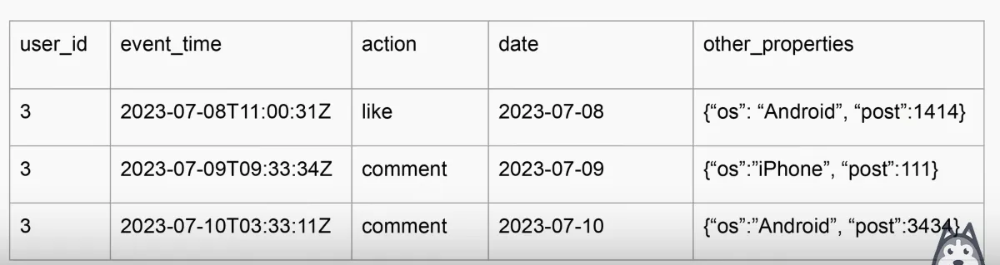
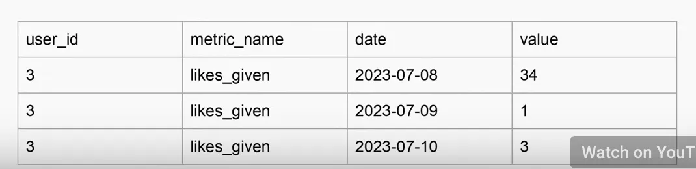
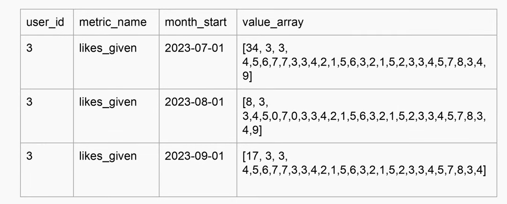

# Day 3 - Lecture

# Why should shuffle be minimized

> *Shuffle happens when you need to have all the data from a specific key on a specific machine.*
>

Big data leverages parallelism as much as it can

The thing that sucks about shuffle is that it’s the **bottleneck for parallelism.**

> If you have a pipeline without shuffles, it can be as parallel as you want. That’s because you don’t need a specific chunk of data to be on ALL machines. You can have all of it split out.
>

Some steps in your big data pipeline are gonna have more parallelism than other steps.

The more parallel it is, the more effectively we can crunch big data.

There are several ways to address shuffling and we will address them later on.

## What types of queries are highly parallelizable

### **Extremely parallel**

- SELECT, FROM, WHERE *(without a window function in SELECT)*

    → This query is **infinitely scalable**.
    Imagine you have 1B row and 1B machines, and each machine had 1 row, that’s fine and will work seamlessly.

### **Kinda parallel**

- GROUP BY, JOIN, HAVING

    → In GROUP BY, the problem is that in order to do the right aggregation, all the rows for a **key** need to be co-located (in the same machine) in order to correctly count them. Otherwise, if the rows are all spread on different machine, how do you know how many there are in total?
    In Spark, you can choose the level of GROUP BY parallelism of group by by setting a value for `spark.sql.shuffle.partitions` (default is 200). Will see more of this in week 5.

    → In JOIN, it’s a bit trickier, because you have to do the shuffle not once, but twice [once per each table in the join, I believe — Ed.]. Here, you have all of the keys on the left side, and all keys on the right side, and they all have to be pushed on a machine (one partition in your shuffle partitions, same setting as for GROUP BY). Finally, after shuffling, the comparison between left and right keys can happen.

    → HAVING and GROUP BY kinda go hand in hand. Technically, HAVING is as parallel as the first category (SELECT etc…) because it’s just a filter, but it’s a step **after** GROUP BY, so you can only apply it after a shuffle.

### **Painfully not parallel**

- ORDER BY *(at the end of a query, not in a window function)*

    → This one you should almost **NEVER** use in distributed compute. This is the most painful and LEAST parallelizable keyword in SQL.

    Let’s go back to the example with 1B rows. The ONLY WAY to know that the data is sorted, is if it all goes back into one machine, and it all gets passed through 1 machine, which is exactly the opposite of parallel.

    You can use ORDER BY, but only at the end of your queries, after all aggregations and stuff, when the final result is a relatively small amount of rows.

    → **How does it work in a window function instead?**

    Here, ORDER BY doesn’t do a global sort. It can, if you don’t put any PARTITION BY in the window function, like if you do a global `rank` function, but if you use PARTITION, then it’s not a global problem but a shuffle problem.

    In a way, PARTITION BY in a window function and GROUP BY in a regular query behave very similarly in the distributed computing world, especially in the way they affect shuffle.

The reason we’re talking about all of this in a **fact data modeling** module, is because

<aside>

How the data is structured determines which of this keywords we have to use.

</aside>

If you have data that’s structured in a certain format, you can skip out on using some of these keywords. Good to remember when planning your fact data modeling.

Remember this paragraph as it’s very useful for not just data modeling, but troubleshooting Spark problems and related problems as well!

## How to make GROUP BY more efficient?

- **Give GROUP BY some buckets and guarantees** (bucketing is supported by many things, not just Spark, e.g. Delta, Iceberg, Hudi etc…)

    → This essentially means **pre-shuffling the data.** Imagine you want to put the data into 8 buckets, you’d choose a (usually high cardinality field), and then you bucket on that field. It will perform the grouping (with MOD operator) when you write the data out.

    This way, when we do a GROUP BY, we don’t have to shuffle, because it already has been!

- **REDUCE THE DATA VOLUME AS MUCH AS YOU CAN!**

### How reduced fact data modeling gives you superpowers

**Fact data often has this schema**

- user_id, event_time, action, date_partition
- very high volume, 1 row per event

**Daily aggregate often has this schema**

- user_id, action_count, date_partition
- medium sized volume, 1 row per user per day

**Reduced fact take this one step further**

- user_id, action_count ARRAY, month_start_partition or year_start_partition

    → This cuts the daily data by 30 (if you use month) or 365 (if you use year).

- low volume, 1 row per user per month or year.
- this is as small as you can get

The key to remember here is you have these 3 flavours. Normal fact data, daily aggregates, and reduced facts. They have tradeoffs (especially 2 and 3) because as the data gets smaller you lose some of the flexibility on what types of analytics you can do on it. Usually that’s worth the trade-off as it allows you to do analytics more quickly.

**Example fact data**

We have the typical schema described above. `user_id`, `event_time`, `action`, `date`, and other less important info.

Here it’s the most granular data, and you can ask very specific questions, but if the data is too large, you can’t make this kind of analysis over a large timeframe (e.g. a month).

In a longer time horizon, using this schema is largely inconvenient.

**Example daily aggregated data**

In this case, we have one row per **user** per **metric** per **day**.

We have lost some details here, but you can work on a much longer time horizon now (e.g. 1 or 2 years). Also, this table can be joined with SCDs, and can be done aggregates at the higher level and bring on other dimensions.

In this table, your partition is not just `date` but `date` AND `metric_name` (as sub-partition).

However, we can still make this schema smaller and not lose anything.

**Example long-array metrics**

In this schema, there’s **only one row per month**. And then we have a `value_array`.

The reason they came up with this model, is because there was the 1st decline in growth at Facebook in the history of the company, and they were panicking and wanting to look at all the metrics in the whole history of Facebook and stuff trying to figure out what was going on etc… They were working with daily metrics, that were pretty fast, but it was not gonna work on longer time frames.

<aside>

This is **not a monthly aggregate**, that’s the beauty of it. If it was, it would be not useful and stupid.

</aside>

In this schema, the `date` is like an index. For the 1st row, `34` is the number of likes given on July 1st, `3` on July 2nd, and so on until the end of the month.

This is quite similar to the Lab 2 of this week, with the date list and the bit mask of 1s and 0s.

---

### Reduced fact data modeling - continued

- Daily dates are stored as an offset of **month_start / year_start**
  - First index is for date month_start + zero days
  - Last index is for date month_start + array_length - 1
- Dimensional joins get weird if you want things to stay performant
→ You don’t want to bring in a dimension in the middle of the month.
  - Your SCD accuracy becomes the same as month_start or year_start
    - You give up 100% accurate SCD tracking for massively increased performance
  - You need to pick snapshots in time (month start or month end or both) and treat the dimensions as fixed.
- Impact of analysis
  - Multi-year analyses took hours instead of weeks
    → A 10 year backfill really took about a week or more in Zach’s situation, before the adoption of this model
  - Unlocked “decades-long slow burn” analyses at Facebook
- Allowed for fast correlation analysis between user-level metrics and dimensions
