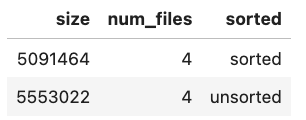

# Day 1 - Lab

Find the setup instructions at [this link](https://github.com/DataExpert-io/data-engineer-handbook/blob/6c32b89b9cc845471ebbfae327e71d434d569bc6/bootcamp/materials/3-spark-fundamentals/README.md#spark-fundamentals-and-advanced-spark-setup)!

Then visit `localhost:8888`, go to `/notebooks` and open `event_data_pyspark`. Run the cell and if it works properly, you’re good to go!

Spark is managed by this thing called `SparkSession`, which you build with the first command. Usually you create some sort of `appName` , and then you run `.getOrCreate()`.

You can notice that the syntax is not Pythonic is because Spark is a JVM library, so it doesn’t use `camel_case`. All Pyspark does is wraps the Spark libraries in Python.

Try running `.collect()` instead of `.show()` in the first cell. It will output all 500k rows, and it might OOM.

Now try running

```python
df.join(df, lit(1) == lit(1)).collect()
# what this does is join each row with every other row. It's like a CROSS JOIN
```

and most likely you will get a `OutOfMemoryError: Java heap space`.

For the record, doing `.collect()` on the whole dataset is a bad practice, as **you don’t ever wanna pull the entire dataset into the driver** (unless it’s really small).

Now restart the Kernel (in the toolbar on top, under Kernel) because probably this operation killed it, and try running this instead

```python
df.join(df, lit(1) == lit(1)).take(5)
```

As we’re bringing just 5 rows back to the driver, this time it will work without problems.

Let’s move on to the next cell, run this and how these lines work.

```python
sorted = df.repartition(10, col("event_date"))\
    .sortWithinPartitions(col("event_date"), col("host"))\
    .withColumn("event_time", col("event_time").cast("timestamp"))
```

- `repartition` ⇒ regardless of how many partitions we had before, now we will have 10, split by `event_date`

Now run this too

```python
sortedTwo = df.repartition(10, col("event_date"))\
    .sort(col("event_date"), col("host"))\
    .withColumn("event_time", col("event_time").cast("timestamp"))

sorted.show()
sortedTwo.show()
```

You’ll see that the difference is that they actually pulled from different data. How is that? `sort` and `sortWithinPartitions` are different, **even more at scale**.

- `sortWithinPartitions` ⇒ It will sort the data **LOCALLY** for each partition (based on the specified key[s]).
- `sort` ⇒ This is instead a **GLOBAL** sort, which means it has to pull data all inside the driver, and it’s very slow (on large data).

Let’s run the `.explain()` for both DataFrames, so we can see the difference between them.

<aside>


The way these plans work is that you go to the **most indented row**, and that would be the first step.

</aside>

As you can see, the first step is reading the CSV.

```python
+- FileScan csv [device_id#369,browser_type#370,os_type#371,device_type#372]
Batched: false,
DataFilters: [isnotnull(device_id#369)],
Format: CSV,
Location: InMemoryFileIndex(1 paths)[file:/home/iceberg/data/devices.csv],
PartitionFilters: [],
PushedFilters: [IsNotNull(device_id)],
ReadSchema: struct<device_id:string,browser_type:string,os_type:string,device_type:string>
```

Then there are a bunch more steps (which depend on your code), notably:

- `Project` → same as `SELECT`
- `Exchange` → where repartition happens.

Finally we get to the `Sort` line, almost all the way to the top.

```python
+- Sort [event_date#343 ASC NULLS FIRST, host#334 ASC NULLS FIRST], **false**, 0
```

The boolean in there, represents wether we’re doing a GLOBAL sort or not. In this case, `false` indicates the sort is NOT GLOBAL.

You will see that in the other plan, there’s a step which doesn’t exist in the 1st one:

```python
+- Exchange rangepartitioning(event_date#343 ASC NULLS FIRST,
 host#334 ASC NULLS FIRST, 200),
 ENSURE_REQUIREMENTS,
 [plan_id=2429]
```

This is the line that’s gonna be painful at scale. Every time you see he word **EXCHANGE** in you query plan, think it means **SHUFFLE**.

In this case `sort` is causing the shuffle because a GLOBAL sort makes all data pass through an executor, as that’s the only way you can guarantee that your data is globally sorted. So at scale, always use `sortWithinPartition`. In fact, basically never use `sort`.

Let’s now move on to the cell where we create the tables with SQL and run them all.

```sql
%%sql

CREATE TABLE IF NOT EXISTS bootcamp.events (
    url STRING,
    referrer STRING,
    browser_family STRING,
    os_family STRING,
    device_family STRING,
    host STRING,
    event_time TIMESTAMP,
    event_date DATE
)
USING iceberg
PARTITIONED BY (years(event_date));
```

Run them all until

```python
# df_2 = df.select('event_date, host, user_id, referrer, url, event_time, device_id'.split(', '))
start_df = df.repartition(4, col("event_date")).withColumn("event_time", col("event_time").cast("timestamp")) \

first_sort_df = start_df.sortWithinPartitions(col("event_date"), col('browser_family'), col("host"))

start_df.write.mode("overwrite").saveAsTable("bootcamp.events_unsorted")
first_sort_df.write.mode("overwrite").saveAsTable("bootcamp.events_sorted")
```

Try adding and removing sort columns inside `final_sort_df` and see how the result of the next queries change.

```sql
%%sql

SELECT SUM(file_size_in_bytes) as size, COUNT(1) as num_files, 'sorted'
FROM demo.bootcamp.events_sorted.files

UNION ALL
SELECT SUM(file_size_in_bytes) as size, COUNT(1) as num_files, 'unsorted'
FROM demo.bootcamp.events_unsorted.files

-- This query is pretty dope because it allows you
-- to see how many files an iceberg table has, its size and other info.
```

You will notice from the screenshot below that the size of the `sorted` table is about 10% smaller than the `unsorted` one. This is due to **run length encoding**, which Zach explained in a previous lecture. But in short, it means:

- When writing data out, you want it to be written out from lowest cardinality to highest.
  - Event date has low cardinality, and host too, but user_id has high cardinality, so you put it last.
- Sort your data (within partitions!) by these low cardinality fields to reduce output side!


