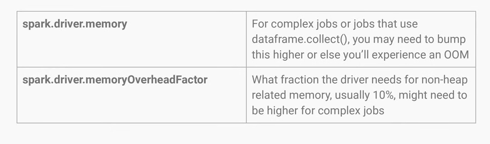

# Day 1 - Lecture

# Intro

Topics covered in this course:

- Architecture
- The roles of the Driver
- The roles of the Executor
- How does it all come together?
- Powers
- When to choose Spark?

Later in the lab we will cover:

- Partitioning
- Sorting
- Data read/write operations

# What is Apache Spark?

It’s a **distributed compute** framework that allows you to process very large amounts of data efficiently.

It’s a successor of legacy technologies such as Hadoop and MapReduce, then Hive, and now Spark is the predominant choice.

## Why is Spark so good?

Spark leverages RAM much more efficiently and effectively than previous generations (those mentioned above). For instance, to do a GROUP BY in Hive or MapReduce, everything had to be written to disk and then read from disk again. It was very resilient, but painfully slow.

Spark minimizes writing to disk, doing so only when it doesn’t have enough memory for an operation — This is called “**spilling to disk”.** You want to avoid this as much as possible, and use as much RAM as you can.

Also, Spark is storage agnostic. You can read whatever you want. A database, object storage, a file, mongoDB, whatever.

## When is Spark not so good?

- Nobody else in the company knows Spark
  - Spark is not immune to the bus factor!
- Your company already uses something else a lot.
  - Inertia is often times not worth it to overcome.
  - Homogeneity of pipelines matters a lot → it’s better to have 20 BQ pipelines than 19 BQ pipelines and 1 Spark pipeline.

# How does Spark work?

Spark has a few pieces to it (with a basketball analogy).

- The plan → (the play)
- The driver → (the coach)
- The executors → (the players)

## The Plan

This is where the “coach” will tell the players what play to do.

- This is the transformation you describe in Python, Scala or SQL.
- The plan is evaluated lazily
  - execution only happens when it needs to.
    → In other words, the play happens only when “the player takes a shot”, which means when they try to write data out somewhere, or when they try to *collect* data somewhere. **Collect** means *to take information from the play and bringing it back to the coach, so the coach can tell them what to do next.*

## The Driver

- The driver reads the plan (the coach).
- Important Spark driver settings
  - `spark.driver.memory` → amount of memory the driver has to process the job. Default is prob 2GB, can go all the way up to 16GB. Usually when you need to bump it up when you have a crazy job with so many steps and plans, or what’s described in the picture below (although that’s considered often bad practice).
  - `spark.driver.memoryOverheadFactor` → the driver needs memory to process the plan. If for some reason you have a very complicated plan, you might have more overhead memory (cause the JVM might take up more memory), and you might want to crank it up. **Non-heap** memory is the memory that Java needs to run, not the memory for the plan or `.collect()`, it’s just the memory that Java needs to run, and you only need to bump this up if you have a very complex job.



<aside>


Every other **driver** setting you shouldn’t touch, according to Zach’s experience.

</aside>

- Driver determines a few things
  - When to actually start executing the job and stop being lazy
  - How to `JOIN` datasets
    - This is very important because depending on what type Spark decides to use, this can mean the job is 10 times more performant, or the exact opposite.
  - How much parallelism each step needs

## Executors (who do the actual work)

- The driver passes the plan to the executors.
- Three settings to touch here
  - `spark.executor.memory` → Has the same constraints as the `driver.memory`, defaults to 1 or 2GB and can go up to 16GB.
    - **Bad practice with this setting** → If a job OOMs, people just update this to 16GB and then forget about it. The job will work but will be much more expensive.
    - Better idea is to run it at a bunch of different memory levels. 2, 4, 6 GBs and so on. Once you find the one that doesn’t crash for a couple of days, that’s your smallest number you can go with.
    - You don’t wanna have too much “padding”, because you waste resources, but you also don’t want to have to little **padding**, because the chance of OOM is annoying and when they break it’s even more expensive.
  - `spark.executor.cores` → Generally, an executor can take 4 tasks at once. You can go up higher to 6, and gives more parallelism per executor. But if you have more than 6, another bottleneck happens: the executor’s disk and the throughput between when tasks finish. Zach often doesn’t touch this setting. Another thing to be careful about is that increasing this increases the amount of memory used, and this might cause OOM.
  - `spark.executor.memoryOverheadFactor` → This is similar to the driver one. Especially with UDFs you want to bump this number up, as Spark UDFs are quite terrible. It can make a difference if the job is unreliable and has a bit crazy plan.


## Types of JOINs in Spark

**Shuffle sort-merge Join**

- Default JOIN strategy since Spark 2.3
- The **least performant** of them all
- But also the **most versatile** → it works no matter what
- Works when both sides of the JOIN are large.

**Broadcast Hash Join**

- Works only when one side of the JOIN is small. Then it works pretty well. In that case instead of shuffling the JOIN, it just ships the whole dataset to the executors. Works great for small-ish amounts of data. Zach has been able to broadcast up to 8 to 10 GB, more than that and it will probably create OOM problems.

**Bucket Join**

- A JOIN without shuffle, you can do this by pre-bucketing data (more on this later).

<aside>


In general, you want to **minimize** the amount of times where you use **shuffle sort-merge join**

</aside>

## How does shuffle work?


As we said before, this is the least scalable part of Spark. As scale goes up, the usage of shuffle gets more and more painful.

Once you start processing 20-30TBs per day, shuffle goes out of the window, and you have to try to solve the problem in a different way.

Imagine you have a table you’re reading in, and it has 4 files, and you’re gonna do a MAP operation (e.g. adding a column, or filtering down, etc…). This operation is infinitely scalable (to the number of original files) as it doesn’t need shuffle.

Then say there’s a GROUP BY operation. The default is 200 partitions (the diagram is a simplified view).

What ends up happening is, imagine you’re grouping on `user_id`, is that `user_id` is modded by the number of partitions (3 in this case).

- If 0 → it goes to partition 1
- If 1 → partition 2
- if 2 → partition 3

This is how shuffle works in its simplest form.

For a `JOIN`, imagine that file 1 and 2 belong to one table, and 3 and 4 belong to another. Then, again, all `user_ids` will be assigned to the same partitions in the same exact way as before.

After all ids have been shuffled to their respective partition, THEN you can do the comparison, one by one, and finish the JOIN.

This is **the default case →** **shuffle sort-merge join**.

In **broadcast join** instead, files 3 and 4 (the 2nd table) are small enough, so you ship all their data to each of the executors (where file 1 and 2 reside) so that you don’t have to do any shuffling at all (which means, the 2nd half of the diagram doesn’t happen).

In **bucket join**, the tables has been “pre-shuffled” already. This mean both left and right side of the join get put into an equivalent number of buckets.

> Editor’s note — bucketing is a technique and has nothing to do with S3 buckets or similar concept. In short, it simply writes out the data in $n$ files, where each file ⇒ 1 bucket. It’s still a grouping operation, because the key you bucket buy gets all sent to the same bucket!
In code, it looks like this
>

```python
n_buckets = 10
data.write.bucketBy(n_buckets, "my_bucketing_key").saveAsTable("table_name");
```

The result of this is that the files already have the guarantee that all the data you’re looking for, based on the bucketing key, is in there. Then when you do the JOIN, you just match up the buckets.

In the diagram example, imagine that the data has been bucketed, so you line up File 1 and File 3, and File 2 and File 4, and perform the JOIN without a shuffle. This gives a massive performance gain.

Moreover: even if the two tables don’t have the same number of buckets, you can do a bucket join assuming they’re **multiples of each other**. Imagine in this case instead we had 1 table with 2 buckets, and another with 4 buckets.

Then (say) files 1 and 2 would line up with just file 3.

The lesson here is:

<aside>


Always bucket your tables in **powers of 2**!

</aside>

Don’t be weird and use odd number of buckets like 7 or 13, because then the only way to obtain a bucket join is if the other side ALSO has the same number of buckets or a weird multiple of it.

**How do you pick the number of buckets?**

Often it’s based on the volume of the data.

E.g. in Facebook, Zach was processing 10 TBs of data, so 1024 buckets would lead to 10 GBs per file. This is kind of the idea.

The rule of thumb here is: if you have too many buckets on data that’s too small, then you have the same problem where there might not be any data in one of the buckets because of the `mod` problem (because of the [**pigeonhole principle**](https://en.wikipedia.org/wiki/Pigeonhole_principle)) → Imagine if you have 1000 rows but 1024 buckets. 24 buckets WILL be empty! *[Also, there’s a bit of overhead due to the I/O issue of opening a lot of empty or super small files — Ed.]*

### Shuffle

Shuffle partitions and parallelism are linked!

Two settings

- `spark.sql.shuffle.partitions`
- `spark.default.parallelism`

For the most part, they’re quite the same, except 1 tiny exception if you’re using the RDD API directly.

Their value is essentially the number of partitions that you get AFTER the shuffle operation (e.g. JOIN or GROUP BY).

**Is shuffle good or bad?**

Don’t think that shuffle is always inherently bad. It depends on the situation.

- If the volume is low-to-medium ( < 10 TBs ) → it’s really good and makes our lives easier.
- At high volumes ( > 10 TBs )
  - Very painful!
  - At Netflix, a shuffle killed the IP enrichment pipeline.
    This was explained in a previous lecture, but the TL;DR was they got rid of the shuffle entirely by solving the problem upstream *[shift left — Ed.],* by having the devs log the data they were joining directly in the event logs. *[The change was more organizational than data oriented, as he had to talk with hundreds of people, all maintaining different microservices — Ed.]*.

<aside>


In other words, the morale of the last example is, if all you have is a hammer (Spark), every problem looks like a nail!

</aside>

This last example shows how taking a different approach was way more beneficial than trying to power through it via Spark.

### How to minimize shuffle at high volumes?

- Bucket the data if multiple JOINs or aggregations are happening downstream
  - This is a **waste** is all you have to do is **ONE SINGLE JOIN**. That’s because you have to pay the shuffle cost at least once anyway to bucket your data!
  - *Also: Presto can be weird with bucketed tables, especially if you have tables with small number of buckets (e.g. 16). If you query stuff with Presto the query might be slower because the initial parallelism would always be 16, and maybe Presto was expecting more.*
- Spark has the ability to bucket data to minimize or eliminate the need for shuffle when doing JOINs.
- Bucket joins are very efficient but have drawbacks
  - Main drawback is that initial parallelism = number of buckets
- Bucket joins **only work** if the two number of buckets are multiples of each other!
  - **As said before, ALWAYS use powers of 2 for # of buckets!!!**

### Shuffle and Skew

Sometimes some partitions have dramatically more data than others.

This can happen because:

- Not enough partitions
- The natural way the data is
  - Beyonce gets a lot more notifications than the average Facebook user

This is problematic because the heavy partition (Beyonce) will be put all into 1 executor, which might go OOM and therefore fail the job. Imagine if this happens after the job has ran for several hours and then it fails at 99%.

**How to tell if your data is skewed?**

- Most common is a job getting to 99%, taking forever (way longer than you expect the job to take), and failing
- Another, more scientific way is to do a box-and-whiskers plot of the data to see if there’s any extreme outliers

**Ways to deal with skew**

- Adaptive query execution - only in Spark 3+
  - Set `spark.sql.adaptive.enabled = True`
  - This alone should solve your problem. Nothing else to do. Period.
  - Don’t set this to `true` all times just in case. It makes the job slower.
- Salting the GROUP BY - best option before Spark 3.
*Works only with a skewed GROUP BY, not a skewed JOIN.*
  - Add a column with random numbers as value, and that breaks up the skew.
  - Then you GROUP BY twice: once by this random number, which breaks up the skew, by distributing it across the executors. This gives you a partial aggregation. And then GROUP BY again, removing the random number and aggregate everything up again, and that will give you the same thing as you would get otherwise.
  - Be careful using this when it comes to **additive vs non additive dimensions.** In most cases you’ll be fine, but some, might give unpredictable results!
  - Also be careful with things like AVG aggregations. Break it into SUM and COUNT and divide!
  - In JOINs, you can’t do the salting, so there are other strategies.
    - One is to exclude the big outliers (Beyonce can wait tomorrow to be joined)
    - Another is to partition the table and have essentially two pipelines (one for the big partitions, and another for the normal data).

# Spark on Databricks vs regular Spark


There’s not a lot to add here aside from the above table. In short, Spark on DBX is all notebook based, which Zach doesn’t like [and neither do I — Ed.], since notebooks don’t encourage good engineering practices, but at the same time they enable less technical people to use Spark, which is not all too bad.

# Miscellaneous

**How to look at Spark query plans**

Use `.explain()` on your dataframes.

- This will show you the join strategies that Spark will take.

**Where can Spark read data from**

Everywhere

- From the lake
  - Delta Lake, Apache Iceberg, Hive metastore
- From an RDBMS
  - Postgres, Oracle, etc…
- From an API
  - Make a REST call and turn into data
    - Be careful because this usually happens on the Driver!
  - Keep in mind that if you need to read from a database that also exposes an API, it’s often preferable to go one level up and read from the DB directly rather than using the API, as it performs better!
- From a flat file (CSV, JSON, etc…)

**Spark output datasets**

- Should almost always be partitioned on “date”
  - Execution date of the pipeline
  - In big tech, this is called “ds partitioning” (in Airflow, this is `{{ds}}`).
  - If you don’t partition on date, your tables are gonna get way too big and bulky.
