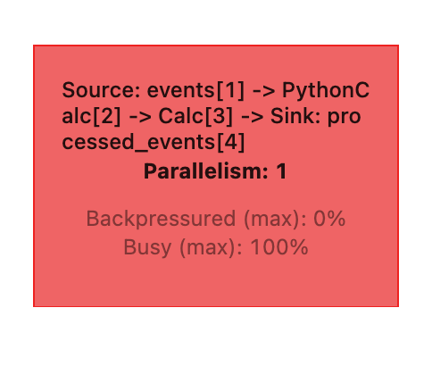

# Day 1 - Lab

# Setup

This requires a bit of setup.

First thing to do is to grab the keys from either Zach’s email or discord. Look for these 2 things:

- `*KAFKA_WEB_TRAFFIC_SECRET*`
- `*KAFKA_WEB_TRAFFIC_KEY*`

Then from the website [https://www.ip2location.io/](https://www.ip2location.io/) you want to register and grab a free API key.

Copy the file `example.env` and rename the copy to `flink-env.env`. Then paste your values there and don’t commit them anywhere.

Then, have docker running and run `make up`. Visit [`localhost:8081`](http://localhost:8081) to ensure everything is working correctly.

Then, we also need Postgres container from week1 to be running. Then open a postgres console or something where you can run queries, and run the code found in `sql/init.sql`. This will create a table so that Postgres can actually collect the data.

As a next step, you need to run `make job`. Then go to the Flink console → Running Jobs, you should see a single job running called `insert-into_default_catalog.default_database.processed_events`. Click on it and make sure it has no errors. If it does, check that the port Postgres is running on is actually `5432` and not some other port.

Last thing, open Postgres and run

```sql
SELECT * FROM processed_events;
```

If you see some events, then you did everything correctly.

# Lab

In this lab we will be working with a job (`start_job.py`) that looks at a Kafka topic, which is the one for **DataExpert** → every time there’s a pageload in DataExpert, it puts a record into Kafka.

The topic name is `bootcamp-events-prod`, and that’s where it’s gonna be writing its values. What the job does is taking the data from Kafka, hits the IP locator API and geocodes that IP address, so we can see where that traffic is coming from.

---

Open the file `start_job.py` in week 4 folder, and go all the way down to the function `log_processing`. This is the start of the Flink job, where all definitions and stuff are gonna go. From here we can see how the job is actually set up.

Let’s go kinda line by line:

```python
def log_processing():
 # --- Set up the execution environment

 # First thing, you want to get the "stream execution environment"
 # Cause flink can also do `enable_batch_mode`, which works, but behaves differently
 env = StreamExecutionEnvironment.get_execution_environment()
 # These are milliseconds so checkpointing here is every 10 seconds.
 env.enable_checkpointing(10 * 1000)

 # --- Set up the table environment
 # 👉 t_env kinda allows us to work with the spark equivalent of a dataframe
 # Here we're enabling the `use_streaming` setting
 settings = EnvironmentSettings.new_instance().in_streaming_mode().build()
 # where we define our sources
 t_env = StreamTableEnvironment.create(env, environment_settings=settings)

 # this is very similar to registering a UDF in Spark.
 t_env.create_temporary_function("get_location", get_location)

 # In get_location, is where we get the IP geolocation, from that API service
 # Check above the function get_location
 # This "UDF" returns a JSON object of country, state and city.

 # You can see it's called a `ScalarFunction`, which means it takes in 1 row or column
 # and returns 1 row or column.
 # In this case we're taking 1 column (IP address) and returns 1 column (JSON object).

 # ----
 try:
   # Here we're creating a couple of tables. A source, and a sink.
   # Check these functions in the code
   source_table = create_events_source_kafka(t_env)
   postgres_sink = create_processed_events_sink_postgres(t_env)
```

---

Let’s take a look for a moment at the source configuration used to connect to sources and sinks.

This is for Kafka source.

```python
WITH (
    'connector' = 'kafka',
    'properties.bootstrap.servers' = '{os.environ.get('KAFKA_URL')}',
    'topic' = '{os.environ.get('KAFKA_TOPIC')}',
    'properties.group.id' = '{os.environ.get('KAFKA_GROUP')}',
    'properties.security.protocol' = 'SASL_SSL',
    'properties.sasl.mechanism' = 'PLAIN',
    'properties.sasl.jaas.config' = 'org.apache.flink.kafka.shaded.org.apache.kafka.common.security.plain.PlainLoginModule required username=\"{kafka_key}\" password=\"{kafka_secret}\";',
    'scan.startup.mode' = 'latest-offset',
    'properties.auto.offset.reset' = 'latest',
    'format' = 'json'
);
```

- connector → specify where you’re reading from. For instance, you can even specify `rabbitmq`, or `jdbc`, so you can read from postgres, etc… In short, Flink can read from anywhere
- bootstrap.servers → all the servers that are running Kafka, a cluster of servers.
- topic → You can think a Kafka topic is very similar to a database table. If you look in the Flink environment, our Kafka topic is `bootcamp-events`.
- group.id → You can think of this like a schema. A lot of times in the DB world, you have `prod.table_name`, `dev.table_name`, this is kinda the same idea.
- properties.security.protocol → the protocol we using to connect to Kafka
- properties.sasl… → probably something specific to SASL security protocol, Zach didn’t treat this in the video because he had slightly different code than the one published.
- scan.startup.mode → remember when we discussed earliest offset and latest offset in the lecture. What this does is, when you first kickoff your Flink job, it’s going to read from either the 1st record in Kafka or the last one.
- properties.auto.offset.reset → This is if it fails and restarts, do we read from the first or the last offset? (or even a checkpoint, but checkpointing is optional)
- format → how is this data stored? In Kafka this is stored as JSON, but this can also be CSV, TSV, etc…

Then, we execute the source table DDL like this `t_env.execute_sql(source_ddl)`, basically to get access to the Kafka queue. [I’m not exactly sure what’s going on here. Is the “table” on Flink? I guess it is. — Ed.]

We defined our source, Kafka. Now let’s look at the configuration for the postgres sink. Here the schema is different from the source.

```python
sink_ddl = f"""
    CREATE TABLE {table_name} (
        ip VARCHAR,
        event_timestamp TIMESTAMP(3),
        referrer VARCHAR,
        host VARCHAR,
        url VARCHAR,
        geodata VARCHAR
    ) WITH (
        'connector' = 'jdbc',
        'url' = '{os.environ.get("POSTGRES_URL")}',
        'table-name' = '{table_name}',
        'username' = '{os.environ.get("POSTGRES_USER", "postgres")}',
        'password' = '{os.environ.get("POSTGRES_PASSWORD", "postgres")}',
        'driver' = 'org.postgresql.Driver'
    );
"""
```

- connector → here is `jdbc` because we connecting to postgres
- url → obviously the URL of our postgres environment
- table-name → ‘processed_events’, what we created before
- username → the postgres username
- password → the postgres password
- driver → this must be included when you deploy Flink if you want to be able to connect to postgres otherwise it will fail.

> Keep in mind, these `CREATE TABLE` statements don’t actually create a table in Postgres. This is just so Flink can be aware of the schema. That’s why we actually had to run the `CREATE TABLE` DDL at the beginning of the lab.
>

Last thing, the Kafka sink. It’s not ran in the main code but the DDL remained, so let’s take a look at it.

```python
sink_ddl = f"""
    CREATE TABLE {table_name} (
        ip VARCHAR,
        event_timestamp VARCHAR,
        referrer VARCHAR,
        host VARCHAR,
        url VARCHAR,
        geodata VARCHAR
    ) WITH (
        'connector' = 'kafka',
        'properties.bootstrap.servers' = '{os.environ.get('KAFKA_URL')}',
        'topic' = '{os.environ.get('KAFKA_GROUP').split('.')[0] + '.' + table_name}',
        'properties.ssl.endpoint.identification.algorithm' = '',
        'properties.group.id' = '{os.environ.get('KAFKA_GROUP')}',
        'properties.security.protocol' = 'SASL_SSL',
        'properties.sasl.jaas.config' = '{sasl_config}',
        'format' = 'json'
    );
    """
```

This is kind of the same as the source data, because it’s the same cluster. The only difference here is the topic, because we are writing to another table/topic.

> One thing that’s cool about Flink SQL is that is has the same performance as Flink Java, but you can write SQL. Example, the “tables” we created for sources and sinks, can then be referenced just by their name like you would do in SQL. In fact, for each of them, the creating functions just return the table names. We will see this right now, in the transformation step.
>

---

Back to the main code, where we do some transformations:

```python
t_env.execute_sql(
    f"""
            INSERT INTO {postgres_sink} # <-- table name!
            SELECT
                ip,
                event_timestamp,
                referrer,
                host,
                url,
                get_location(ip) as geodata # <-- the UDF we created to get ip geolocation!
            FROM {source_table}
            """
).wait()
```

This is very simple, there’s probably nothing to explain.

The `.wait()` is to make it run continuously instead of just running once for every record in the Kafka queue and then ending the job.

The try-catch is in case there’s a failure on either side.

---

Let’s now kill the Flink processes with `make down` and restart them with `make up`. If you now visit `localhost:8081`, and go to Jobs → Running Jobs, you will see there’s no running job ‘cause we just started the task manager.

Now click on “Overview”.

- Available task slots → how many jobs you can run at once. If you have more, is gonna wait for one to finish (’cause Flink jobs can also be batch jobs).

Now run `make job` in the terminal to restart the job.

Flink is similar to Spark in a certain way, as Spark is lazily evaluated and only starts a job when there’s an `insert` statement, or a `.collect()` or something that moves data. Flink is similar, which is why if we were running both sinks (Kafka and Postgres) we would see two jobs running.

As a fun experiment, kill the jobs again and change the offset to `earliest`, then restart flink and the job (`make up` and `make job`). This will create some interesting things in the UI.

In the Flink UI, click Jobs → Running Jobs, then open the details of the running job. The first thing you’ll notice is that the color of the box is no longer blue, but fully red (give it a couple seconds).



Also, the **“busy”** level is now at 100% [in previous experiments with latest offset it was running around 16% — Ed.].

- **Busy** → it means we’re at MAX compute, i.e. this job cannot process any more data and if it processes more data [not exactly sure how that would work — Ed.] it gets moved into **“backpressured”.**
- **Backpressured** → this essentially tells Kafka “slow down, add a bit more latency to the data, so we can process all of it and we don’t go OOM”. This can happen if your dataset goes very viral, or you get a lot of hits and spike.

Sure, you can enable some parallelism, but you have to pick the number of machines ahead of time, and you don’t know how much data you’re gonna have.

One tricky aspect of this pipeline is that we’re using a postgres sink, which contrarily to kafka sink is not tuned for high throughput, so in general you want to be aware when you’re building your Flink jobs about where your data is going.

👆 This is also the reason you’re seeing the job busy for so long. Because writing to postgres is going to take a while. If you were using a Kafka sink instead, you would see it get in the “blue” probably much quicker.
