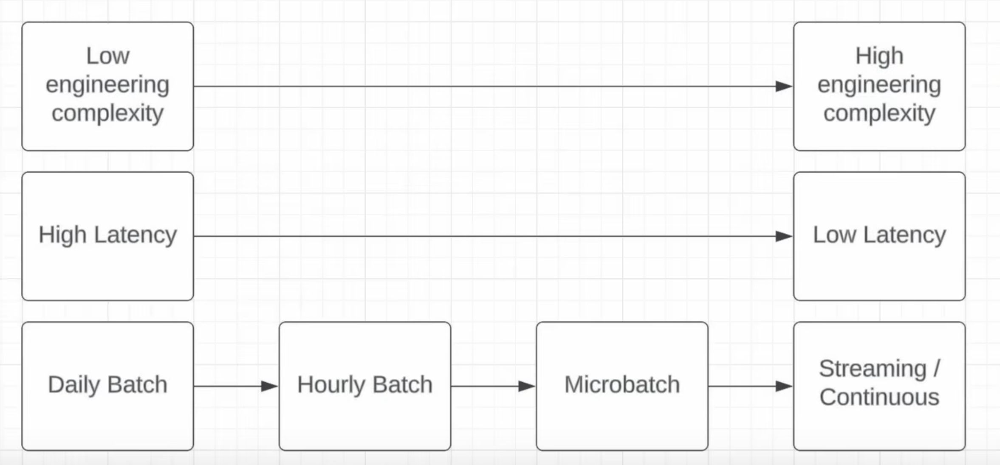

# Day 1 - Lecture

# Intro

In this course we will cover

- Apache Flink
- Apache Kafka
- how to process data in real time
- how to connect to an Apache Kafka cluster in the cloud that’s attached to Data Expert Academy
- working with clickstream data in the labs
- working with the complex windowing functions available in Flink like **count windows**, **sliding windows** and **session windows**

# What is a streaming pipeline?

Streaming pipelines process data in a low-latency way. In this lecture we will talk about different types of low latency pipelines.

Usually **“low-latency”**, means the data is processed in the order of minutes, depending also on the windowing functions, between couple minutes to half an hour.

Another word Zach likes to use is **“intraday”**, ‘cause a lot pipelines in the business world are daily pipelines, i.e. once a day, kicking off at UTC 00:00, and then run for a couple hours, then they’re done for the day.

Intraday pipelines run more than once a day, and that’s where this gets complicated, and we’re gonna talk about the different ways this can happen.

# What’s the difference between streaming, near real-time and real-time?

- Streaming (or continuous)
  - Data is processed immediately as it is generated → processed like a river, a **stream**
  - Example: Flink
- Near real-time
  - Instead of processing data as is generated, you wait maybe a couple of minutes, to collect all data that has happened in that period of time, and then you process that data as it comes in.
  - Example: **Spark Structured Streaming** (not yet a continuous processing framework).
- Real-time
  - Often synonym with **streaming**, but not always!
  - You wanna make sure to understand latency requirements of the pipeline
  - Don’t take your stakeholder words at face value (e.g. “I need it real time!”)
  - Zach says, in his career, only two times a stakeholder actually meant a streaming pipeline when asking for **real-time**, so like 10% of the times in his case.
  - **As a rule of thumb: streaming pipelines use cases are quite rare!**
- Micro-batch
  - Almost the same as **near real-time**

## What does real-time mean from stakeholders

- It **RARELY** means streaming
- It usually means low-latency or predictable refresh rate

> Sometimes Zach had stakeholders tell him “real-time”, but what they really meant is *“every day at 9 AM”*
>

Lot of times, what stakeholders mistake is that they think real-time means “reliable”, “predictable”. This is good to talk about with them: you can have a Service Level Agreement (SLA) discussion, which essentially means you ask them *“When do you want the data refreshed?”* and a lot of times the will give you a time like “8 hours after midnight”, and then you can agree with them that you guarantee the data will be available by then.

This conversation will be way better than not having this conversation, and just do everything in streaming.

This is a proper example how good communication is fundamental in Data Engineering.

<aside>

Don’t build them a Ferrari when a bicycle would work.

</aside>

# Should you use streaming?

Is it even worth to use it?

You need to ask yourself these questions:

- Do members on the team have a streaming skillset?
  - When Zach was working at Netflix, most pipelines in the security space were done in batch or microbatch. The people in security wanted lower latency, even if they were giving already 15 minutes refresh times.
  - What happened was the security team kept pushing, so one guy in the DE team started migrating some of the pipelines to streaming, and what happened is that this guy became an island: when one of the streaming jobs broke, he was the only one who could fix it. Zach had to learn how to fix it, but they were only 2 out of 15, which was not really fair, also ‘cause they had to be on-call half the year each.
- What’s the incremental benefit?
  - In the Netflix example, let’s say they lowered the latency from 15 mins to 2 or 3 minutes, what is the real benefit gained? In the security space maybe you can make a case for it, but in other cases, you have to consider what the value added is of reducing latency.
- Homogeneity of your pipelines
  - If you’re a DE team, and you have 99% batch pipelines, then why have 1% streaming pipelines?
  - The only case this makes sense, is if you have already people with the skills, and you have a STRONG incremental benefit to it, then maybe.
  - Otherwise, if you’re a batch team, you should stay with batch, and if you’re a streaming team, you should stick with streaming (e.g. Uber and the Kappa architecture).
- Tradeoff between daily batch, hourly batch, microbatch and streaming.
  - There’s a continuum between complexity vs latency
  - Again you want to go back to what the incremental benefit is
- Where are you gonna put data quality checks?
  - ‘Cause this is a lot harder to do in streaming (batch pipelines have easier DQ paths).
  - In batch you have obvious steps: A→B→C. You can put quality anywhere between these clear cut steps.
  - But in streaming, where do you put it? It just runs all the time, there’s no A→B→C, it’s always on.

# Streaming-only use cases

> **KEY: low latency makes or breaks the use case**
>

This means those cases where hourly batches for instance won’t cut it, and they only make sense in a streaming situation.

Examples:

- Detecting fraud, preventing bad behavior
  - Stealing credit card: you don’t want them to be able to go on a 1-day spending spree before the fraud is detected → it would be quite a bad fraud detection system
- High-frequency trading
  - Imagine you’re like “I found a perfect setup for a trade, yesterday”, ‘cause the data is in daily batch. Well, that opportunity is gone!
- Live event processing
  - Like sports analytics during a live game, those all come from streaming pipelines.

> For the streaming-only use cases, there’s an obvious signal that we should be using streaming, because without it would break the product.
>

## Gray-area use cases (microbatch may work too)

- Data that is served to customers
  - What you want to be careful about is the tradeoff between data quality and latency. So streaming might not a good fit, but microbatch might, as it’s easier to implement DQ.
  - Customers might be ok having 1 hour latency.
  - What’s bad is if you’re many days behind.
- Reducing the latency of upstream master data
  - Imagine you have master data that is upstream in your DWH, one of the furthest upstream dataset that’s depended on by a lot of other datasets. In this case here streaming could be very powerful, because all the downstream datasets can fire sooner, because the daily data will be ready sooner.
  - This allows your warehouse to also be amortized, as you use all the compute throughout the day, as supposed to having some dead compute in the middle of the day, and at midnight having a big spike, which happens a lot in many different warehouses, especially in those hours between 0:00AM and 2:00AM.
  - This makes even more sense if you’re not using on-demand resources but you’re just renting.

Here’s an example from Zach where he failed to implement streaming: he was working in notifications, and he needed to work on this notification event fact data.

Every row was a notification event: sent, delivered, clicked on etc…

The thing is that these events can be duplicated because you can click on a notification twice. So this was a perfect use case for streaming, and no matter what Zach did it kept going OOM.

The reason for that is that the duplicate can happen at any point throughout the day, so even if one event happens in the morning and the other at night, those duplicates still need to be managed, so that means you have to hold on every **notification_id** for the entire day, everything in RAM. And that dataset was 20 TB.

In that case, what Zach ended up doing was eventually abandoning streaming and did it in micro-batches. [Here’s the example repo](https://github.com/EcZachly/microbatch-hourly-deduped-tutorial) (it’s the tree deduping microbatch approach).

This made all the notifications datasets way more up-to-date, form 9 hours latency to about 1 hour.

# No-go streaming use cases! (use batch please)

If the analyst is just upset that the data is up-to-date in those cases where he’s querying early in the morning. Let it be, it doesn’t matter. You need to ask yourself: ok if it was up to date, what would change in the business? **Most times, nothing, so it would be a waste of time to reduce the latency.**

If you think about the velocity at which business decisions are made at, most business decisions take hours, it never happens that a business sees the data and goes “omg! we need to act now!”.

> So you need to ask yourself, even if data was available right from the moment it gets generated, how is the business gonna change?
>

Some cases, real-time data it might even be detrimental, as people might just get stuck on the screen watching the numbers update continuously, like traders addicted to the stock market in the minute-to-minute charts.

# How are streaming pipelines different from batch pipelines?

- Streaming pipelines run 24/7! Batch pipelines run for a small % of the day, like 1 to 4 hours or so, where 4 hours is for those giant behemoth big tech pipelines.
  - A pipeline running all the time has more probability of breaking, rather than something running just a few minutes a day.
  - Thus require a very different skillset → Streaming pipelines act as a webserver, serving and moving data.
- 👆 Therefore, streaming pipelines are much more software engineering oriented
  - They act a lot more like servers than DAGs
- Streaming pipelines need to be treated as such and have more unit test and integration test coverage like servers!

# The streaming → batch continuum

This continuum goes from not complex → very complex, and from high latency → low latency.

The lower the latency, the higher the engineering complexity.

> As you reduce the latency of your solution, complexity goes up!
>

---

Real-time is actually a myth (even with Flink)!.

- You’ll have seconds of latency just because there’s network transfer time (generation → Kafka → Flink → sink)
  - Example, in the lab today, every time Zach’s website gets a web request, there’s an interceptor that intercepts the web request and logs it into Kafka. The avg. latency for this step is 150ms.
  - The above is just a step, but there’s actually many more moving pieces that delay the data!

> Just remember real-time doesn’t mean instantly.
>

# The structure of a streaming pipeline

- The sources
  - Kafka, RabbitMQ
    - Rabbit doesn’t scale as much as Kafka due to throughput
    - But it has more complex routing mechanisms → i.e. Rabbit can be like a message broker; you can do “pub-sub” a lot easier than you can do with Kafka.
    - Kafka is more like a firehose, in one direction. You can’t really like divert → “here’s my stream of events now process it!”
    - Because of this architecture, Kafka is very fast.
- Enriched dimensional sources (i.e. side inputs)
  - Here is where you have events coming in, and you want to have that event bring in some dimensional sources, maybe doing some de-normalization of your fact data, where you bring in different columns from other tables.
  - These are called side inputs. Google “Flink side inputs” to learn more about it.
  - Data comes from regular data-at-rest, like Iceberg or Postgres
  - This dimensional data can refresh on a cadence, like 3-6 hours, you decide.
  - Obviously, if your dimensions change a lot, then you want the cadence of refresh to be smaller.
  - You don’t wanna refresh too much as you’re gonna waste compute on data that doesn’t change too much.

---

- The compute engine → Two SOTA options:
  - Flink → very powerful framework
  - Spark Structured Streaming
  - These are what actually do the crunching of the data.

---

Here basically what happens is:

- Your data lands in real-time in Kafka
- Flink picks it up in real-time and dumps it somewhere

Components:

- The destination, also called “the sink”
- Common sinks
  - Another Kafka topic
  - Iceberg → one of the reasons why it was created was to solve this streaming problem.
    - Before you had HIVE (metastore was very *batch oriented*)
    - If you wanted to add data, you had to override the whole partition
    - No way to add new data to a partition that already existed
    - Iceberg let people do this 👆(append new data to existing partitions)
    - Iceberg tables can be easily populated by streaming, but also queried in batch.
  - Postgres
    - This is another powerful option to setup a sink

# Streaming challenges

- Out of order events
- Late arriving data
- Recovering from failures

Remember that there’s latency between when data is generated and when it lands in Kafka.

Because of this latency, you can have newer data that is ahead of older data in the dataset, or in other words, the data is not in the right order. How do you manage these? Especially in cases like funnel analysis, or other event streams that depend on the order of events.

For late arriving data, compare it with batch world: in the batch world it doesn’t have such a big impact, because you only have to worry about it at midnight. A lot of the times, the batch job doesn’t even fire until 10-15 minutes after 00:00AM. You don’t really have to worry about late arriving data here, unless it’s really really late, but in that case, most people would go “eh fuck it, who cares”.

Regarding failure recovery, in streaming pipelines it’s tricky when it fails, because you need to re-set it and have it run again. And the longer you wait to fix a streaming pipeline failure, the more data gets behind it, getting backed up more and more.

> Most of these problems don’t exist in the batch environment.
>

## Out of order events

How does Flink deal with out-of-order events?

- You can specify a **WATERMARK** → what watermark does is say “there’s no events that are newer than the watermark”. In other words, when the watermark is hit, you can guarantee that all events inside that watermark are gonna be older than the events after the watermark.
- How it works, is the watermark looks at the event time, and usually there’s some buffer (like 15 seconds). So the watermark says “ok, everything within the next 15 seconds could be out-of-order, but something 16 seconds away is NOT out of order”.
- Basically you give yourself a window of X seconds where there’s a possibility that your events will be out of order, and Flink will fix the ordering in that window automatically.

## Recovering from failures

Flink manages in different ways:

The big one is **CHECKPOINTS.** You can Flink to checkpoint every `n` number of seconds, and what this does is to save the state of the job at that moment in time, knowing where to read from and write to if it fails.

This leads to talk about **offsets.** When Flink starts up, you have to tell it whether to do either:

- **earliest offset** → read everything that’s in Kafka, all the way back
- **latest offset** → only read new data after the job starts
- A specific moment in time → read at this timestamp or newer.

Or it can pick up from a checkpoint / savepoint.

- Checkpoints → internal to Flink internal mechanisms
- Savepoints → More agnostic, kinda like a CSV file that says “ok we processed this data and we got this far”. Sometimes if Flink fails, we want other systems to be aware where we failed and where to pick up from.

## Late-arriving data

How late is too late?

You actually have to choose the time here. 5 minutes? 10 minutes?

> Late arriving data and out of order are related, because out of order is data that arrived late.
>

Watermarking and late-arriving data are similar concepts, but:

- Watermarking is for the 99% of data
- Late arriving is for the long tail, the small amount of data that might come in exceptionally late
