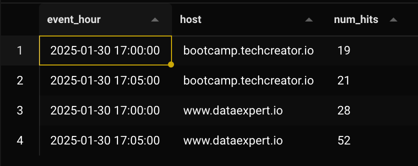

# Day 2 - Lab

In this lab we will work with aggregations over window functions in Flink. First, let’s start up Flink with `make up`.

Let’s start by creating the necessary tables in Postgres:

```sql
-- to count hits on host every 5 minutes
CREATE TABLE processed_events_aggregated (
  event_hour TIMESTAMP(3),
  host VARCHAR,
  num_hits BIGINT
);

-- to count hits on host for each referrer every 5 minutes
CREATE TABLE processed_events_aggregated_source (
 event_hour TIMESTAMP(3),
 host VARCHAR,
 referrer VARCHAR,
 num_hits BIGINT
);
```

Now open `aggregation_job.py`. Like with the other job, let’s go step by step.

```python
def log_aggregation():
  # Set up the execution environment
  env = StreamExecutionEnvironment.get_execution_environment()
  env.enable_checkpointing(10)
  env.set_parallelism(3)

  # Set up the table environment
  settings = EnvironmentSettings.new_instance().in_streaming_mode().build()
  t_env = StreamTableEnvironment.create(env, environment_settings=settings)

  # these first settings are standard that you're going to see
  # in pretty much every single Flink job

  try:
      # Create Kafka table
      # Here we create our source table, which was created from that other job
      source_table = create_processed_events_source_kafka(t_env)

      # and here we define our sinks
        aggregated_table = create_aggregated_events_sink_postgres(t_env)
        aggregated_sink_table = create_aggregated_events_referrer_sink_postgres(t_env)

        # Here we're gonna have a window that is open every 5 minutes (see the tumble)
        # And basically counts, for every 5 minutes, how many hits each host gets (group by)
        # and returns 3 columns: the initial time of the window, the host, and the hit count.
        t_env.from_path(source_table)\  # read from source table
            .window(  # do the 5 minutes window on a time column
            Tumble.over(lit(5).minutes).on(col("window_timestamp")).alias("w")
        ).group_by(  # group by the window and other dimensions
            col("w"),
            col("host")
        ) \
            .select(  # return the columns we need
                    col("w").start.alias("event_hour"),
                    col("host"),
                    col("host").count.alias("num_hits")  # this is the aggregation
            ) \
            .execute_insert(aggregated_table)
        # in other words, this 👆 is gonna do an aggregation every 5 minutes
        # Another note: you most likely wanna do your windowing on event time,
        # rather than processing time!!!

        # The other job is pretty much exactly the same,
        # except it adds another dimension (referrer) to the aggregation.
```

> Keep in mind that when using window functions in Flink, your source needs to have watermarks for them to work, as seen in the function that defines the source `create_processed_events_source_kafka`. *[This is at least according to how Zach debugged an issue with the pipeline during the video lesson. — Ed.]*
>

Now, in your terminal, run `make aggregation_job` to start these new jobs. You need to keep it running for at least 5 minutes to see some data on postgres. When you do, data for the first job should look like this:



Whereas data for the 2nd should look like this. It’s basically the same but grouped by also referrer.


---

One thing that’s important about Flink is working with parallelism. If you check the Flink UI, you see that any of the running job has a parallelism of 3 and also 3 tasks for stage. Parallelism is correlated to how data is partitioned at the source, so if you have 3 partitions, a parallelism of 3 will give 3 times the speed of no parallelism.

Another interesting aspect is that parallelism numbers in Flink are much smaller than Spark. In Spark, the default partitioning is 200, whereas in Flink it’s 1.

That’s one of the fundamental differences between batch and streaming: In streaming you process the data as it comes in, but then your job is running all the time, and you’re not going to all the time have spikes that require a lot of parallelism. So it’s kind of a trade-off.

**Do we need to do the aggregation in real time? And should it be Flink, or Spark, or batch?**

This depends on the situation. In this case, it’s nice to use Flink because the aggregation window is only of 5 minutes. Running a Spark job that does GROUP BY every 5 minutes would be an absolute joke, since it would take like 3 minutes every time to start the job.

There’s a threshold where it flips, where batch becomes preferable to streaming, which is probably around 1 hour, in that you don’t want to do a tumble window that’s as large as 1 hour.

Obviously this rule of thumb only matters when you’re working at a very large scale.

At a smaller scale, it’s totally possible to use Flink to do daily aggregations, when the data is quite small.

But this is the reason why batch becomes better on larger timeframes, because Flink needs to hold on so much stuff in memory when doing a windowing, so imagine if you were to do a window of 2 hour with billions of events.
