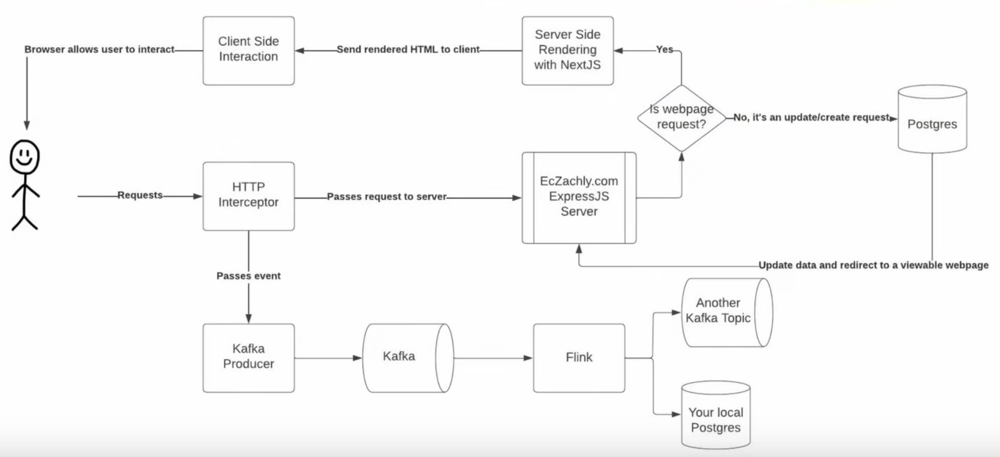

# Day 2 - Lecture

# Streaming needs a lot of pieces to work



Let’s navigate more in detail what is going on when events from Zach’s website show up in our local postgres instance like we saw in previous lecture and lab.

This diagram above is the architecture of his entire website.

Starting from the stick figure:

1. The http request (to visit the website) gets intercepted
2. It’s logged to Kafka
    1. Goes to a **Kafka Producer**
    2. Kafka Producer puts it on Kafka
    3. Read from Kafka with Flink
    4. Can dump it to either another Kafka topic or our local Postgres
3. It’s also passed forward to [Eczachly.com](http://Eczachly.com) ExpressJS server
4. Check if the request is a webpage request (a normal HTML request)
5. If yes, server side rendering with NextJS
    1. Passes the rendered HTML to client
    2. Client ready for the user to work with it
6. If it’s not a web request, then it’s an API request (update, create, delete)
    1. Request gets sent to Postgres (like a signup)
    2. Goes back to the server
    3. Redirect the user

The whole point is that streaming needs to have some type of **real-time architecture** like this. It has to have a way to intercept real time events, so there’s more to streaming than just Kafka.

There has to be another layer, an **event generation layer**, which in this case is the HTTP interceptor, when every time an action is taken by a user it gets dumped to Kafka.

## HTTP Interceptor

```jsx
export default function createAPIEventMiddleware(req, res, next) {
 const shouldBeLogged =
  req.url && !req.hostname.includes('localhost') && !isFileRequest(req);
 const event = {
  url: req.url,
  referrer: req.headers.referer,
  user_agent: JSON.stringify(useragent.parse(req.headers['user-agent'])),
  headers: JSON.stringify(req.headers),
  host: req.headers.host,
  ip: req.connection.remoteAddress,
  event_time: new Date(),
 };

 if (shouldBeLogged) {
  Promise.all([
   sendMessageToKafka({...event}),
  ]).then(() => {
   next();
  });
 } else {
  next();
 }
}
```

This sits between the user and when the request hits the server.

You see it has 3 arguments:

- req → the request
- res → the response
- next → when it’s called, it passes the request to the server

What happens here, is the 1st line wants to understand if the events should actually be logged. This way, during local development, those events are not sent to Kafka as it’s not real traffic; file requests also don’t get logged (like image requests) as that would be excessive, as we only care about the webpage requests and API requests.

Then we have the `event`, and that’s the schema we were working with last lab.

Last step is: if the event should be logged, then pass the event to Kafka and then call `next()`. Otherwise, just call `next()`.

## Kafka Producer

```jsx
export default function sendMessageToKafka(message: object) {
 const producer = new Kafka.Producer({
  connectionString: process.env.KAFKA_URL,
  ssl: {cert: process.env.KAFKA_CLIENT_CERT...},
 });

 const messageObject = {
  topic: 'porcupine-78436.bootcamp-events',
  message: {...},
 } as Message;

 producer
  .init()
  .then(() => {
   return producer.send([messageObject]);
  })
  .then((result) => {
   console.log('Message sent successfully', result);
   return producer.end();
  })
  .catch((err) => {
   console.error('Error sending message', err);
   return producer.end();
  })
}
```

This is the producer code,  that in the Interceptor sends the message to Kafka. In the Producer we need to also specify the SSL connection like we had to to for Flink.

The `messageObject` is composed of both the topic to send the message to, as well as the payload.

Eventually, with the producer we try to send the data (`producer.send`), and catch any error that may happen.

Since this is just logging to Kafka, we don’t want this to throw an error, because it’s just logs anyway.

> Interceptor and Producer are the two things that happen upstream to events landing in Kafka.
>

# Future version of the architecture


It’s similar to the previous one, with a couple more pieces.

We have the Flink job that outputs to another Kafka topic, and then a Kafka consumer listens to the processed Kafka queue, which will then push events back to [EcZachly.com](http://EcZachly.com) server, and then the server will push those events through a Websocket, and then the client will be updated in real-time.

This is what a real-time data product looks like: you have a full loop where the clients generate some data, which gets processed by the server somehow and fed back live to the client.

Let’s talk a little more about websockets:

Generally speaking, when you’re building a website, you have a client and a server, and the client always asks the server for data, and it almost always initiates the request. This is basically how HTTP works.

However, if you need the server to also send requests to the client, then you need a **websocket,** which enables a two-way communication and real-time updates.

# The big competing architectures

For processing data, there are two competing alternatives.

- Lambda architecture
- Kappa architecture

**Lambda architecture**

Imagine you have a batch pipeline that you want to optimize for latency, so you create a second one that is a streaming pipeline and lands data earlier so the data is ready earlier.

In Lambda architecture, you keep both pipelines, batch and streaming, both writing the same data, and the main reason is that the batch pipeline acts as a backup if the streaming pipeline fails in some way.

The biggest pain here is double code.

**Kappa architecture**

In this one you don’t need both streaming and batch, you can just use streaming. For instance, Flink can handle both streaming and batch loads, however backfilling is quite hard, as Flink is mainly tailored to read from Kafka, and reading many days of Kafka history is quite painful.

However, with Iceberg things are changing, because you can dump data to Iceberg and have a nice partitioned table, and if you need to backfill with Flink, you can do so days at a time, rather than on a single line of data as it would be in Kafka.

The poster child of Kappa architecture is Uber, as they’re basically a 100% streaming only company, which makes sense, as it’s very in their nature to be streaming first.

- Pros
  - Least complex
  - Great latency wins
- Can be painful when you need to read a lot of history
  - You need to read things sequentially
- Delta Lake, Iceberg, Hudi are making this architecture much more viable!

> In the end, one is not better than the other, but it’s useful to know about both of them and where they would fit.
>

# Flink UDFs

UDFs generally speaking won’t perform as well as built-in functions

- Use UDFs for custom transformations, integrations, etc…
- Python UDFs are going to be even less performant than Java or Scala UDFs, and the reason for this is that they need to have a separate python process that gets called when you hit that UDF call (kind of like it is in PySpark).

# Flink Windows

There’s two types of windows in Flink: count windows, and time driven windows. You can kind of think of these as GROUP BY or window functions in SQL. It’s kind of like that, but different.

**Data-driven windows**

- Count
- How this window works is you open it, and then it stays open until you see **N** number of events
- You can key here, so you can make them “per user” (e.g. like PARTITION BY in SQL, in Flink you have Key By)
- One important aspect is that the number of events may never come, e.g. you threshold is 50 but a person only does 3, so you want to specify a timeout to close the window.
- Very powerful for funnel analytics that have a predictable number of events.

**Time-driven windows**

- Tumbling
  - Fixed size
  - No overlap
  - Similar to hourly data
  - Great for chunking data
  - The closest comparison to data in batch. A lot of times in the batch world you have hourly or daily data. This is kind of like a window. From point A to B, e.g. midnight to midnight of the day after.


- Sliding
  - Has overlap
  - Captures more windows
  - Good for finding “peak-use” windows
  - Good at handling “across midnight” exceptions in batch
  - These usually have a fixed with, but can be overlapping. If your fixed with is 1hr, you can have from 1:00 to 2:00, but also from 1:30 to 2:30. You get more duplicates this way so you need to understand how to manage them downstream. You use sliding windows probably to find the window with most datapoint, e.g. “peak-time”. If your window is 1 hour long, but you shift it every 30 minutes, you may realize the peak is between 12:30 to 1:30 rather than 12 to 1. It’s also useful when crossing the midnight boundary. If your user starts the session at 11.58 PM and ends at 00:02AM, do they count as daily active on both days? Sliding windows in this case can show you these kind of double counts. However, they’re relatively niche, and have a very specific use case, because of this weird overlap problem, and they’re more suited towards an analytical use case rather than for building out master data.


- Session (no graph here unfortunately)
  - Variable length → User specific
  - Based on activity
  - Used to determine “normal” activity
  - Imagine when user signs in, they make the first event, that’s the start of the window. Then the window will last until there’s a big enough gap (e.g. 5, 10, 20 minutes), where you have no data from the user.

# Allowed Lateness vs Watermarking

Two ways to deal with out-of-order or late arriving events. If it’s a little be late, then **watermarking** is gonna be good (like a couple seconds). If it’s late in the order of minutes, then **“allowed lateness”** works better.

**Watermarks**

- Defines when the computational window will execute
- Helps define ordering of events that arrive out-of-order
- Handles idleness too

**Allowed Lateness**

- Usually set to 0
- Allows for reprocessing of events that fall within the late window
- CAUTION: WILL GENERATE/MERGE WITH OTHER RECORDS

Allowed lateness seem to have several drawbacks, Zach provides a nice metaphor here to understand the difference: imagine you have a Zoom call to attend and you’re just a couple minutes late: you’re not going to text anybody about it. But if you know you’re gonna be more than like 5 minutes late, then you probably will text to warn about it.

Zach reasons the same about events. He only uses **watermarks** most of the time, and if an event is too late (like a person being too late in a Zoom call), he assumes they’re not coming and discards them.

Obviously, it depends on the use case, as in some you need to capture 100% of the data even if it is really late, but that’s probably not the case for most pipelines.
