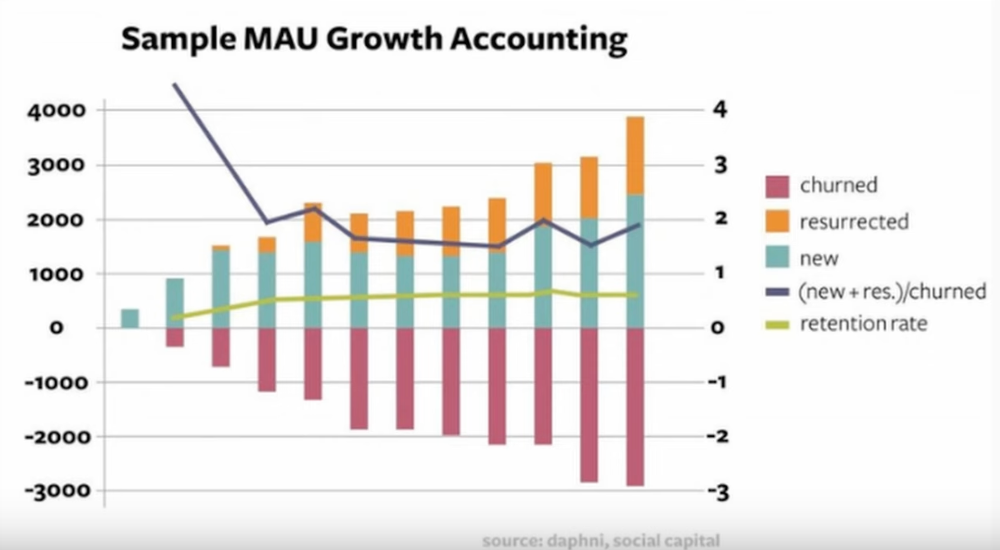

# Day 1 - Lecture

# Intro

Analytical Patterns will save you a lot of time as a data engineer.

<aside>


Not all data engineering pipelines are built differently

</aside>

There are a couple patterns that if you can see them, then you’ll know exactly what type of pipeline to implement.

In this lecture we will consider two of these patterns:

- Growth Accounting → How facebook tracks inflows and outflows of active and inactive users.
  - This can be used for any other state change transition tracking
  - Closely related to the cumulative table design concepts we’ve seen in weeks 1 and 2
- Survivor Analysis Pattern → Of all users that signed up today, what % are still active in 30, 60, 90 days?
  - The retention number

---

Repeatable analyses are your best friend. The reason is that they allow you to think at a higher level, at a more abstract layer, recognizing that the SQL will write itself once you recognize the higher level abstraction.

In a way, these abstractions are an extension to SQL. ‘Cause SQL in itself is already an abstraction over some lower level language. If SQL is already an abstraction, we don’t have to be married to this layer, we can go a layer above.

Common patterns to learn

- State change tracking (closely connected to SCD)
- Survivorship analysis
- Window based analysis

Some of these are really closely linked with cumulative table design, some based on it, and don’t work very well without it.

# Repeatable analyses

- Reduce cognitive load of thinking about the SQL → You can think about bigger picture layers
  - The more important thing is knowing these high level patterns rather than knowing every single SQL function
- Streamline your impact
  - Tech will change in the future, but so it’s better to learn to focus on the bigger picture so that no matter the tech, you can still bring your A game, which is gonna be a lot more impactful than just being on top of the bleeding edge of every technology.

<aside>


Once you recognize the higher level picture, the pipeline writes itself

</aside>

# Common patterns

- Aggregation-based patterns
- Cumulation-based patterns
- Window-based patterns

95% of pipelines that Zach has ever written in his life are based on just these 3 patterns.

There’s maybe a 4th pattern that could be called “enrichment-based pattern”, but here we’re already at the master data level, which means we already have all the columns that we need.

## Aggregation-based patterns

Probably the simplest patterns. When you’re building a pipeline and you do an aggregation, the keyword is `GROUP BY`. Aggregations are all about grouping by different things and counting things by different dimensions.

Counting is a very important part of analytics that doesn’t get enough credits, as it’s not sexy or fancy, it’s kinda like the meat and potatoes of analytics.

- Trend analysis
- Root cause analysis → You can plug in any metric, it would explain the movement of that metric.
  - Imagine you have a week-over-week change of +1 million, it would give you the dimensional breakdown on this increase (so like +1.5 million in the US and -500k in India).
  - One thing you can do with this is if you see a certain shift in a metric, you can start bringing in other dimensions to understand where this change is coming from (country, gender, age, height, etc…)
  - This gives a better picture than just “number down → ☹️☹️☹️”.

### Aggregation based analyses

- The most common type of analysis, probably more than 50% of all analyses.
- `GROUP BY` is your friend
- Upstream dataset is often the “daily metrics”.
- Common types of analysis
  - Root cause analysis (why is this thing happening)
  - Trends
  - Composition

These analyses you shouldn’t be going back to the fact data, even though there’s a strong urge to go there. The problem is fact data should be aggregated along the dimensional line (e.g. user, or listing_id, or device_id etc…).

You wanna have things already aggregated up because if you go back to fact data, then join all the dimensions, then aggregate the result, it’s gonna be complicated because dimensions aren’t gonna be 1-to-1.

You want to have some kind of pre-aggregation on the fact data, like “daily data”, on some dimension such as `user_id`, and then join this one with the users table (or whatever table you’re aggregating on) [admittedly this part was a bit hard to understand — Ed.].

There are a couple gotchas: when doing aggregation based analyses, you wanna be careful to not bring in too many dimensions. If you start bringing in too many, ultra-specific dimensions and apply all of them at the same time, then basically you just go back to the daily data, as the groups can get as small as a single person (we saw this in a previous lecture).

Also, when looking at % based metrics, make sure that you’re looking at actual counts. A 100% drop of something might just be a single person’s action (e.g. going from 1 → 0).

Another gotcha is when doing a long time frame analysis, you don’t want to have too many cuts in your data (e.g. > 90 days). So don’t do a per day analyses, but maybe do it per week or month. A daily grain with a long term analysis will give you a lot of rows, especially if you bring in also another high cardinality dimension [also, it’s very noisy — Ed.].

## Cumulation-based patterns

- State transition tracking
- Retention (also called j curves, or survivorship analysis).

These patterns are gonna all be based on the cumulative table design that we’ve worked on week 1.

- **Time is a significantly different dimensions** vs other ones
  - Yesterday vs today
- `FULL OUTER JOIN` is your friend here (built on top of cumulative tables)
  - You need to keep track where there ISN’T data. That’s another big difference between aggregation-based pattern and this pattern.
  - **No data, is data!** → The fact that someone didn’t DO something, we want to keep track of it in cumulation-based (in contrary to aggregation-based).
- Common for these following patterns:
  - State change tracking
  - Survival analysis (also called retention)

### Growth accounting

A special version of state transition tracking. This is where the cumulation part of it will make more sense.

There’s 5 states the user can be in:

- New (didn’t exist yesterday, active today)
- Retained (active yesterday, active today)
- Churned (active yesterday, inactive today)
- Resurrected (inactive yesterday, active today)
- Stale (inactive yesterday, inactive today).

In some patterns you have a 6th state like “deleted” or “deactivated” (active/inactive yesterday, don’t exist today).

This pattern is very powerful. Take a look at this chart, as a result of it (MAU stands for monthly active users).



You can calculate **growth** as `new + resurrected - churned`, which will give you the growth rate of your business → how many incremental people are coming in (people coming in minus leaving).

> This is not just specific to growth.
>

You can do this in many different areas. “Churned”, “resurrected” and “new” are just labels.

You can use this pattern for more abstract on different things. For instance, Zach was using it when tracking fake accounts, so he would have these labels:

- New fake account (account that was never fake, now is fake)
- Resurrected → Reclassified fake account (fake account that was “approved” as real person and then classified fake again)
- Churned → Declassified (in this case a good thing, a fake account that is leaving)

As you can see, there is the same set of states as for user growth.

Another example at Netflix: they were labeling applications in their microservices as “Risky” or Not risky”, and they wanted to track the flow of this as well.

One of the things that these types of patterns give you is very good monitoring, e.g. you can monitor the health of your ML models (e.g. fake accounts, or risky microservices etc…).

Another example at Airbnb: another ML model that was for hosts, based on the probability that they were gonna cancel on you last minute, which is very bad obviously, especially once the customer already flied to destination. They did the same kind of tracking on this model, labeling hosts as “risky” and “not-risky”. This analysis is good for 2 things:

- You can look at these charts to track the health of the ML model
- But also to track the effectiveness of whatever you’re doing (do your actions have an impact on hosts behavior?)

### Survivorship analysis and bias


In WW2, planes would get into dogfights, then fly home, and they were like “we need to reinforce those areas with all the shots!”. But then a really smart person was like “hold up, those are the planes that survived, so the areas that need to be bolstered are those with NO bullet holes!”.

The point here is survivorship and how long things survive is an important measurement to have in our analytical patterns.

**Survivor analysis J-curves**


If you think about retention, that is essentially “surviving”.

Look at the chart, there’s 3 ways that things can go. See at the top everything starts at 100%; the fundamental component of this analysis that we’re starting from a point (like a date) where everyone is on the same page, and then as time progresses, the state will change: some users will stick around, some will leave.

If your app has is like the grey line, it’s kinda doomed because as you get new users, over time they will keep going away forever, you lack the “stickiness”.

In the green and orange line instead, you have found a successful app, as there’s a certain % of users that stay for the long term.

There’s other applications of J-curves beyond user growth:


Basically, as you can see from the chart, there’s some kind “state” to be retained over time, which can be pretty much anything, and is checked versus a reference date.

### Window-based analyses

- DoD / WoW / MoM / YoY (day, week, month, year)
  - Zach likes to think of this like a derivative, a rate of change over time. Using window functions here is great.
- Rolling Sum / Average
  - This one is the opposite of the above, like an integral, i.e. the cumulation over a certain period of time.
- Ranking
  - This one doesn’t need to be solved by window functions necessarily, but it depends on how complicated the ranking is.

One of the keyword of these analyses is **rolling**. For **rolling**, ****the syntax is the same every single time

```sql
function()
 over(partition by keys order by sort rows between n preceding and current row)
```

Sort here is often by **date**, then **partition by** whatever the dimensional cut you’re doing (user_id, country, etc…), and **“n”** is gonna be the number of rolling days.

One thing that’s interesting is that thee 2 lines (week-over-week vs rolling sum / average) are in contrast to each other: the first is spiky, where as the 2nd is smoothed out.


> Side note: make sure to partition on something if you’re using big data, because if you don’t, your windows are gonna be so huge and it’s gonna cause OOM errors to happen.
>