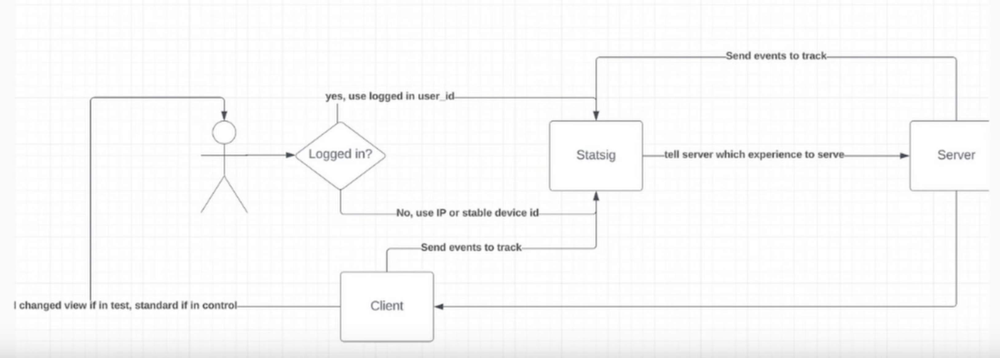

# Day 2 - Lecture

# Leading vs lagging metrics

Ultimately, every metric that you write should be correlated, in some way, with money. And the metric can even be money itself. Revenue is its own metric.

One of the problems of “revenue” as a metric, is that is quite slow moving, and there’s a lot of things that have to happen before revenue happens, therefore revenue is called **“lagging metric”**, whereas the alternative might be called **“leading metric”**.

As Data Engineers, the data that we provide should be linked to revenue either directly, or indirectly by decreasing costs, which can happen in all sorts of ways: optimizing pipelines, making a process more efficient by providing better data etc…

One exception to this rule is where you’re working in a non-profit, in that case probably your North Star metric is different, but even then, they still care about reducing spend.

---

- Are we measuring inputs or outputs?
  - Does our effort impact our output?
- Are inputs and outputs correlated? (i.e. conversion rate)

Imagine a funnel like social media impression → website visits → signup → purchase. The further away you are from money, the more the metrics are “leading” or “input”.

This idea of leading vs lagging metrics can also apply to your life. E.g. if you’re getting a job, you can say “I’m gonna spend 100 hours practicing SQL”, and that can be your “input” metric.

The final funnel metric is going to be “jobs received”. You can have an extremely lagging metric, like “in 5 or 6 years I’m gonna make a bootcamp where I teach people how to get better jobs”.

Anyway, when applying for a job you have a lot of different things to think about: number of applications sent, how many recruiters you talk to, how many interviews you pass, etc… There’s a lot of steps.

The conversion rate here can be “hours spent applying divided by job interviews”.

## The learning / job funnel

### The top of the funnel

This is where you have your learning and networking.

Common mistakes

- Tutorial hell
- Going too broad
- Not networking
- Networking only on LinkedIn

### The middle of the job funnel

Common mistakes

- Applying only to jobs you’re 100% qualified for
- This makes your growth very slow
- Only filling out apps, not networking

### The bottom of the job funnel

Common mistakes

- Not asking questions in interviews
  - “If you could change 1 aspect of your job, what would it be?”
  - “If I’m 2 weeks behind in a project and I don’t know which direction it’s gonna go, how would you react as a manager?”
  - Don’t make the interview one-sided by being passive
- Not recognizing unsupportive managers
  - An unsupportive manager is one of the most detrimental things you can have in your career
- Focusing only on getting better at code

### The end of the job funnel

Common mistakes

- Staying in a toxic job because of the pay
- Not caring enough to help others

# Product analytics example of leading vs lagging

- The most extreme leading metric is: ad spend on an impression
- The most extreme lagging metric is: a testimonial or a repeat purchase

### The funnel that runs the world

### Top of the funnel

One of the reasons Zach was able to reach us with this course, is because for 2.5 years, Zach did tons and tons of impressions on LinkedIn → Organic growth.

Each step of this funnel can be A/B tested.

Also, one of the biggest things you need to do, when you have a bunch of different channels that are spilling into your business, you need to track where people are coming from.

E.g., for Zach, his biggest source in terms of conversion rate was Instagram. Tiktok converted 0, even if at the time he had 31k followers, and LinkedIn converted the most in absolute numbers due to his large following. So you need to understand where to invest the most.

Another thing that’s important is to avoid repeating the same steps of the funnel for the people that already went through them. One example is Zach collecting emails before he had a product to sell, so that when he did, he could contact his audience directly, without repeating the first 2 steps (impressions / mail acquisition). He did that by promising a newsletter, which also didn’t exist, and came like a year later or so.

You also want to test responsiveness and page speed at this stage, and optimize for them. Remember that not everyone in the world runs on an iPhone 14 with the best specs.

### Middle of the funnel

Experiments and purchases are trickier because here you have more risks when fiddling with stuff. You risk upsetting current customers, and you wanna be careful about that.

You also have to understand elasticity, or how people respond in price changes (a % change in price corresponds to how much % change in demand?). Ideally you want to optimize the pricing structure in order to maximize your gains.

Pricing strategy is a big factor: imagine in Starbucks, you have 3 cups, small for $4, medium for $5.50, and large for $6, most people are gonna buy the large, because the medium is just a decoy.

### Retention part of the funnel

A big part of engagement / retention is having a smooth onboarding process. Another one is schedule, admittedly this example is fit on Zach’s bootcamp itself.

### Virtuous cycle of funnels

To have someone go from “engaged” to referral or testimonial, you need to impact their life in some way, more than just giving them knowledge. You need to give them something else, like a mentor, or network, or other stuff (again this example comes from Zach’s experience with the bootcamp).

This is the next piece of the puzzle, to get people to be all the way down the funnel, and they become your brand champions so that you don’t have to market anymore, thanks to word of mouth.

---

You’ll notice that in every single one of these steps have metrics that you can measure. Thinking like a product manager is how you should reason as a Data Engineer. If you’re doing product analytics, and you come up with a metric, you should be able to come up with a cohesive story about where that metric plays in the funnel.

Example:

In notifications at Facebook is part of the “retention” step, that’s how you get people engaged. Another one in that step is “friending”.

If your metric doesn’t fit in this funnel anywhere, that’s probably a waste of time. There are some minor exceptions, but then you wouldn’t be a product focused DE anymore (e.g. if you were using on optimizing cloud costs).

> Everything that you do in product analytics, always be thinking about funnels, ‘cause if you think about funnels, you’re going to impact the business way more, and it will help you put your work into context and help you build more robust data models.
>

# How to think like a product manager?

> At every step of the funnel, think “What is causing pain?” and “What is sparking joy?”
>

**Examples from Zach’s bootcamp**

For prospects

- One of the thinks that spark joy in the prospective students was Zach’s content on social media about data engineering.
- People saw him as knowledgeable and signed up for the newsletter

For new students

- When buying the bootcamp, you get immediate access to a huge content library. students like that
- On the other side, the hiccups of getting people on Discord and Github, not being automated.

For engaged students

- Students are happy when they get put into groups so they feel less alone
- Students are happy when they get mentors as a reward for being engaged
- Students feel pain when they get overwhelmed by the intensity of the bootcamp

For referral / testimonial

- Students feel very happy when they land a better job from the skills they learned in the boot camp. They tell everybody they know about the boot camp.
