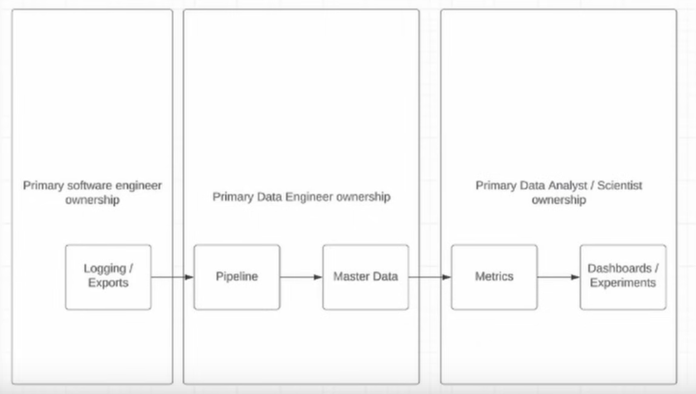

# Day 1 - Lecture

# Intro

Data pipeline maintenance is a inevitable part of DE. In this course we will cover:

- How to do data migration?
- How to setup runbooks for oncall rotation?
- Ownership models (so that your DEs don’t become burned out)
- Common Ownership and Maintenance Problems

---

We will also cover the following topics:

- The difficult parts of the data engineering job
- Team models for data engineering

As a DE, every time you build a pipeline, you then have to maintain it.

<aside>

Data engineering is inherently unsustainable. Every pipeline you build, adds a cost, and eventually you’re gonna have too many pipelines to maintain them all.

</aside>

Imagine every pipeline you have has a 10% chance of failing on a given day.

- If you have 1 pipeline, that means if you’re on call, you’ll end up doing something 3 days a month.
- If you have 10 pipelines, that means being on call you’ll have to do something every single day.
- If you have 100, every day you end up doing 10 things to maintain them.

That’s something to think about, as you have more and more pipelines, the burden becomes unsustainable.

> DE isn’t just writing SQL and sipping martinis on a beach
>

As a data engineer, you’re very subject to burnout, so you need to protect your peace and wellbeing.

If you don’t, DE is gonna eat you alive. It’s not a forgiving field.

# The difficult parts of data engineering

- High expectations that can lead to burnout
- Data quality issues
- Unclear priorities and ad-hoc requests

These are 3 main areas that cause frustrations in these field, and also the main reason why people **leave** data engineering, ‘cause even at the best companies they still haven’t figured out how to manage them all correctly.

## High expectations

- Building pipelines is a **marathon**
- Analytics is a **sprint**
- **SAY NO TO SPRINTING THE MARATHON!**

Every time you cut corners on a pipeline to get an answer faster, you will regret it later. You’re eventually going to feel pain in either of these 3 buckets: quality, completeness or maintainability.

On the flip side, analytics is a sprint, so the faster you can provide answers, the better.

So there is kind of a push and pull between analytics and engineering. But you never want to “sprint the marathon” and get burned out. In other words, don’t be naive see every issue as a life-and-death situation. Take your time to reach the solution, businesses don’t move very quickly, so even if things are 1 or 2 weeks delayed, it’s not that big of a deal. Keep an eye out on how much pressure you put on yourself.

> We’re not saving lives in data engineering.
>

(obviously you should have a healthy amount of care, lest you’re gonna get fired 😅).

## Ad-hoc requests

- Analytics need to solve **URGENT** problem
  - But to them, everything is urgent all the time → if everything is urgent, nothing is urgent.

**Strategy to address ad-hoc requests**

Allocate 5-10% per quarter to ad-hoc requests

→ that’s about 1/2 day per week. Or in a quarter is about a week or two at most. This is how much time you should spend on ad-hoc requests. The other 12-13 weeks should be spent on long term infrastructure building projects.

When evaluating ad-hoc requests you should evaluate the ROI:

- Means that if the request is ad-hoc and complex, you probably shouldn’t drop what you’re doing
  - When things are complex, they should be put on the roadmap → Include it in the quarterly plan in a structured manner, rather than at random at any given time, so that as a team you can figure out the right ways to process this, and you don’t slap together a rushed solution.
- Low hanging fruit can be prioritized though!

In other words, don’t be a simp to your analytics partners and say yes to everything they ask right away, or they will keep doing it nonstop and you will never get anything done. Make it so that they are forced to prioritize and stop shooting requests with a machine gun. Make them feel a little pain (e.g. delayed results) as a consequence of their approach, so they willingly work to change it for the better.

- Most analytics questions are less urgent than they appear → we’re not saving lives
- Get analytics partners input for quarterly planning so ad-hoc requests become scalable models!

## Ownership models

Who owns what?

- Data sets
- Data pipeline
- Data documentation
- Metrics
- Experiments

DEs might end up owning too much stuff, which obviously in the long run becomes unsustainable. Let’s see some ownership models.

**The most common ownership model**

In reality, the edges are never so clearcut, ownership near them is more blurry, also depending on the people available in each team. Zach prefers this pattern than the next one because in the next one the data engineer risks becoming like an island, having too much knowledge of everything in a single individual.

**Another common pattern**

This pattern can also be kind of good: owning the “metrics” as well for the data / analytics engineer team can be convenient because it’s very easy to update them, since they already know the master data very well.

The trade-off being that often the data engineer doesn’t have enough time to develop the business context that they need to get good metrics (as this requires many conversations with many different people).

### Where do ownership problems arise?

At the boundaries!

- Data engineers owning logging!
- Data scientists writing pipelines!
- Data engineers owning metrics!

Basically, people owning things they shouldn’t be owning because other roles are lacking somewhere.

Try to avoid going for *“whatever, I’ll do it myself!",* because you’re just sowing the seeds of your own burnout and creating a team structure that’s not sustainable.

### What happens when these crossed boundaries persist?

- **BURNOUT!** → People quit, get angry, get frustrated
- **BAD TEAM DYNAMIC / THE BLAME GAME!** → People blaming this or that person, or thinking you stealing credit, or not giving them time, or taking their work and stealing the promotion, etc…
- **BAD CROSS-FUNCTIONAL SUPPORT!** → Don’t be the sole owner of an entire pipeline, and have some backup, so if you leave or go on vacation, the business can have some questions answered. Solve these problems at the organizational level, not at the technical level. In other words, talk to the managers so that they can get the people that need to do a certain job to actually do it. It’s better to do that than to be the hero.

# Centralized vs Embedded teams

Zach prefers **centralized data teams**. The tradeoff is that the teams that you support have to come to you, and you have to be able to prioritize their asks vs other teams asks.

Oncalls are a big part of data engineering, because some pipelines will fail, and some of them are quite sensitive as they need data to land within a specific timeframe.

Although, Zach did a small experiment at Airbnb where he intentionally let pipelines fail for a couple of days, and showed that the ML model that was fed by them would only lose 0.5% effectiveness for each day the pipeline was failing.

The point for him was to show that troubleshooting that pipeline at 3:00AM was not worth the hassle!

> Understand what the impact of a failing pipeline is, and if it’s huge impact, like $1M, then by all means do wake up at 3:00AM to fix it, but if the impact is marginally small, like $1k, then it’s most likely not worth it.
>

In other words, you want to make oncalls as easy as possible, and seriously evaluate on which situations it is worth to do oncalls.

Because a $1k loss might seem not insignificant, but imagine an engineer waking up 10 times at 3:00AM within 2 months to fix some shit and save the company $10k. That engineer is gonna quit, and the cost of replacement is going to be A LOT higher than $10k.

---

The other model is **embedded**. In this one you have essentially one DE per team. Zach doesn’t like this one as much, because here the DEs are dedicated to a whole business area, but more isolated w.r.t. other data engineers. Oncall here is even more complicated because who’s on call will be an heterogeneous group of people with all different skillsets, rather than all data engineers (where you have an expectations of what their skillsets are).

# Common issues in pipelines

- Skewed pipelines that OOM
- Missing data / schema change of upstream data
- Backfill needs to trigger downstream data sets
- Business questions about where and how to use data

## How to fix skew

Skew happens when in a GROUP BY or JOIN there’s a key with **a lot more data**. Imagine you did a viral post that receives 100M likes, and for every like you get also a notification. Whatever executor is gonna get that data in Spark, is probably going to choke and die.

There’s 3 ways to fix this:

- Best option: **upgrade to Spark 3** and enable adaptive query execution!
- 2nd best option: bump up the executor memory and hope it’s not more skewed later
- 3rd best option: update the job to include a [skew join salt](https://medium.com/curious-data-catalog/sparks-salting-a-step-towards-mitigating-skew-problem-5b2e66791620)
  - In this technique, you use random numbers to make it so that if you have a skewed row, you split it up first and then aggregate, so that all that data doesn’t get shipped to 1 single executor.

You can also get OOM not related to skew, although that’s rare, and usually it’s a symptom of somebody writing the job wrong (e.g. having a `.collect()` somewhere, which collects all data in the driver)

## Missing data / schema change

- Pre-check your upstream data!
  - Especially if it’s data you don’t trust, like from a 3rd party API or data that can change anytime
  - Have the DQ checks **BEFORE** the pipeline runs! → If the checks fail, the pipeline won’t even start
- Fixed in a collaborative manner:
  - If it’s someone at your company → find the upstream owner and ask them to fix the problem
  - If it’s 3rd party API → quite messy, most times you won’t be able to talk to them. In that case you have to change the code.
    - They might also just turn off their API and in that case you’re kinda screwed

You want to be aware if these situations are one-offs or repeat over time. It’s important to have runbooks and proper oncall handoffs, so you can identify pattern for failures and solve the root cause of these failures, rather than applying band-aids every time something breaks.

## Backfill triggers downstream pipelines

These are one of the most painful parts of DE.

**For small migrations**

- Do a parallel backfill into `table_backfill`
- If everything looks good, do the swap
- Rename `production` to `production_old`
- Rename `table_backfill` to `production`

You want to do a parallel backfill into a separate table, like `table_backfill`, and then validate it and make sure that the data looks good. If it looks good, do the swap, where you rename the current production table to `production_old`, and `table_backfill` → `production`.

However, if you’re working with **pipelines that have a lot of downstreams**, you can’t do it that way. Because you have to migrate hundreds of people. In this case, you want backfill into a table like `table_v2`, and then you build a parallel pipeline next to production that fills `v2`, and then you encourage everyone to move over to `v2`. After all the references to the prod table are migrated to `v2`, then you can drop `production`, and rename `table_v2` to `production` (and now everyone needs to update their reference again). It’s quite painful, but if you don’t do this, your table names are going to become more and more weird.

In short:

- Build a parallel pipeline that populates `table_v2` while `production` gets migrated
- After all references to `production` have been updated, drop it and rename `table_v2` (and all its references) to `production`.

---

Here’s a flowchart to illustrate a common backfill pattern, mostly fitting the 1st scenario described above.

# Business questions

Another thing that can happen, if you own data sets, people are gonna ask questions about them (how to query, info, etc…). You might have a channel where people post questions, most of the time you don’t wanna set people expectations (like I’m gonna answer within x minutes).

- Set an SLA on when you’ll get back to people. Maybe it’s 2 hours maybe it’s a day.
  - The point of SLA is to give you breathing room and not feeling you have to immediately respond when you’re on call, so you can still have a life while you’re on call.
- You’re gonna get the same questions over and over again → consolidate them and put them in the documents.
- Is the “business question on call” the same as the “pipeline oncall”? This comes back to “who is owning stuff”. In other words, if you’re oncall, are you actually supposed to be answering business questions too? Try to not do this when oncall, and instead loop in your analytics partners!
