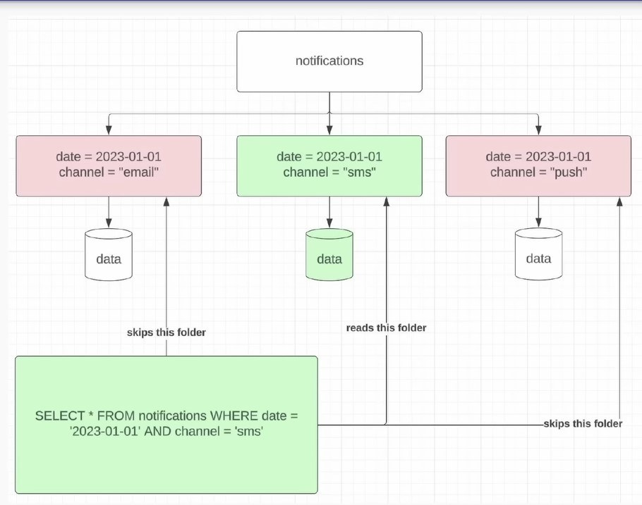
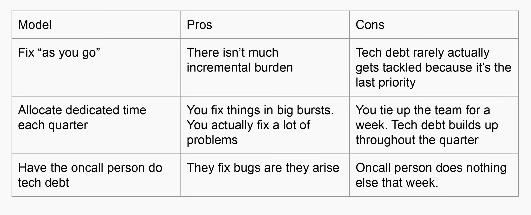

# Day 2 - Lecture

# What are signals of tech debt in data engineering

- Painful pipelines that break or are delayed
- Large cloud bills
- Multiple sources of truth
- Unclear data sets that aren’t documented

Each of these has their fixes which we’re gonna go over.

## Path forward for painful pipelines

Imagine you’ve got a pipeline that’s breaking often and ruins your oncall time and makes your life miserable.

- The only thing better than **optimized** **is****deprecated!** → Sometimes, deprecating is the right play!
- Is there anything that can be done?
  - Migrate to new technology
    - Like migrating from hive to Spark. Often sees an order of magnitude increase in efficiency. Especially for pipelines that use high-cardinality `GROUP BY` and/or `JOIN`. Remember that HIVE does everything on disk, so while Spark is more efficient, it’s less reliable/resilient and can OOM, whereas HIVE can’t.
    - Moving to streaming: that should be thought about a lot. In some cases this might be more reliable as it processed data as it comes in, so the memory footprint of the job can be more consistent, and you don’t have big spikes in memory footprint (which are what make the job more likely to OOM).
  - Better data modeling → fewer pipelines running
  - Bucketing?
  - Sampling? → A lot of time you just need directionality, not every single record. So with a 1% sample now you get a 100x reduction in the complexity of the pipeline.
- Deprecating without a replacement can be a hard sell! (Although, sometimes, that’s the only option left.)
  - Deprecating is an option to consider especially if you inherit a pipeline. Question the value! Ask yourself “is this worth it?”. Maybe it’s not, maybe it shouldn’t even exist.

These solutions seem straightforward and plain, but they’re smart! If the pipeline is a burden and not all too necessary, they’re very worth to consider.

### Sampling

**When should you sample?**

If directionality is what you care about, sampling is good enough. Make sure to **consult a data scientist** on this to guarantee you get the best sample of the data set → It’s very important to get a random sample.

In Zach’s example, they were working with a pipeline that would process 100s of TBs per hour. It’s understandable that’s absolutely reasonable here to sample it.

Another thing to consider is HOW you sample, e.g.:

- A small % of all the requests across the board
- All the requests, but for a small % of users

You’ll get the same reduction, but that makes a big different on the dataset itself and what you’re trying to solve for.

When should you not sample?

If you need the entire dataset for auditing purposes, sampling won’t work!

### Bucketing

Consider bucketing when

- You have an expensive high-cardinality `JOIN` or `GROUP BY`  → When you write the datasets, bucket them on the JOIN or GROUP BY key.
  - The point is that past a certain size of data (like 10+ TB), shuffle operations just break, so you want to resort to alternatives
  - Bucketing allows you to avoid the shuffle when doing those operations.

However, this doesn’t mean everything should be bucketed. On small data, it’s probably not worth it. Remember that reading from many different files takes time.

## Large cloud bills

IO is usually the number one cloud cost!

→ Moving data around from A to B is likely the most expensive part (e.g. imagine you have large master data and hundreds of pipelines reading from it).

→ At the bottom of the tree, where a pipeline only feeds a dashboard for instance, IO is not the biggest cost anymore.

Followed by compute and then storage!

→ Compute is generally fixed (unless you use serverless…), cause you rent a certain capacity and that’s it.

→ Storage is just really cheap in general

Too much IO can happen because:

- Duplicative data models
- Inefficient pipelines → use cumulative table design!
  - Imagine you’re doing a monthly active users pipeline, and you’re reading the last 30 days of fact data instead of doing cumulative table design. You’re scanning 30 days where you could be scanning just one day!
- Excessive backfills
  - You did a backfill too quickly without validating the data, and then it’s wrong data, and then you need to do it all over again
  - Backfill can be very expensive, imagine having to run the query over years and years of data
- Not sampling
  - Using the entire dataset when you can just use a small fraction of it
- Not subpartitioning correctly (predicate pushdown is your friend)
  - Subpartitioning is great when you have other low cardinality column you can split the data on. It allows you to just completely ignore  certain data altogether.

        

---

Large IO and compute costs are correlated by:

- Scanning too much data (use cumulative tables plz)
- O(n^2) algorithms applied in UDFs (nested loops are usually bad)

Large IO and storage costs are correlated by:

- Not leveraging Parquet file format effectively
- Duplicative data models (having multiple definitions for the same thing)

## Multiple sources of truth

This is probably where you can have the most impact as a data engineer; and it makes you more efficient, and it makes your job easier, and it makes the maintenance better.

- This is some of the hardest (but most impactful) work for data engineers

Steps:

- Document all the sources and the discrepancies
- Understand from stakeholders why they needed something different
- Build a spec that outlines a new path forward that can be agreed upon

It’s very common, as an org gets bigger and bigger and the data needs increase, that due to the lack of data engineers, people are gonna solve their data problems by themselves, without caring too much about quality or if the dataset already exists somewhere else, and then they’ll keep doing that.

This work is complicated because:

- When people do these multiple sources and pipelines that produce the same thing, they might have different variations of the same definition → that means you have to convince somebody that their definition is wrong/not-correct.
- You wanna get all stakeholders in a room, and talk it out and see how to address it.
- Sometimes, all existing sources of truth might be wrong and you have to define a new one.

Generally speaking, you don’t find all existing sources of truth via code search or grep, because people can name their data whatever they want, so it’s always suggested to talk to the relevant stakeholders. It can also can help you understand why they’re using this data, and the pains of using it, and all sorts of things that will give you a better view of the situation. Also if you take a pipeline out of someone’s plate, they’ll love you because it means they won’t have to manage it anymore.

After you’ve done all of this, that’s when you want to build a new spec for the path forward, and have the stakeholders agree to it, BEFORE you build anything.

## Document all the the sources and the discrepancies

If  your company is really ahead of the game they might have lineage, so that you can go up to the source data.

- Talk with all relevant stakeholders!
- If you can code search for similar names, that works great
- Lineage of the shared source data is a good place to start too

> Microsoft Fabric seemingly gives lineage out of the box
>

### Understand from stakeholders why they needed something different

- There’s usually a reason why there’s multiple datasets
- Could be organizational, ownership, technical, skills, etc…
- Work with stakeholders to find an ownership model that works

A key point is understanding how we have gotten to this certain point. E.g. sometimes a team doesn’t trust what another team built, and so they rebuild it themselves. Another time is when a team doesn’t have the bandwidth to do a certain thing, so another team does it.

If you can solve the organizational problems, then you stop the bleeding, you stop this problem from proliferating, and get people to trust each other more, and more consolidated datasets

# Build a pipeline spec

- Capture all the needs from stakeholders
- Get all the multiple sources of truth owners to sign off (**this helps a lot with migrations later!!!**)

Once they sign off, when it’s time for them to actually move and migrate their downstream pipeline, then you can kinda bully them into doing it because you can say “yo, you signed that you were gonna do it”. Migrations are so painful, and having a document like this can be very helpful in having people actually do them.

# Models for getting ahead of tech debt

- Fix “as you go”
  - This sounds a bit too good to be true, it’s kinda like saying “as you’re flying, fix the plane!”
- Allocate a portion of time each quarter **(often called tech excellence week)**
  - Zach’s favorite
  - Also the heaviest, but probably the only one taken seriously
  - One of the problems with this is that you don’t have the “fix as you go at all”, so at the end of the quarter there’s a lot more tech debt in the codebase
  - It’s like saying “I’m gonna save up all the teeth brushing, and then do it once for 90 minutes at the end of the quarter”
  - During that week, people don’t have time for anything else → it amounts to 1 month a year
- Have the on-call person focus on tech debt during their shift
  - The cool thing about that is that they’re very aware of what the most urgent things are
  - Contrary to the “dedicated week”, unfortunately it’s not everybody participating, and sometimes the on-call person just doesn’t do it

# Data migration models

- The extremely cautious approach
  - Be careful not to break anything
  - Parallel pipelines for months → expensive cause you’re paying 2x for the pipelines for the duration of the migration
- The bull in a china shop approach
  - Efficiency wins, minimize risk by migrating high-impact pipelines first
  - Kill the legacy pipeline as soon as you can

When Zach was at Airbnb, they used to use the first approach, but it was lasting too long, so leadership came out and said “you’re all taking too long”, as people were too cautious about breaking other people stuff.

What happened later is that instead, people were given a month to migrate, and if they don’t migrate in a month, you start breaking stuff, so that there weren’t these crazy long periods of time where migrations would take forever, and people would deprioritize moving the tables and doing backfills etc…

This is the most boring part of DE, so people don’t wanna do it unless they have to, and the way to force them to do it is by deleting the old pipeline, and you make it so that their pipeline can’t run anymore, because their upstream data doesn’t exist, and the only way to make their pipeline run again is by migrating.

Both approaches have benefits and cons, obviously, although Zach prefers the 2nd style, as migration is not usually a lot of work to do, and people tend to slack off.

# Proper oncall responsibilities

- Set proper expectations with your stakeholders! → **The most important part of on call**
  - If you get this right, on-call can be a breeze
  - When Zach was at Airbnb, initially the expectation was that any bug was gonna be troubleshooted in 4 hours, and then after 6 months Zach was like “fuck this, we’re doing 24 hours”, as 4 hours had no impact downstream, but would make DEs life miserable.
  - It’s withing your power to change expectations of oncalls that you inherit
- **DOCUMENT EVERY FAILURE AND BUG** (it’s a huge pain short-term but a great relief long-term!)
- Oncall handoff
  - Usually oncall lasts a week, and then you pass to another person
  - Should be a 20-30 mins sync to pass context from one oncall to the next. Context is things like anything that broke, or is currently broken, etc…

# Runbooks

- Complex pipeline need runbooks (which should be linked in the spec too)
  - Not all pipelines need runbooks.
  - You only need them if you have lots of inputs, or outputs used by a lot of teams, or complicated logic, or complex DQ checks, etc…

**What’s the difference between a runbook and a spec?**

Most important pieces

- Primary and secondary owners → if you’re oncall and something breaks and you have no idea how to fix it, who do you call?
- Upstream owners → **teams, not individuals**
  - This is in case DQ checks on upstream data fails, so you need to call them and tell them that the data sucks
- Common issues (if any)
  - And how to troubleshoot them (assuming they can’t be fixed long term yet)
- Critical downstream owners → **teams, not individuals**
  - People that you need to when something happens
  - Doesn’t need to be all of them, just the most important ones
- SLAs and agreements
  - Usually these are like number of hours/days when the data is expected to arrive
  - This is an agreement between you and your stakeholders that says “the data is not late until X hours after midnight”. Which avoids a lot of unnecessary questions.

**Upstream and downstream owners**

You should have a regularly (monthly / quarterly) 1-to-1 meeting with both upstream and downstream, just to get everyone on the same page and trying to understand where they’re trying to go, and if we can improve these datasets to make them better. This is good because you develop a better connection with them and the business, and you develop a nicer relationship with them, which makes your life easier over time.

You definitely wanna do relationship building with these people.
